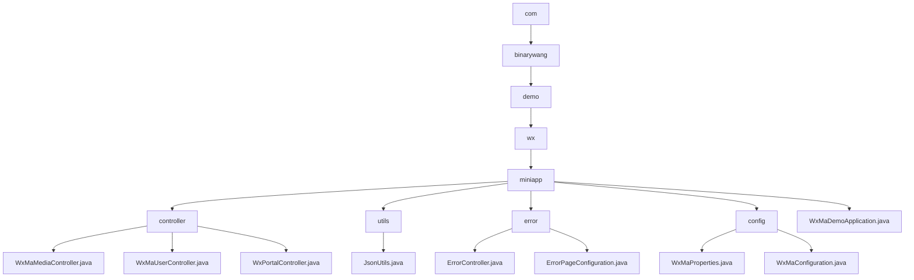

# Basic Information

|      |      |
|------|------|
| Name | com |
| Language | .java |
| Code Path | weixin-java-miniapp-demo/src/main/java/com |
| Package Name | docs.src.main.java.com |
| Brief Description | This module provides backend services for WeChat Mini Programs, supporting multi-instance configuration, user authentication, media management, and message push notifications. It adopts a RESTful interface design, integrating the WxJava SDK with the Spring Boot framework to implement functionalities such as file upload, JSON parsing, and AES encrypted communication, while enhancing system stability through a unified error handling mechanism. |

# Description

## Overview

This module provides backend core services for WeChat Mini Programs, supporting multi-instance configuration, user authentication, message processing, and media resource management. Request isolation is achieved through AppId routing and thread-local variables, while integration with the WxJava SDK enables compliance with WeChat protocols. Examples include uploading images to return MediaIds or obtaining user sessions based on Codes.

The interfaces follow RESTful style, supporting Multipart file transfer, JSON/XML parsing, and AES encrypted communication. Key dependencies include wx-java-miniapp-spring-boot-starter, commons-fileupload, and Spring Web-related components. Core data structures encompass WxMaConfig, WxMaUserInfo, WxMaJscode2SessionResult, and WxMpXmlMessage.

Additionally, it incorporates a unified error handling mechanism that renders views for 404/500 statuses via ErrorController and ErrorPageConfiguration. Similar to an event bus architecture, erroneous requests are centrally dispatched to the /error path where Thymeleaf template pages are rendered.

The module utilizes the JsonUtils utility class for JSON serialization operations, configured with Jackson's ObjectMapper to ignore null values and format output. The overall structure follows standard Spring Boot conventions, initialized by the WxMaDemoApplication startup class.

## Main Business Scenarios

The module integrates three major interaction flows of WeChat Mini Programs: user login, message push, and material management. These interactions resemble an event bus architecture, with the Portal Controller distributing requests uniformly. For example, GET validates URL validity whereas POST receives user behavior data, which is then processed by Service components executing specific logic.

Support spans the complete lifecycle from configuration loading to service runtime. Multi-instance parameters are bound using WxMaProperties, and different types of events are routed via a message router to handlers such as logs, text replies, or image responses. Typical use cases include scanning QR codes returning their image data or triggering message pushes upon subscription notifications.

API categories cover HTTP interfaces at the Controller layer, business logic within the Service layer, and custom message handler registration mechanisms—suitable for deployment in Spring Boot microservice environments. It also integrates a unified error page mechanism to enhance frontend experience consistency, enabling developers to quickly reuse components to build customized error prompt interfaces.

### Package Internal Structure View

This flowchart illustrates the package structure and file organization of the WeChat Mini Program Java Demo project, expanding from the top-level package down to specific controllers, utility classes, configuration classes, and the application startup class, clearly reflecting the hierarchical dependency relationships between modules.

# File List

| Name   | Type  | Description |
|-------|------|-------------|
| [github](github/_module.md) | package | This module provides backend services for WeChat Mini Programs, supporting multi-instance configuration, user authentication, media management, and message push notifications. It adopts a RESTful interface design, integrating the WxJava SDK with the Spring Boot framework to implement file upload, JSON parsing, AES encrypted communication, and other functions, while enhancing system stability through a unified error handling mechanism. |

