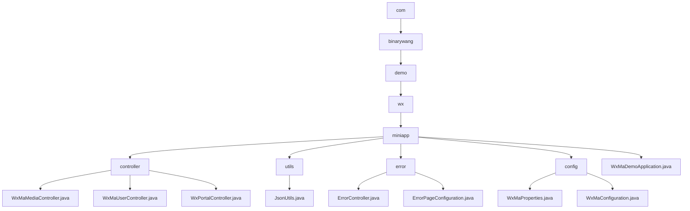

# Basic Information

|      |      |
|------|------|
| Name | com |
| Language | .java |
| Code Path | weixin-java-miniapp-demo/src/main/java/com |
| Package Name | docs.src.main.java.com |
| Brief Description | This module provides backend core functionalities for WeChat Mini Programs, including media upload/download, user authentication, and message routing. Developed based on Spring Boot, it supports multi-tenant configuration switching, with interfaces following RESTful style and using JSON for communication. Key components include WxMaConfig, WxMaMessage, etc., and it depends on the weixin-java-miniapp SDK. The module covers error handling, configuration management, and application startup bootstrap, featuring high cohesion and low coupling, making it suitable for independent deployment within a microservices architecture.``` |

# Description

## Overview

This module provides comprehensive backend service capabilities for WeChat Mini Programs, covering user authentication, message processing, media resource management, and multi-account configuration support. The interfaces follow RESTful specifications, communicate in JSON format, and ensure thread safety. All controller operations clean up ThreadLocal resources upon completion, similar to ServletContext lifecycle management mechanisms. Key data structures include WxMaConfig, WxMaJscode2SessionResult, and WxMaMessage. External dependencies mainly consist of the weixin-java-miniapp SDK, Spring Boot, and its Web module, without introducing other third-party libraries. For example: upload images via /media/upload to obtain media_id; decrypt phone numbers using /wxa/business/getuserphonenumber; configure multiple mini-program instances through wx.miniapp.configs.

## Main Business Scenarios

The module supports four core processes of WeChat Mini Programs: access verification, identity management, message routing, and multimedia interaction. It supports GET signature verification and POST reception of plaintext/AES encrypted messages, and distributes processing through routers to form an interaction architecture similar to an event bus pattern. User-related interfaces implement login state maintenance and sensitive information decryption, such as exchanging code for openid. Media controllers are suitable for typical scenarios like avatar upload and voice download. It also supports unified error page redirection to enhance user experience consistency under exceptional circumstances. API types cover HTTP GET/POST requests, with integration cases including closed-loop processing from WeChat callbacks to business responses. For example: accessing undefined interfaces returns a "page not found" prompt; adding text processors through WxMaMessageRouter implements automatic reply functionality.


### Package Internal Structure View



This flowchart illustrates the package structure and file organization of the WeChat Mini Program Java Demo project, covering the hierarchical structure from the top-level package name to specific modules such as controllers, utility classes, configuration classes, and error handling, clearly reflecting the code distribution and dependency relationships of the project.

# File List

| Name   | Type  | Description |
|-------|------|-------------|
| [github](github/_module.md) | package | This module provides backend core functionality for WeChat Mini Programs, including media upload/download, user authentication, and message routing. Developed based on Spring Boot, it supports multi-tenant configuration switching, with interfaces following RESTful style and using JSON communication. Key components include WxMaConfig, WxMaMessage, etc., and it depends on the weixin-java-miniapp SDK. The module covers error handling, configuration management, and application startup bootstrap, featuring high cohesion and low coupling characteristics, making it suitable for independent deployment within microservice architectures.``` |


