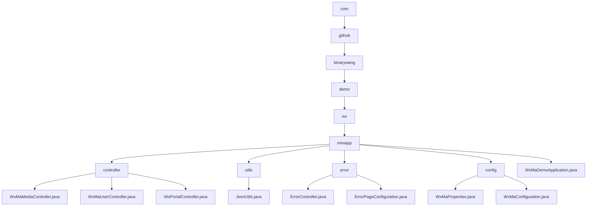

# Basic Information

|      |      |
|------|------|
| Name | com |
| Language | .java |
| Code Path | weixin-java-miniapp-demo/src/main/java/com |
| Package Name | docs.src.main.java.com |
| Brief Description | WeChat Mini Program backend core module, including media management, user session and message routing functions, supporting multi-account configuration, built with Spring Boot framework, containing error handling and JSON utility classes. |

# Description

## Overview  
This module is a collection of backend services for WeChat Mini Programs, with core responsibilities including media file management, user session services, and WeChat message routing, while also integrating error page handling and configuration management. It adopts a multi-tenant architecture based on appid, with interface specifications adhering to the Spring MVC standard. Key data structures encompass media_id lists, user session JSON, WeChat message objects, and the WxMaProperties configuration class. External dependencies include WeChat SDK encryption services, HTTP request processing, and the Spring framework. For example, the upload interface returns a media_id, the login interface returns a sessionKey, and error handling automatically routes to a 404 page.  

## Core Business Scenarios  
The module supports three types of core workflows: 1) Media file management operates similarly to CDN operations; 2) User authentication follows the OAuth2.0 pattern; 3) Message routing employs an event bus mechanism. A typical interaction follows a request→validation→execution→cleanup→response loop, comprehensively addressing Mini Program backend development needs. Multi-tenant configuration management enables parallel processing of multiple Mini Program instances, while error handling implements automatic redirection through status code mapping. For example, exchanging a code for a session or routing messages to the corresponding processor chain based on message type.

### Package Internal Structure View

This flowchart illustrates the module structure of a WeChat Mini Program Java project, starting from the top-level com package and hierarchically expanding to specific functional modules. The core miniapp module contains submodules such as controllers, utility classes, error handling, and configuration. The controller module includes three specific functional controller files, error handling comprises two configuration files, the utility class contains one JSON utility class, and the configuration module consists of two property configuration files. The project entry point is the WxMaDemoApplication.java application startup file.

# File List

| Name   | Type  | Description |
|-------|------|-------------|
| [github](github/_module.md) | package | Core backend modules for WeChat Mini Program, including media management, user sessions, and message routing functionalities, supporting multi-account configuration. Built with Spring Boot framework, incorporating error handling and JSON utility classes. |

