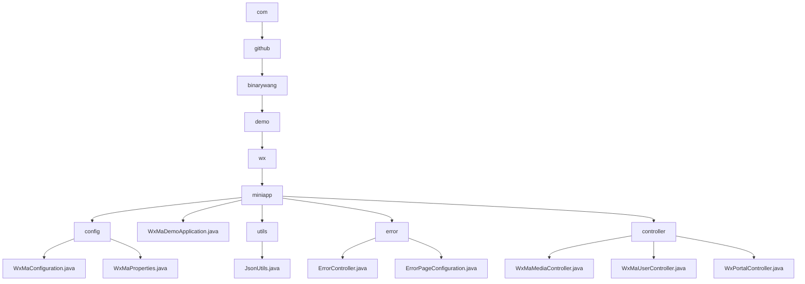

# Basic Information

|      |      |
|------|------|
| Name | com |
| Language | .java |
| Code Path | weixin-java-miniapp-demo\src\main\java\com |
| Package Name | docs.src.main.java.com |
| Brief Description | WeChat Mini Program backend system, including multi-account management, message routing, error handling, media file management, and user session functionality, implemented based on Spring Boot and WeChat SDK. |

# Description

## Overview  
This module serves as a comprehensive backend system for WeChat Mini Programs, with core responsibilities including multi-account service configuration, message routing and distribution, and HTTP error handling, functioning similarly to a gateway routing and error handling hub. It manages multiple accounts via WxMaProperties, with key data structures including the Config class (Appid/Secret), a message routing Map, and an ErrorPage registry. It relies on the WeChat SDK, Spring Web, and Lombok. For example, @ConfigurationProperties injects configurations, MsgRouter predefines five types of handlers, and ErrorController uniformly renders error pages.  

## Key Business Scenarios  
The module covers the entire lifecycle of a Mini Program: initial configuration validation → building multi-account services → handling messages/errors. The interaction model is event-driven, such as text messages triggering customer service replies or 404 errors redirecting to preset pages. It fully supports WeChat protocols (e.g., subscription message distribution) and HTTP status handling. Typical workflows include media file uploads (returning media_id), user login (AES-decrypted information), and portal interactions (GET/POST dual modes). API integration examples include QR code generation and session maintenance, all implemented within a multi-tenant architecture based on AppID isolation.

### Package Internal Structure View

This flowchart illustrates the directory structure of a WeChat Mini Program Java project, starting from the top-level com package and drilling down to the miniapp module. The miniapp module contains four sub-modules: configuration, utilities, error handling, and controllers. The configuration module includes 2 Java files, while the utilities, error handling, and controller modules each contain multiple functional class files. The entire structure clearly reflects the project's layered organization by functionality.

# File List

| Name   | Type  | Description |
|-------|------|-------------|
| [github](github/_module.md) | package | WeChat Mini Program backend system, featuring multi-account management, message routing, error handling, media file management, and user session functionality, implemented based on Spring Boot and WeChat SDK. |

