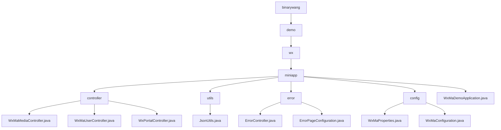

# Basic Information

|      |      |
|------|------|
| Name | github |
| Language | .java |
| Code Path | weixin-java-miniapp-demo/src/main/java/com/github |
| Package Name | docs.src.main.java.com.github |
| Brief Description | This module provides backend services for WeChat Mini Programs, supporting multi-instance configuration, user authentication, media management, and message push notifications. It adopts a RESTful interface design, integrating the WxJava SDK with the Spring Boot framework to implement file upload, JSON parsing, AES encrypted communication, and other functions, while enhancing system stability through a unified error handling mechanism. |

# Description

## Overview

This module provides backend core services for WeChat Mini Programs, supporting multi-instance configuration, user authentication, message processing, and media resource management. Request isolation is achieved through AppId routing and thread-local variables, while integration with the WxJava SDK enables communication according to WeChat protocols. For example, uploading images returns a MediaId, or obtaining a user session based on a code.

The interfaces follow RESTful style, supporting Multipart file transfer, JSON/XML parsing, and AES encrypted communication. Key dependencies include wx-java-miniapp-spring-boot-starter, commons-fileupload, and Spring Web related components. Core data structures encompass WxMaConfig, WxMaUserInfo, WxMaJscode2SessionResult, and WxMpXmlMessage among others.

Additionally, it includes a unified error handling mechanism that renders views for 404/500 status codes via ErrorController and ErrorPageConfiguration. Similar to an event bus architecture, erroneous requests are centrally dispatched to the /error path where Thymeleaf template pages are rendered.

The module uses the JsonUtils utility class for JSON serialization operations, configured with Jackson's ObjectMapper to ignore null values and format output. The overall structure follows standard Spring Boot conventions, initialized by the WxMaDemoApplication startup class.

## Main Business Scenarios

The module integrates three major interaction flows of WeChat Mini Programs: user login, message push, and material management. Its interaction model resembles an event bus architecture, distributing requests uniformly through the Portal Controller. For instance, GET validates URL validity, POST receives user behavior data, which is then processed by Service components executing specific logic.

Support spans the complete lifecycle from configuration loading to service runtime. Multi-instance parameters are bound using WxMaProperties, and different types of events are distributed to loggers, text reply handlers, or image response processors via a message router. Typical applications include returning QR codes upon scanning or triggering message pushes through subscription notifications.

API types cover HTTP interfaces at the Controller layer, business logic at the Service layer, and custom message handler registration mechanisms—suitable for deployment in Spring Boot microservices environments. It also integrates a unified error page mechanism to enhance frontend experience consistency, allowing developers to quickly reuse and build custom error prompt interfaces.

### Package Internal Structure View

This flowchart illustrates the package structure and hierarchical relationships among the main class files of the WeChat Mini Program Java Demo project, covering modules such as controllers, utility classes, error handling, and configuration.

# File List

| Name   | Type  | Description |
|-------|------|-------------|
| [binarywang](binarywang/_module.md) | package | This module provides backend services for WeChat Mini Programs, supporting multi-instance configuration, user authentication, media management, and message push. It adopts a RESTful interface design, integrates the WxJava SDK with the Spring Boot framework, implements functions such as file upload, JSON parsing, and AES encrypted communication, and enhances system stability through a unified error handling mechanism. |

