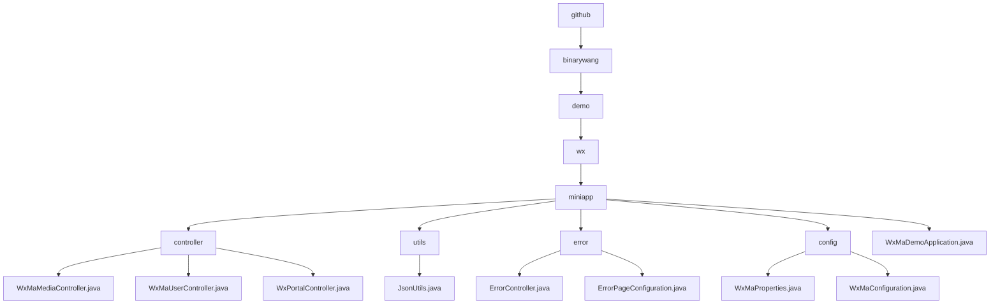

# Basic Information

|      |      |
|------|------|
| Name | github |
| Language | .java |
| Code Path | weixin-java-miniapp-demo/src/main/java/com/github |
| Package Name | docs.src.main.java.com.github |
| Brief Description | Core backend modules for WeChat Mini Program, including media management, user sessions, and message routing functionalities, supporting multi-account configuration. Built with Spring Boot framework, incorporating error handling and JSON utility classes. |

# Description

## Overview  
This module is a collection of backend services for WeChat Mini Programs, with core responsibilities including media file management, user session services, and WeChat message routing, while also integrating error page handling and configuration management features. It adopts a multi-tenant architecture based on appid, with interface specifications adhering to Spring MVC standards. Key data structures encompass media_id lists, user session JSON, WeChat message objects, and the WxMaProperties configuration class. External dependencies include WeChat SDK encryption services, HTTP request processing, and the Spring framework. For example, the upload interface returns a media_id, the login interface returns a sessionKey, and error handling automatically routes to a 404 page.  

## Core Business Scenarios  
The module supports three types of core workflows: 1) Media file management similar to CDN operations; 2) User authentication following the OAuth2.0 pattern; 3) Message routing employing an event bus mechanism. A typical interaction follows a request→validation→execution→cleanup→response loop, comprehensively addressing Mini Program backend development needs. Multi-tenant configuration management enables parallel processing of multiple Mini Program instances, while error handling implements automatic redirection through status code mapping. Examples include exchanging a code for a session or routing messages to corresponding processor chains based on message type.

### Package Internal Structure View

This flowchart illustrates the core directory structure of the WeChat Mini Program Demo project, starting from the root directory `github` and expanding hierarchically to `binarywang`, `demo`, `wx`, and `miniapp`. Under `miniapp`, it includes submodules such as controllers, utility classes, error handling, configuration, and the main application file `WxMaDemoApplication.java`. The controller module consists of three specific controller classes, the utility module includes the `JsonUtils` utility class, the error handling module contains two error-related classes, and the configuration module comprises two configuration classes. The overall structure clearly demonstrates the typical layered architecture of a Spring Boot project.

# File List

| Name   | Type  | Description |
|-------|------|-------------|
| [binarywang](binarywang/_module.md) | package | WeChat Mini Program backend core modules, including media management, user session and message routing functionalities, supporting multi-account configuration, built with Spring Boot framework, incorporating error handling and JSON utility classes. |

