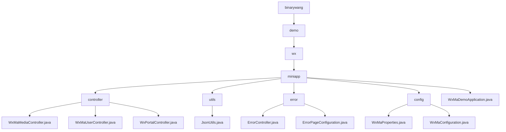

# Basic Information

|      |      |
|------|------|
| Name | binarywang |
| Language | .java |
| Code Path | weixin-java-miniapp-demo/src/main/java/com/github/binarywang |
| Package Name | docs.src.main.java.com.github.binarywang |
| Brief Description | WeChat Mini Program backend core modules, including media management, user session and message routing functionalities, supporting multi-account configuration, built with Spring Boot framework, incorporating error handling and JSON utility classes. |

# Description

## Overview  
This module is a collection of backend services for WeChat Mini Programs, with core responsibilities including media file management, user session services, and WeChat message routing, while also integrating error page handling and configuration management features. It adopts a multi-tenant architecture based on appid, with interface specifications adhering to the Spring MVC standard. Key data structures encompass media_id lists, user session JSON, WeChat message objects, and the WxMaProperties configuration class. External dependencies include WeChat SDK encryption services, HTTP request processing, and the Spring framework. For example, the upload interface returns a media_id, the login interface returns a sessionKey, and error handling automatically routes to a 404 page.

## Core Business Scenarios  
The module supports three types of core workflows: 1) Media file management operates similarly to CDN operations; 2) User authentication follows the OAuth2.0 pattern; 3) Message routing employs an event bus mechanism. A typical interaction follows the request→validation→execution→cleanup→response loop, comprehensively addressing Mini Program backend development needs. Multi-tenant configuration management enables parallel processing of multiple Mini Program instances, while error handling implements automatic redirection through status code mapping. Examples include exchanging a code for a session or routing messages to the corresponding processor chain based on message type.

### Package Internal Structure View

This flowchart illustrates the core structure of the WeChat Mini Program demo project, starting from the root directory 'binarywang' and hierarchically expanding to the 'miniapp' module, which includes submodules such as controller, utils, error, config, and their corresponding Java class files. Each node displays only the last-level name, clearly presenting the project's hierarchical relationships and organizational architecture.

# File List

| Name   | Type  | Description |
|-------|------|-------------|
| [demo](demo/_module.md) | package | WeChat Mini Program backend core module, including media management, user session and message routing functions, supporting multi-account configuration, built with Spring Boot framework, containing error handling and JSON utility classes. |

