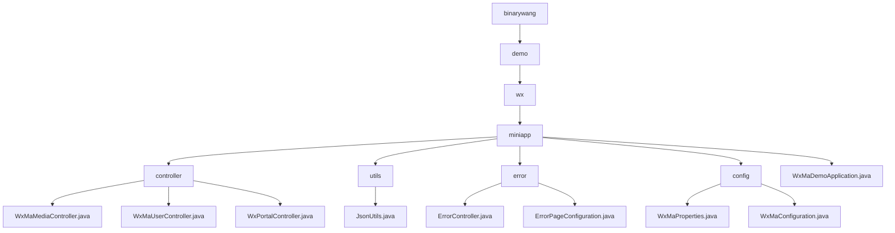

# Basic Information

|      |      |
|------|------|
| Name | binarywang |
| Language | .java |
| Code Path | weixin-java-miniapp-demo/src/main/java/com/github/binarywang |
| Package Name | docs.src.main.java.com.github.binarywang |
| Brief Description | This module provides backend support for WeChat Mini Programs, covering media upload/download, user login, message processing, and other functions. Based on Spring Boot and WXJava SDK, it implements multi-mini-program management, interface routing, and secure communication. It supports JSON/XML parsing, unified exception handling, and dynamic configuration loading, making it suitable for enterprise-level WeChat ecosystem integration scenarios. |

# Description

## Overview

This module provides backend core support for WeChat Mini Programs, covering user login, media resource management, message receiving, and multi-instance routing functionalities. By integrating the WXJava SDK and Spring Boot framework, it implements RESTful API-style interfaces and multi-tenant configuration management. For example: using WxMaService to handle credential verification, and WxMaConfig to support switching between multiple mini programs.

The module exposes unified HTTP interfaces, supporting GET/POST requests with JSON/XML format interaction, and includes built-in encryption/decryption and exception handling mechanisms. Key data structures include MediaId, JSCode, Echostr, HttpStatus, ModelAndView, etc., combined with ThreadLocal cleanup mechanism to ensure service stability.

Main external dependencies include the WXJava Miniapp SDK, Spring Boot Web module, Jackson library, and related logging components. For example: JsonUtils uses ObjectMapper to implement object-to-JSON formatting conversion.

## Main Business Scenarios

The module covers three core business processes: first, media upload and download (such as image acquisition of MediaId), second, user identity verification (such as exchanging JSCode for OpenId), and third, message subscription and event distribution (such as automatic reply to text messages). The system implements multi-mini-program access through Appid routing, supporting plaintext/AES transmission and parsing of various message types.

The error handling mechanism uniformly takes over exception states such as 404/500, combining ErrorController and ErrorPageRegistrar to achieve page redirection or response output. For example, when accessing an illegal path, it redirects to the /error/404 view.

Typical application scenarios include third-party platforms hosting multiple mini programs, enterprise portals connecting to the WeChat ecosystem, and compliance scenarios requiring secure transmission of user sensitive information. API types cover Controller layer HTTP interfaces, SDK calls, and configuration injection, supporting integration with infrastructure such as Nginx and HTTPS gateways. The overall architecture is similar to an event bus pattern, featuring good extensibility and dynamic routing capabilities.

### Package Internal Structure View

This flowchart illustrates the package structure and organizational relationships among the main class files of a WeChat Mini Program Java Demo project, covering modules such as controllers, utility classes, error handling, and configuration.

# File List

| Name   | Type  | Description |
|-------|------|-------------|
| [demo](demo/_module.md) | package | This module provides backend support for WeChat Mini Programs, covering media upload and download, user login, message processing, and other functions. Based on Spring Boot and the WXJava SDK, it implements multi-mini-program management, interface routing, and secure communication. It supports JSON/XML parsing, unified exception handling, and dynamic configuration loading, making it suitable for enterprise-level WeChat ecosystem integration scenarios. |

