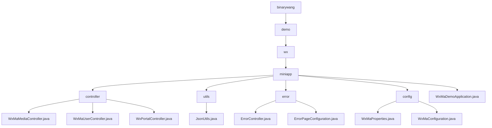

# Basic Information

|      |      |
|------|------|
| Name | binarywang |
| Language | .java |
| Code Path | weixin-java-miniapp-demo/src/main/java/com/github/binarywang |
| Package Name | docs.src.main.java.com.github.binarywang |
| Brief Description | This module provides backend services for WeChat Mini Programs, supporting multi-instance configuration, user authentication, media management, and message push. It adopts a RESTful interface design, integrates the WxJava SDK with the Spring Boot framework, implements functions such as file upload, JSON parsing, and AES encrypted communication, and enhances system stability through a unified error handling mechanism. |

# Description

## Overview

This module provides backend core services for WeChat Mini Programs, supporting multi-instance configuration, user authentication, message processing, and media resource management. Request isolation is achieved through AppId routing and thread-local variables, while integration with the WxJava SDK enables communication according to WeChat protocols. Examples include uploading images to return MediaIds or obtaining user sessions based on authorization codes.

The interfaces follow RESTful style, supporting multipart file transfers, JSON/XML parsing, and AES-encrypted communications. Key dependencies include wx-java-miniapp-spring-boot-starter, commons-fileupload, and Spring Web-related components. Core data structures encompass WxMaConfig, WxMaUserInfo, WxMaJscode2SessionResult, and WxMpXmlMessage.

Additionally, a unified error handling mechanism is implemented using ErrorController and ErrorPageConfiguration to render views for 404/500 status responses. Similar to an event bus architecture, error requests are centrally dispatched to the /error path where Thymeleaf template pages are rendered accordingly.

The module utilizes JsonUtils for JSON serialization operations, configured via Jackson's ObjectMapper to ignore null values and enable formatted output. The overall structure follows standard Spring Boot conventions, initialized by the WxMaDemoApplication startup class.

## Main Business Scenarios

The module integrates three major interaction flows of WeChat Mini Programs: user login, message push, and material management. Its interaction pattern resembles an event bus architecture, with all incoming requests routed by a Portal Controller. For instance, GET requests validate URL validity whereas POST requests receive user behavior data which is then processed by dedicated Service components.

Support spans the complete lifecycle from configuration loading to service runtime. Multi-instance parameters are bound via WxMaProperties, while a message router dispatches different types of events—such as logs, text replies, or image responses—to their respective handlers. Typical use cases include returning QR codes upon scanning or triggering message pushes through subscription notifications.

API types cover HTTP interfaces at the Controller layer, business logic within the Service layer, and custom message handler registration mechanisms suitable for deployment in Spring Boot microservice environments. It also incorporates a centralized error page system that enhances front-end experience consistency, enabling developers to quickly build reusable custom error display interfaces.

### Package Internal Structure View

This flowchart illustrates the directory structure of the WeChat Mini Program Java Demo project, expanding from the top-level package name down to various controllers, utility classes, configuration classes, and error handling modules, clearly reflecting the code organization and dependency relationships.

# File List

| Name   | Type  | Description |
|-------|------|-------------|
| [demo](demo/_module.md) | package | This module provides backend services for WeChat Mini Programs, supporting multi-instance configuration, user authentication, media management, and message push. It adopts a RESTful interface design, integrates the WxJava SDK with the Spring Boot framework, implements functions such as file upload, JSON parsing, and AES encrypted communication, and enhances system stability through a unified error handling mechanism. |

