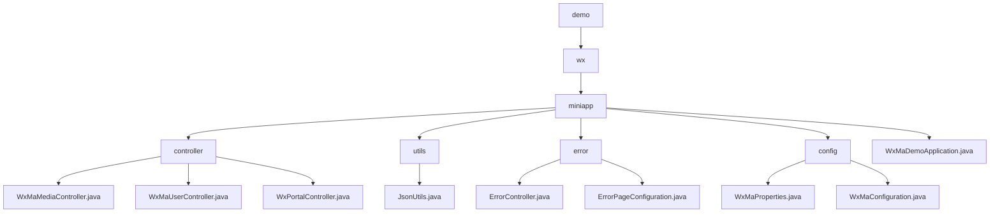

# Basic Information

|      |      |
|------|------|
| Name | demo |
| Language | .java |
| Code Path | weixin-java-miniapp-demo/src/main/java/com/github/binarywang/demo |
| Package Name | docs.src.main.java.com.github.binarywang.demo |
| Brief Description | This module provides backend services for WeChat Mini Programs, supporting multi-instance configuration, user authentication, media management, and message push. It adopts a RESTful interface design, integrates the WxJava SDK with the Spring Boot framework, implements functions such as file upload, JSON parsing, and AES encrypted communication, and enhances system stability through a unified error handling mechanism. |

# Description

## Overview

This module provides backend core services for WeChat Mini Programs, supporting multi-instance configuration, user authentication, message processing, and media resource management. Request isolation is achieved through AppId routing and thread-local variables, while integration with the WxJava SDK enables communication according to WeChat protocols. Examples include uploading images to return a MediaId or retrieving a user session based on a code.

The interfaces follow RESTful style, supporting multipart file transfer, JSON/XML parsing, and AES-encrypted communication. Key dependencies include wx-java-miniapp-spring-boot-starter, commons-fileupload, and Spring Web-related components. Core data structures encompass WxMaConfig, WxMaUserInfo, WxMaJscode2SessionResult, and WxMpXmlMessage.

Additionally, it incorporates a unified error handling mechanism that renders views for 404/500 status codes via ErrorController and ErrorPageConfiguration. Similar to an event bus architecture, error requests are centrally dispatched to the /error path where Thymeleaf template pages are displayed.

The module utilizes the JsonUtils utility class for JSON serialization operations, configured with Jackson's ObjectMapper to ignore null values and format output. The overall structure follows standard Spring Boot conventions, initialized by the WxMaDemoApplication startup class.

## Main Business Scenarios

The module integrates three major interaction flows of WeChat Mini Programs: user login, message push, and material management. The interaction pattern resembles an event bus architecture, with the Portal Controller distributing requests uniformly. For example, GET validates URL validity, POST receives user behavior data, and Service components execute specific logic.

Support spans the complete lifecycle from configuration loading to service execution. Multi-instance parameters are bound using WxMaProperties, and a message router dispatches different types of events—such as logs, text replies, or image responses—to corresponding handlers. Typical applications include scanning to retrieve QR codes or triggering message pushes via subscription notifications.

API types cover HTTP interfaces at the Controller layer, business logic in the Service layer, and custom message handler registration mechanisms, suitable for deployment within Spring Boot microservices environments. It also integrates a unified error page mechanism to enhance frontend experience consistency, enabling developers to quickly reuse and build custom error prompt interfaces.

### Package Internal Structure View

This flowchart illustrates the directory structure and file organization of the WeChat Mini Program Demo project, covering the hierarchical distribution from the main package to modules such as controllers, utility classes, error handling, and configuration, clearly reflecting the Java package structure and the ownership relationships between components.

# File List

| Name   | Type  | Description |
|-------|------|-------------|
| [wx](wx/_module.md) | package | This module provides backend services for WeChat Mini Programs, supporting multi-instance configuration, user authentication, media management, and message push notifications. It adopts a RESTful interface design, integrates the WxJava SDK with the Spring Boot framework, implements functionalities such as file upload, JSON parsing, and AES encrypted communication, and enhances system stability through a unified error handling mechanism. |

