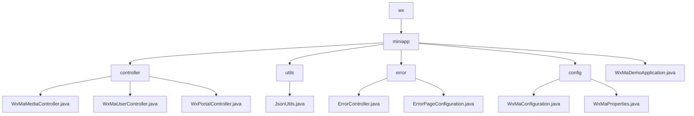

# Basic Information

|      |      |
|------|------|
| Name | wx |
| Language | .java |
| Code Path | weixin-java-miniapp-demo/src/main/java/com/github/binarywang/demo/wx |
| Package Name | docs.src.main.java.com.github.binarywang.demo.wx |
| Brief Description | This module provides backend support for WeChat Mini Programs, covering user authentication, media management, message processing, and other functions. It supports multi-application configuration switching and secure access control, adopts RESTful API and JSON response format, depends on the weixin-java-miniapp SDK, and features good extensibility and stability. |

# Description

## Overview  
This module provides backend core support for WeChat Mini Programs, covering user authentication, media management, message routing, and multi-application configuration switching. It uniformly provides services through RESTful APIs, adopts JSON as the interaction format, and clears ThreadLocal variables at the end of requests to prevent memory leaks. For example: WxMaUserController handles login and information decryption, while WxPortalController is responsible for message distribution.

The module's interface specifications are uniformly designed based on Spring MVC style, supporting GET/POST method calls and compatible with both plaintext and AES encrypted transmission methods. Key data structures include WxMaJscode2SessionResult (login credential result), WxMaUserInfo (user sensitive information), and WxMpXmlMessage (WeChat push messages). External dependencies mainly include the weixin-java-miniapp SDK, Spring Boot Web components, and related HTTP client libraries.

## Main Business Scenarios  
The module supports three typical processes: user identity verification and session management, temporary material upload and download, and WeChat platform message subscription and event response. The interaction pattern is similar to MVC architecture, where frontend requests are parsed by Controllers before calling Service layers for processing, ultimately returning responses in a unified format. For example: scan-to-login is handled by UserController, while avatar upload is executed by MediaController.

Functionally, it implements a full-link closed loop from configuration loading and message listening to customer service message pushing, with good scalability and integration capabilities. Typical application scenarios such as enterprise-level multi-tenant mini program platforms can quickly build standardized communication entry points through this module. API types cover configuration injection interfaces and message callback interfaces, supporting flexible expansion of new message types. For example: when receiving an image message, it automatically uploads and returns the processing result.

### Package Internal Structure View

This flowchart shows the module structure of the WeChat Mini Program demo project, where `wx` branches into the `miniapp` submodule under the root directory. `miniapp` contains core components such as controllers, utility classes, error handling, configuration, and the main application entry point. The hierarchical relationships between modules are clearly defined, facilitating understanding of the overall project architecture and code organization.

# File List

| Name   | Type  | Description |
|-------|------|-------------|
| [miniapp](miniapp/_module.md) | package | This module provides backend support for WeChat Mini Programs, covering user authentication, media management, message processing, and other functions. It supports multi-application configuration switching and secure access control, adopts RESTful API and JSON response format, depends on the weixin-java-miniapp SDK, and has good extensibility and stability. |

