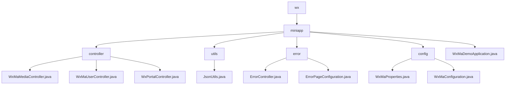

# Basic Information

|      |      |
|------|------|
| Name | wx |
| Language | .java |
| Code Path | weixin-java-miniapp-demo/src/main/java/com/github/binarywang/demo/wx |
| Package Name | docs.src.main.java.com.github.binarywang.demo.wx |
| Brief Description | WeChat Mini Program backend core modules, including media management, user sessions, and message routing functionalities, supporting multi-account configuration, built with the Spring Boot framework, and incorporating error handling and JSON utility classes. |

# Description

## Overview  
This module is a collection of backend services for WeChat Mini Programs, with core responsibilities including media file management, user session services, and WeChat message routing, while also integrating error page handling and configuration management. It adopts a multi-tenant architecture based on appid, with interface specifications adhering to Spring MVC standards. Key data structures encompass media_id lists, user session JSON, WeChat message objects, and the WxMaProperties configuration class. External dependencies include WeChat SDK encryption services, HTTP request processing, and the Spring framework. For example, the upload interface returns a media_id, the login interface returns a sessionKey, and error handling automatically routes to a 404 page.  

## Core Business Scenarios  
The module supports three types of core workflows: 1) Media file management operates similarly to CDN operations; 2) User authentication follows the OAuth2.0 pattern; 3) Message routing employs an event bus mechanism. A typical interaction follows a request→validation→execution→cleanup→response loop, comprehensively addressing Mini Program backend development needs. Multi-tenant configuration management enables parallel processing of multiple Mini Program instances, while error handling implements automatic redirection through status code mapping. Examples include exchanging a code for a session or routing messages to corresponding processor chains based on message type.

### Package Internal Structure View

This flowchart illustrates the core structure of a WeChat Mini Program Demo project, with `miniapp` as the root node encompassing four subdirectories (`controller`, `utils`, `error`, `config`) and the main application file. The `controller` directory manages three interface controllers, `utils` provides a JSON utility class, `error` handles exception pages, and `config` stores Mini Program configuration classes. The overall hierarchy is clear, adhering to the layered architecture typical of a Spring Boot application.

# File List

| Name   | Type  | Description |
|-------|------|-------------|
| [miniapp](miniapp/_module.md) | package | WeChat Mini Program backend core modules, including media management, user sessions, and message routing functionalities, supporting multi-account configuration. Built with the Spring Boot framework, it includes error handling and JSON utility classes. |

