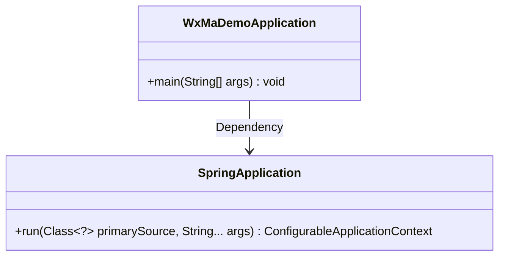
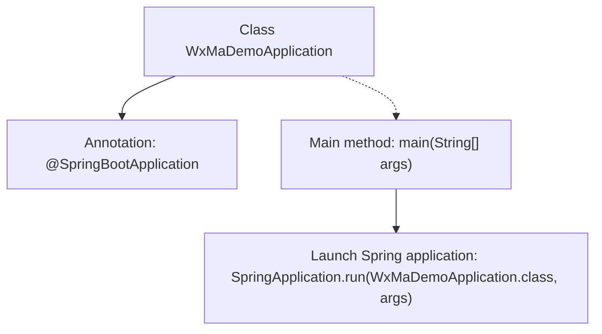

# Basic Information

|      |      |
|------|------|
| Name | WxMaDemoApplication |
| Language | .java |
| Code Path | weixin-java-miniapp-demo\src\main\java\com\github\binarywang\demo\wx\miniapp\WxMaDemoApplication.java |
| Package Name | com.github.binarywang.demo.wx.miniapp |
| Dependencies | ['org.springframework.boot.SpringApplication', 'org.springframework.boot.autoconfigure.SpringBootApplication'] |
| Brief Description | This is the main class of a Spring Boot application, marked with the @SpringBootApplication annotation, which starts the application via the main method. |

# Description

This is the entry class for a WeChat Mini Program Demo application based on the Spring Boot framework. The class is annotated with `@SpringBootApplication`, indicating it is the main configuration class of a Spring Boot application. The `main` method serves as the program entry point, launching the entire application via the `SpringApplication.run` method by passing the current class object and command-line arguments. This structure represents the standard startup approach for a typical Spring Boot application.

# Class Summary

| Name   | Type  | Description |
|-------|------|-------------|
| WxMaDemoApplication | class | This is the main class of a Spring Boot application, marked with the @SpringBootApplication annotation, which starts the application via the main method. |

## Class WxMaDemoApplication

|      |      |
|------|------|
| Access Modifier | @SpringBootApplication;public |
| Type | class |
| Name | WxMaDemoApplication |
| Description | This is the main class of a Spring Boot application, marked with the @SpringBootApplication annotation, which starts the application via the main method. |

### UML Class Diagram

This code illustrates a simple Spring Boot application launcher class `WxMaDemoApplication`, which invokes `SpringApplication.run()` via its `main` method to bootstrap the application. The class diagram comprises two primary classes: `WxMaDemoApplication` serves as the entry point class, depending on the core launching functionality of `SpringApplication`. The `run` method of `SpringApplication` employs the generic parameter `Class<?>` to accept any primary configuration class, embodying Spring Boot's convention-over-configuration principle.

### Internal Method Call Graph

This flowchart illustrates the core structure of the WxMaDemoApplication class. The class is marked with the @SpringBootApplication annotation, indicating it as the main configuration class of a Spring Boot application. The program entry point is the main method, which starts the entire Spring Boot application by invoking SpringApplication.run(), passing the current class object and command-line arguments as parameters. This concise flow demonstrates the standard bootstrapping approach of a Spring Boot application, where the annotation handles auto-configuration while the run method initializes the application context and launches the embedded server.

### Field List

| Name  | Type  | Description |
|-------|-------|------|

### Method List

| Name  | Type  | Description |
|-------|-------|------|
| main | void | Start a Spring Boot application by running the WxMaDemoApplication class via the Java main method. |

