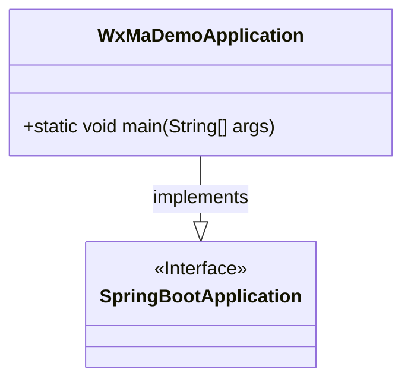
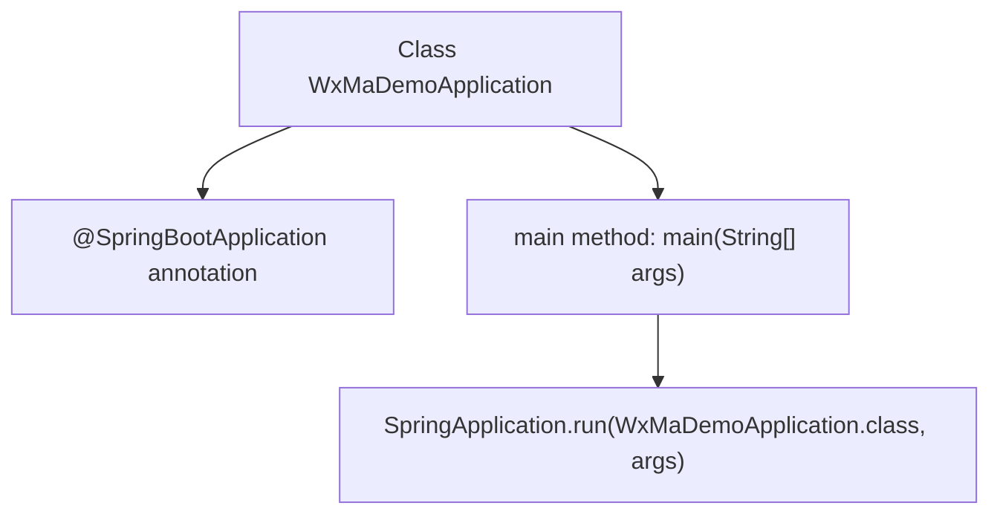

# Basic Information

|      |      |
|------|------|
| Name | WxMaDemoApplication |
| Language | .java |
| Code Path | weixin-java-miniapp-demo/src/main/java/com/github/binarywang/demo/wx/miniapp/WxMaDemoApplication.java |
| Package Name | com.github.binarywang.demo.wx.miniapp |
| Dependencies | ['org.springframework.boot.SpringApplication', 'org.springframework.boot.autoconfigure.SpringBootApplication'] |
| Brief Description | This is a Spring Boot application startup class, marked with the @SpringBootApplication annotation, and starts the Spring application context through the main method. |

# Description

This is a backend application startup class for a WeChat Mini Program based on the Spring Boot framework. This class is identified as the Spring Boot application entry point through the @SpringBootApplication annotation, and contains a main method used to start the Spring application context. When the program executes, it will initialize the Spring container and load relevant configurations to provide backend service support for the WeChat Mini Program. As the startup bootstrap program for the entire application, this class is responsible for initializing the framework environment and runtime configuration.

# Class Summary

| Name   | Type  | Description |
|-------|------|-------------|
| WxMaDemoApplication | class | This is the startup class of a Spring Boot application, named WxMaDemoApplication. This class is annotated with @SpringBootApplication and contains a main method used to start the Spring application context. |

## Class WxMaDemoApplication

|      |      |
|------|------|
| Access Modifier | @SpringBootApplication;public |
| Type | class |
| Name | WxMaDemoApplication |
| Description | This is the startup class of a Spring Boot application, named WxMaDemoApplication. This class is annotated with @SpringBootApplication and contains a main method used to start the Spring application context. |

### UML Class Diagram

This class diagram describes a Spring Boot-based application startup class `WxMaDemoApplication`, which implements the `SpringBootApplication` interface. This class contains a static main method used to start the Spring Boot application context. Through the @SpringBootApplication annotation, this class simultaneously assumes configuration and startup responsibilities, serving as the entry point for the entire WeChat Mini Program backend service.

### Internal Method Call Graph

This flowchart illustrates the structure and execution process of the Spring Boot application startup class `WxMaDemoApplication`. The `@SpringBootApplication` annotation enables Spring Boot features, the `main` method calls `SpringApplication.run()` to start the application context, completing program initialization and execution. The overall logic is clear and represents a standard Spring Boot startup entry point.

### Field List

| Name  | Type  | Description |
|-------|-------|------|

### Method List

| Name  | Type  | Description |
|-------|-------|------|
| main | void | This is the main startup class method of a Spring Boot application, used to launch the WeChat Mini Program Demo application. |

