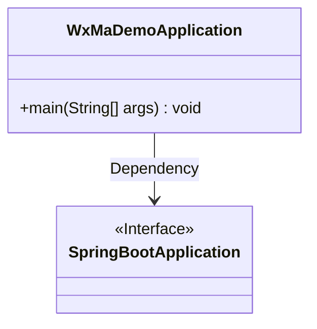
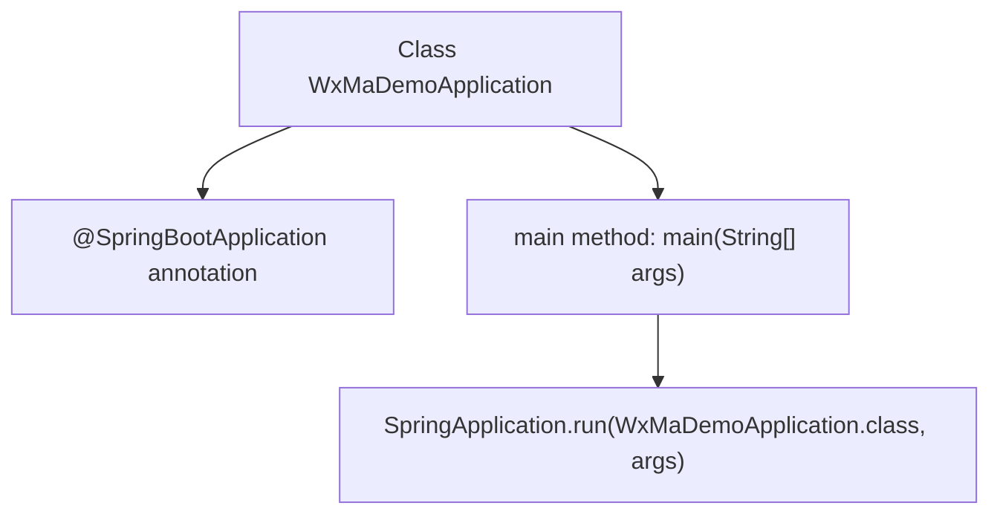

# Basic Information

|      |      |
|------|------|
| Name | WxMaDemoApplication |
| Language | .java |
| Code Path | weixin-java-miniapp-demo/src/main/java/com/github/binarywang/demo/wx/miniapp/WxMaDemoApplication.java |
| Package Name | com.github.binarywang.demo.wx.miniapp |
| Dependencies | ['org.springframework.boot.SpringApplication', 'org.springframework.boot.autoconfigure.SpringBootApplication'] |
| Brief Description | This is the startup class of a Spring Boot application, named WxMaDemoApplication. This class is annotated with @SpringBootApplication and contains a main method used to start the Spring application context. |

# Description

This is the main startup class of a Spring Boot application, named WxMaDemoApplication. This class is annotated with @SpringBootApplication, indicating that it is a Spring Boot application. The main method serves as the program entry point, and the entire Spring Boot application context environment is started through the SpringApplication.run() method.

# Class Summary

| Name   | Type  | Description |
|-------|------|-------------|
| WxMaDemoApplication | class | This is the startup class of a Spring Boot application, named WxMaDemoApplication. This class is annotated with @SpringBootApplication and contains a main method used to start the Spring application context. |

## Class WxMaDemoApplication

|      |      |
|------|------|
| Access Modifier | @SpringBootApplication;public |
| Type | class |
| Name | WxMaDemoApplication |
| Description | This is the startup class of a Spring Boot application, named WxMaDemoApplication. This class is annotated with @SpringBootApplication and contains a main method used to start the Spring application context. |

### UML Class Diagram

This class diagram shows a WeChat Mini Program application startup class `WxMaDemoApplication` based on Spring Boot. It is identified as a Spring Boot application through the `@SpringBootApplication` annotation, and starts the Spring application context in the main method. This class depends on the Spring Boot core mechanism to complete application initialization and execution.

### Internal Method Call Graph

This flowchart illustrates the structure and execution flow of the Spring Boot application startup class `WxMaDemoApplication`. It is identified as a Spring Boot application through the `@SpringBootApplication` annotation. The `main` method calls `SpringApplication.run()` to start the application context, completing the initialization of the Spring container and the startup of the web service. The overall logic is clear and represents a standard Spring Boot startup entry point.

### Field List

| Name  | Type  | Description |
|-------|-------|------|

### Method List

| Name  | Type  | Description |
|-------|-------|------|
| main | void | This is the main startup class of a Spring Boot application, which starts the WxMaDemoApplication application through the SpringApplication.run() method. |

