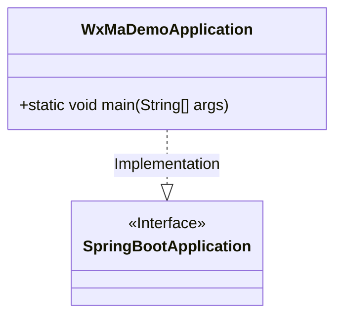
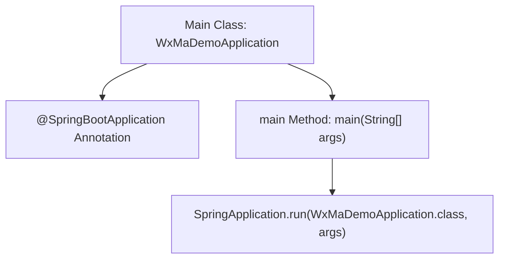

# Basic Information

|      |      |
|------|------|
| Name | WxMaDemoApplication |
| Language | .java |
| Code Path | weixin-java-miniapp-demo/src/main/java/com/github/binarywang/demo/wx/miniapp/WxMaDemoApplication.java |
| Package Name | com.github.binarywang.demo.wx.miniapp |
| Dependencies | ['org.springframework.boot.SpringApplication', 'org.springframework.boot.autoconfigure.SpringBootApplication'] |
| Brief Description | This is the startup class of a Spring Boot application, marked with the @SpringBootApplication annotation, and starts the Spring application context through the main method. |

# Description

This is a backend application startup class for a WeChat Mini Program based on the Spring Boot framework. This class is identified as the Spring Boot application entry point through the @SpringBootApplication annotation, and contains a main method internally for starting the Spring application context. When the program executes, it initializes the Spring container and loads related configurations to provide backend service support for the WeChat Mini Program. As the startup bootstrap program for the entire application, this class is responsible for initializing the framework environment and starting the Web server.

# Class Summary

| Name   | Type  | Description |
|-------|------|-------------|
| WxMaDemoApplication | class | This is a Spring Boot application startup class, marked with the @SpringBootApplication annotation, and starts the Spring application context through the main method. |

## Class WxMaDemoApplication

|      |      |
|------|------|
| Access Modifier | @SpringBootApplication;public |
| Type | class |
| Name | WxMaDemoApplication |
| Description | This is a Spring Boot application startup class, marked with the @SpringBootApplication annotation, and starts the Spring application context through the main method. |

### UML Class Diagram

This class diagram illustrates a WeChat Mini Program application startup class based on the Spring Boot framework. `WxMaDemoApplication` is the entry point of the application, containing the `main` method used to start the Spring Boot application. It is identified as a standard Spring Boot application configuration class through the `@SpringBootApplication` annotation, indicating that it possesses core functionalities such as auto-configuration and component scanning. This design follows the typical Spring Boot project structure, simplifying the initialization process of the WeChat Mini Program backend service.

### Internal Method Call Graph

This flowchart illustrates the structure and execution process of the Spring Boot-based main class `WxMaDemoApplication`. First, it is identified as a Spring Boot application through the `@SpringBootApplication` annotation, then the application context is started by calling `SpringApplication.run()` within the `main` method, completing the project's initialization and execution. The entire process reflects the standard Spring Boot startup mechanism.

### Field List

| Name  | Type  | Description |
|-------|-------|------|

### Method List

| Name  | Type  | Description |
|-------|-------|------|
| main | void | This is the main startup class of a Spring Boot application, which starts the WxMaDemoApplication through the SpringApplication.run() method. |

