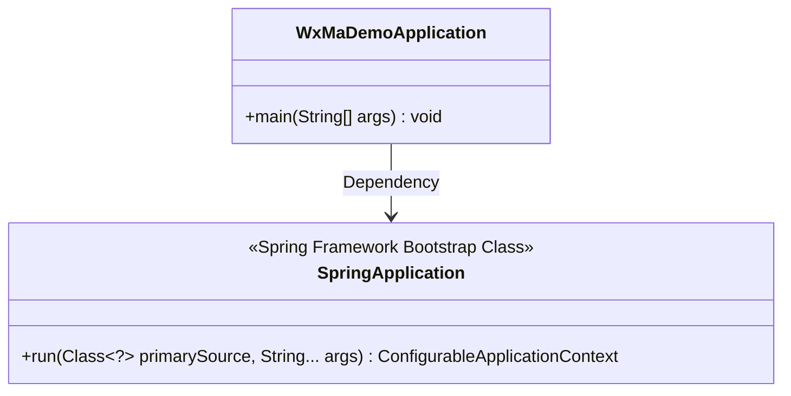
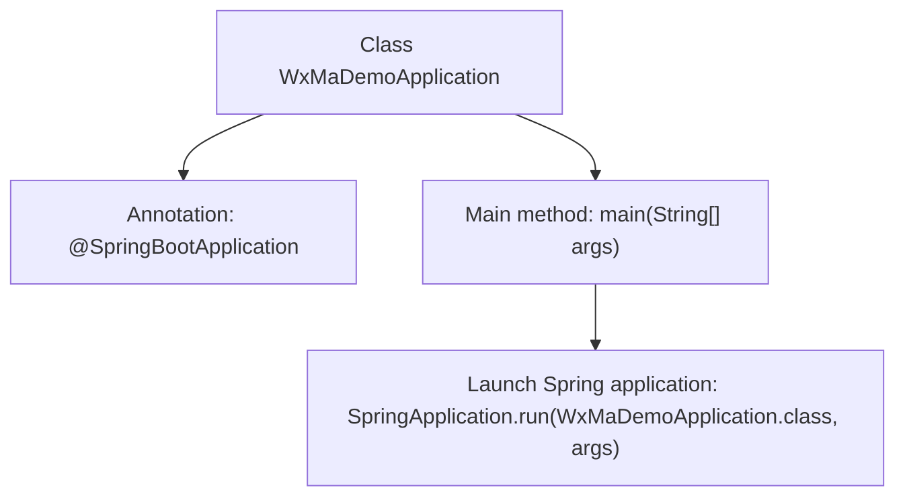

# Basic Information

|      |      |
|------|------|
| Name | WxMaDemoApplication |
| Language | .java |
| Code Path | weixin-java-miniapp-demo/src/main/java/com/github/binarywang/demo/wx/miniapp/WxMaDemoApplication.java |
| Package Name | com.github.binarywang.demo.wx.miniapp |
| Dependencies | ['org.springframework.boot.SpringApplication', 'org.springframework.boot.autoconfigure.SpringBootApplication'] |
| Brief Description | This is the main class of a Spring Boot application, marked with the @SpringBootApplication annotation, which starts the application via the main method. |

# Description

This content describes a Java application entry class based on the Spring Boot framework. The class is named WxMaDemoApplication and is marked with the @SpringBootApplication annotation, indicating that it is the main configuration class of a Spring Boot application. This annotation combines the functionalities of three core annotations: @Configuration, @EnableAutoConfiguration, and @ComponentScan. The class includes a standard Java main method as the program entry point, which starts the entire Spring Boot application by calling the SpringApplication.run method, passing the current class object and command-line arguments (args). This class follows the typical structure of a Spring Boot application startup class, used to initialize the application context and enable auto-configuration.

# Class Summary

| Name   | Type  | Description |
|-------|------|-------------|
| WxMaDemoApplication | class | This is the main class of a Spring Boot application, marked with the @SpringBootApplication annotation, which starts the application via the main method. |

## Class WxMaDemoApplication

|      |      |
|------|------|
| Access Modifier | @SpringBootApplication;public |
| Type | class |
| Name | WxMaDemoApplication |
| Description | This is the main class of a Spring Boot application, marked with the @SpringBootApplication annotation, which starts the application via the main method. |

### UML Class Diagram

This code demonstrates a typical Spring Boot application bootstrap class structure. The WxMaDemoApplication class, annotated with @SpringBootApplication, serves as the entry point of the Spring Boot application. Its main() method delegates to SpringApplication.run() to launch the entire application. The class diagram clearly illustrates the dependency relationship between the bootstrap class and Spring framework's core class SpringApplication, where SpringApplication provides static methods to run Spring applications and returns a configurable application context. This design embodies Spring Boot's convention-over-configuration philosophy, simplifying the application startup process.

### Internal Method Call Graph

This flowchart illustrates the core structure of a WeChat Mini Program application's startup class based on Spring Boot. The class WxMaDemoApplication is marked as the Spring Boot application entry point by the @SpringBootApplication annotation. The main method serves as the program's starting point, invoking the SpringApplication.run() method, which initializes the Spring container, loads auto-configuration, and starts the embedded server. The entire process is concise and clear, demonstrating the standard startup pattern of a Spring Boot application, where annotation-driven development and auto-configuration are the framework's core features.

### Field List

| Name  | Type  | Description |
|-------|-------|------|

### Method List

| Name  | Type  | Description |
|-------|-------|------|
| main | void | Start a Spring Boot application with the Java main method by running the WxMaDemoApplication class. |

