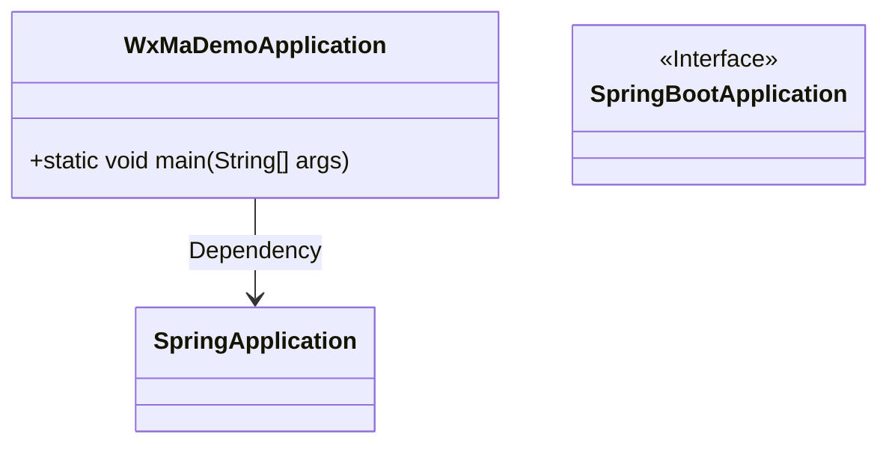
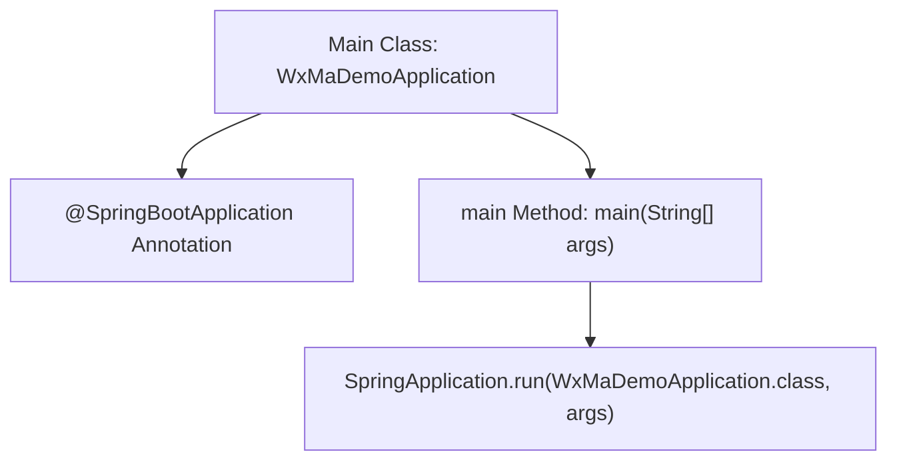

# Basic Information

|      |      |
|------|------|
| Name | WxMaDemoApplication |
| Language | .java |
| Code Path | weixin-java-miniapp-demo/src/main/java/com/github/binarywang/demo/wx/miniapp/WxMaDemoApplication.java |
| Package Name | com.github.binarywang.demo.wx.miniapp |
| Dependencies | ['org.springframework.boot.SpringApplication', 'org.springframework.boot.autoconfigure.SpringBootApplication'] |
| Brief Description | This is the startup class of a Spring Boot application, marked with the @SpringBootApplication annotation, and starts the Spring application context through the main method. |

# Description

This is the main startup class of a Spring Boot application named WxMaDemoApplication. This class is marked with the @SpringBootApplication annotation, indicating that it is the entry point of a Spring Boot application. The main method starts the entire application through the SpringApplication.run() method, passing the WxMaDemoApplication class as a parameter along with the command line arguments args. This class serves as the startup entry for the WeChat Mini Program related functionality demonstration project.

# Class Summary

| Name   | Type  | Description |
|-------|------|-------------|
| WxMaDemoApplication | class | This is the startup class of a Spring Boot application named WxMaDemoApplication. This class is annotated with @SpringBootApplication and contains a main method used to start the Spring application context. |

## Class WxMaDemoApplication

|      |      |
|------|------|
| Access Modifier | @SpringBootApplication;public |
| Type | class |
| Name | WxMaDemoApplication |
| Description | This is the startup class of a Spring Boot application named WxMaDemoApplication. This class is annotated with @SpringBootApplication and contains a main method used to start the Spring application context. |

### UML Class Diagram

This class diagram shows a Spring Boot-based WeChat Mini Program application startup class `WxMaDemoApplication`, which depends on `SpringApplication` to run the application context, and is identified as a standard Spring Boot application configuration entry point through the `@SpringBootApplication` annotation. This class diagram reflects the typical Spring Boot project startup structure.

### Internal Method Call Graph

This flowchart illustrates the startup process of a Spring Boot application. The `WxMaDemoApplication` class is identified as the Spring Boot application entry point through the `@SpringBootApplication` annotation. The `main` method calls `SpringApplication.run()` to start the application context and initialize the Spring container. The entire process reflects the standard Spring Boot startup mechanism.

### Field List

| Name  | Type  | Description |
|-------|-------|------|

### Method List

| Name  | Type  | Description |
|-------|-------|------|
| main | void | This is the main startup class of a Spring Boot application, which starts the WxMaDemoApplication through the SpringApplication.run() method. |

