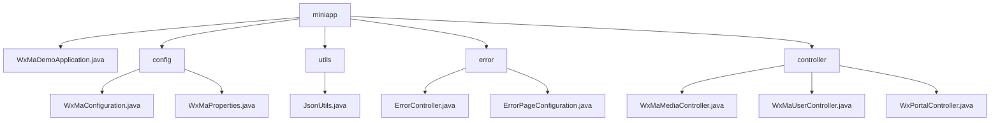

# Basic Information

|      |      |
|------|------|
| Name | miniapp |
| Language | .java |
| Code Path | weixin-java-miniapp-demo\src\main\java\com\github\binarywang\demo\wx\miniapp |
| Package Name | docs.src.main.java.com.github.binarywang.demo.wx.miniapp |
| Brief Description | WeChat Mini Program backend system, featuring multi-account management, message routing, error handling, media file management, and user session functionality, implemented based on Spring Boot and WeChat SDK. |

# Description

## Overview  
This module serves as a comprehensive backend system for WeChat Mini Programs, with core responsibilities including multi-account service configuration, message routing and distribution, and HTTP error handling, functioning similarly to a gateway routing and error handling hub. It manages multiple accounts via WxMaProperties, with key data structures such as the Config class (Appid/Secret), a message routing Map, and an ErrorPage registry. It relies on the WeChat SDK, Spring Web, and Lombok. For example, @ConfigurationProperties injects configurations, MsgRouter predefines five types of handlers, and ErrorController uniformly renders error pages.  

## Key Business Scenarios  
The module covers the entire lifecycle of a Mini Program: initializing and validating configurations → building multi-account services → processing messages/errors. The interaction model is event-driven, such as text messages triggering customer service replies or 404 errors redirecting to preset pages. It fully supports WeChat protocols (e.g., subscription message distribution) and HTTP status handling. Typical workflows include media file uploads (returning media_id), user login (AES-decrypted information), and portal interactions (GET/POST dual modes). API integration examples include QR code generation and session maintenance, all implemented within a multi-tenant architecture based on AppID isolation.

### Package Internal Structure View

This flowchart illustrates the directory structure of a WeChat Mini Program Demo project. The root node "miniapp" contains five submodules: the main application class, configuration directory, utility class directory, error handling directory, and controller directory. Each submodule includes corresponding implementation files, such as the configuration module containing WeChat configuration and property classes, and the controller module comprising media, user, and portal controller classes.

# File List

| Name   | Type  | Description |
|-------|------|-------------|
| [WxMaDemoApplication.java](WxMaDemoApplication.md) | file | This is the main class of a Spring Boot application, marked with the @SpringBootApplication annotation, which launches the application via the main method. |
| [config](config/_module.md) | package | WeChat Mini Program backend configuration class, initializes services and message routing, supports multiple accounts, and defines five message processing rules. The configuration property class binds Mini Program configuration items, including fields such as ID and secret key. |
| [controller](controller/_module.md) | package | The three controller classes in WeChat Mini Program: the Media Management class handles file uploads and downloads; the User Management class handles login, user information, and phone numbers; the Portal class handles WeChat authentication and message routing. All verify the appid and clean up ThreadLocal. |
| [utils](utils/_module.md) | package | The JsonUtils class provides a static method `toJson`, which uses ObjectMapper to convert an object into a JSON string, automatically ignoring null values and formatting the output. Returns null in case of an exception. |
| [error](error/_module.md) | package | The Spring MVC controller handles 404/500 errors and returns a unified view. The configuration class registers error page mappings, directing 404 to /error/404 and 500 to /error/500. |

