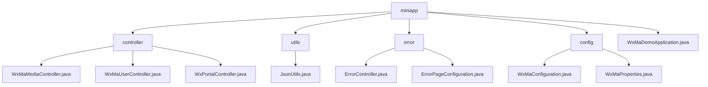

# Basic Information

|      |      |
|------|------|
| Name | miniapp |
| Language | .java |
| Code Path | weixin-java-miniapp-demo/src/main/java/com/github/binarywang/demo/wx/miniapp |
| Package Name | docs.src.main.java.com.github.binarywang.demo.wx.miniapp |
| Brief Description | This module provides backend support for WeChat Mini Programs, covering user authentication, media management, message processing, and other functions. It supports multi-application configuration switching and secure access control, adopts RESTful API and JSON response format, depends on the weixin-java-miniapp SDK, and has good extensibility and stability. |

# Description

## Overview  
This module provides backend core support for WeChat Mini Programs, covering user authentication, media management, message routing, and multi-application configuration switching. It uniformly provides services through RESTful APIs, adopts JSON as the interaction format, and clears ThreadLocal variables at the end of requests to prevent memory leaks. For example: WxMaUserController handles login and information decryption, while WxPortalController is responsible for message distribution.

The module's interface specifications are uniformly designed based on Spring MVC style, supporting GET/POST method calls and compatible with both plaintext and AES encrypted transmission methods. Key data structures include WxMaJscode2SessionResult (login credential result), WxMaUserInfo (user sensitive information), and WxMpXmlMessage (WeChat push messages). External dependencies mainly include the weixin-java-miniapp SDK, Spring Boot Web components, and related HTTP client libraries.

## Main Business Scenarios  
The module supports three typical processes: user identity verification and session management, temporary material upload and download, and WeChat platform message subscription and event response. The interaction pattern is similar to MVC architecture, where frontend requests are parsed by Controllers before calling Service layer processing, ultimately returning a unified format response. For example: scan-to-login is handled by UserController, while avatar upload is executed by MediaController.

Functionally, it implements a full-link closed loop from configuration loading, message listening to customer service message pushing, with good scalability and integration capabilities. Typical application scenarios such as enterprise-level multi-tenant mini program platforms can quickly build standardized communication entry points through this module. API types cover configuration injection interfaces and message callback interfaces, supporting flexible expansion of new message types. For example: when receiving an image message, it automatically uploads and returns the processing result.

### Package Internal Structure View

This flowchart shows the module structure of the WeChat Mini Program Demo project, including the main components such as controllers, utility classes, error handling, and configuration, along with their hierarchical relationships.

# File List

| Name   | Type  | Description |
|-------|------|-------------|
| [WxMaDemoApplication.java](WxMaDemoApplication.md) | file | This is the startup class of a Spring Boot application named WxMaDemoApplication. This class is annotated with @SpringBootApplication and contains a main method used to start the Spring application context. |
| [config](config/_module.md) | package | This configuration class is used to initialize the WeChat Mini Program service. It completes the registration and management of multiple mini program accounts by reading configuration properties, builds a message router, and defines message processing logic for text, images, QR codes, and other message types. It supports sending customer service messages and subscription message notifications. |
| [error](error/_module.md) | package | This is a Spring Boot error handling system that includes an error controller and configuration class. The controller handles 404 and 500 error requests, uniformly returning the error view; the configuration class registers custom error pages, implementing an elegant error notification mechanism. |
| [utils](utils/_module.md) | package | The JsonUtils utility class provides JSON serialization functionality, using ObjectMapper to implement the conversion from objects to JSON strings. It is configured with non-null field serialization and formatted output. It returns null and prints stack information when an exception occurs. |
| [controller](controller/_module.md) | package | This controller implements the media file upload and download functionality for WeChat Mini Programs, supporting multi-file processing and exception handling. It provides user login, information retrieval, and phone number binding interfaces, handling JSCode validation and session management. Additionally, it is responsible for Mini Program access verification and message reception processing, supporting both plaintext and AES encrypted transmission, automatically switching between JSON or XML format parsing, routing data to designated processors, and ensuring stable service operation. |

