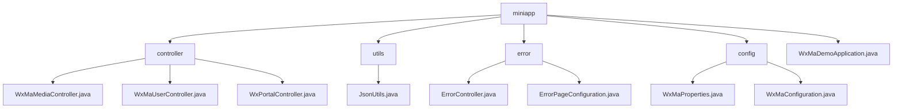

# Basic Information

|      |      |
|------|------|
| Name | miniapp |
| Language | .java |
| Code Path | weixin-java-miniapp-demo/src/main/java/com/github/binarywang/demo/wx/miniapp |
| Package Name | docs.src.main.java.com.github.binarywang.demo.wx.miniapp |
| Brief Description | This module provides backend services for WeChat Mini Programs, supporting multi-instance configuration, user authentication, media management, and message push. It adopts a RESTful interface design, integrates the WxJava SDK with the Spring Boot framework, implements functions such as file upload, JSON parsing, and AES encrypted communication, and enhances system stability through a unified error handling mechanism. |

# Description

## Overview

This module provides backend core services for WeChat Mini Programs, supporting multi-instance configuration, user authentication, message processing, and media resource management. Request isolation is achieved through AppId routing and thread-local variables, while integration with the WxJava SDK enables compliance with WeChat protocols. Examples include uploading images to return MediaIds and obtaining user sessions based on Codes.

The interfaces follow RESTful style, supporting Multipart file transfer, JSON/XML parsing, and AES encrypted communication. Key dependencies include wx-java-miniapp-spring-boot-starter, commons-fileupload, and Spring Web-related components. Core data structures encompass WxMaConfig, WxMaUserInfo, WxMaJscode2SessionResult, and WxMpXmlMessage.

Additionally, it includes a unified error handling mechanism that renders 404/500 status views via ErrorController and ErrorPageConfiguration. Similar to an event bus architecture, error requests are centrally dispatched to the /error path and rendered using Thymeleaf template pages.

The module uses the JsonUtils utility class for JSON serialization operations, configured with Jackson's ObjectMapper to ignore null values and format output. The overall structure follows standard Spring Boot conventions, initialized by the WxMaDemoApplication startup class.

## Main Business Scenarios

The module integrates three major interaction flows of WeChat Mini Programs: user login, message push, and material management. Its interaction pattern resembles an event bus architecture where the Portal Controller dispatches requests uniformly. For example, GET validates URL validity, POST receives user behavior data, and Service components execute specific logic.

It supports the complete lifecycle from configuration loading to service operation. Multi-instance parameters are bound using WxMaProperties, and different types of events are routed by the message router to handlers such as logs, text replies, or image responses. Typical applications include returning QR codes upon scanning and triggering message pushes via subscription notifications.

API types cover HTTP interfaces at the Controller layer, business logic at the Service layer, and custom message handler registration mechanisms, suitable for deployment in Spring Boot microservice environments. It also integrates a unified error page mechanism to enhance frontend experience consistency, enabling developers to quickly reuse and build custom error prompt interfaces.```


### Package Internal Structure View



This flowchart shows the module structure of the WeChat Mini Program Java backend demo project, including main components such as controllers, utility classes, error handling, and configuration, along with their hierarchical relationships.

# File List

| Name   | Type  | Description |
|-------|------|-------------|
| [WxMaDemoApplication.java](WxMaDemoApplication.md) | file | This is the startup class of a Spring Boot application, marked with the @SpringBootApplication annotation, and starts the Spring application context through the main method. |
| [config](config/_module.md) | package | This class is the configuration class for WeChat Mini Programs. It reads configuration properties with the prefix `wx.miniapp` through the `@ConfigurationProperties` annotation, supporting multiple sets of Mini Program configurations. It contains a static inner class `Config` that defines core parameters such as appid, secret, token, aesKey, and msgDataFormat. A List collection is used to manage multiple sets of configuration information, which is utilized to initialize the Mini Program service and register message routers to handle various messaging scenarios. |
| [error](error/_module.md) | package | This is a Spring Boot error handling system that includes an error controller and configuration class. The controller handles 404 and 500 errors and returns a unified error page, while the configuration class maps HTTP status codes to corresponding error paths for unified management. |
| [utils](utils/_module.md) | package | The JsonUtils utility class provides JSON serialization functionality, using ObjectMapper to implement the conversion from objects to JSON strings. It is configured with non-null field serialization and formatted output. In case of exceptions, it returns null and prints stack trace information. |
| [controller](controller/_module.md) | package | This controller implements the media file upload and download functionality for WeChat Mini Programs. It supports uploading temporary image materials and returning a list of media_ids, provides the capability to download materials based on mediaId, receives files in multipart format and processes requests through CommonsMultipartResolver, cleans up thread-local variables after each operation, and throws an exception prompt when the corresponding appid configuration is not found. |


