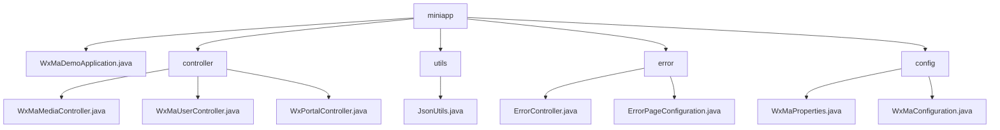

# Basic Information

|      |      |
|------|------|
| Name | miniapp |
| Language | .java |
| Code Path | weixin-java-miniapp-demo/src/main/java/com/github/binarywang/demo/wx/miniapp |
| Package Name | docs.src.main.java.com.github.binarywang.demo.wx.miniapp |
| Brief Description | WeChat Mini Program backend core modules, including media management, user sessions, and message routing functionalities, supporting multi-account configuration. Built with the Spring Boot framework, it includes error handling and JSON utility classes. |

# Description

## Overview  
This module is a collection of backend services for WeChat Mini Programs, with core responsibilities including media file management, user session services, and WeChat message routing, while also integrating error page handling and configuration management features. It adopts a multi-tenant architecture based on appid, with interface specifications adhering to the Spring MVC standard. Key data structures encompass media_id lists, user session JSON, WeChat message objects, and the WxMaProperties configuration class. External dependencies include WeChat SDK encryption services, HTTP request processing, and the Spring framework. For example, the upload interface returns a media_id, the login interface returns a sessionKey, and error handling automatically routes to a 404 page.  

## Core Business Scenarios  
The module supports three types of core workflows: 1) Media file management operates similarly to CDN operations; 2) User authentication follows the OAuth2.0 pattern; 3) Message routing employs an event bus mechanism. A typical interaction follows the request→validation→execution→cleanup→response loop, fully covering the backend development needs of Mini Programs. Multi-tenant configuration management supports parallel processing of multiple Mini Program instances, and error handling implements automatic redirection through status code mapping. For example, exchanging a code for a session or routing messages to the corresponding handler chain based on message type.

### Package Internal Structure View

This flowchart illustrates the core structure of a WeChat Mini Program Demo project, including the main application class, controllers, utility classes, error handling modules, and configuration modules. The controller section contains three implementation classes, the error handling and configuration modules each have two components, and the utility class includes a JSON processing tool. The overall structure is clear with well-defined module divisions.

# File List

| Name   | Type  | Description |
|-------|------|-------------|
| [WxMaDemoApplication.java](WxMaDemoApplication.md) | file | This is the main class of a Spring Boot application, marked with the @SpringBootApplication annotation, which starts the application via the main method. |
| [controller](controller/_module.md) | package | Three controller classes in WeChat Mini Program: The Media Controller handles file uploads and downloads; the User Controller provides login, user information retrieval, and phone number functionality; the Portal Controller manages WeChat server authentication and message routing. All are configured based on appid and clean up ThreadLocal. |
| [config](config/_module.md) | package | WxMaProperties is a configuration class for WeChat Mini Programs, supporting multi-account management and containing fields such as appid and secret keys. WxMaConfiguration initializes services and handles message routing, incorporating various message handlers and exception handling. |
| [error](error/_module.md) | package | Spring MVC error handling controller, mapping the `/error` path, including 404 and 500 error handling methods. The configuration class implements the `ErrorPageRegistrar` interface to register 404 and 500 error page paths. |
| [utils](utils/_module.md) | package | The JsonUtils class provides static JSON serialization methods, using ObjectMapper to configure non-null field output and formatting, returning null on exceptions. |

