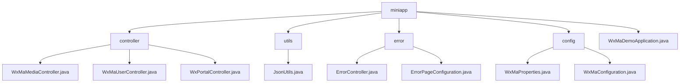

# Basic Information

|      |      |
|------|------|
| Name | miniapp |
| Language | .java |
| Code Path | weixin-java-miniapp-demo/src/main/java/com/github/binarywang/demo/wx/miniapp |
| Package Name | docs.src.main.java.com.github.binarywang.demo.wx.miniapp |
| Brief Description | This module provides backend support for WeChat Mini Programs, covering media upload and download, user login, message processing, and other functions. Based on Spring Boot and the WXJava SDK, it implements multi-mini-program management, interface routing, and secure communication. It supports JSON/XML parsing, unified exception handling, and dynamic configuration loading, making it suitable for enterprise-level WeChat ecosystem integration scenarios. |

# Description

## Overview

This module provides backend core support for WeChat Mini Programs, covering user login, media resource management, message receiving, and multi-instance routing functionalities. By integrating the WXJava SDK and Spring Boot framework, it implements RESTful API-style interfaces and multi-tenant configuration management. For example: using WxMaService to handle credential validation, and WxMaConfig to support switching between multiple mini programs.

The module exposes unified HTTP interfaces, supporting GET/POST requests with JSON/XML format interaction, and includes built-in encryption/decryption and exception handling mechanisms. Key data structures include MediaId, JSCode, Echostr, HttpStatus, ModelAndView, etc., combined with ThreadLocal cleanup mechanisms to ensure service stability.

Main external dependencies include the WXJava Miniapp SDK, Spring Boot Web module, Jackson library, and related logging components. For example: JsonUtils uses ObjectMapper to implement object-to-JSON formatting conversion.

## Main Business Scenarios

The module covers three core business processes: first, media upload and download (such as image acquisition of MediaId), second, user identity verification (such as exchanging JSCode for OpenId), and third, message subscription and event distribution (such as automatic reply to text messages). The system achieves multi-mini-program access through Appid routing, supporting plaintext/AES transmission and parsing of various message types.

The error handling mechanism uniformly takes over exception states such as 404/500, combining ErrorController and ErrorPageRegistrar to achieve page redirection or response output. For example, when accessing an illegal path, it redirects to the /error/404 view.

Typical application scenarios include third-party platforms hosting multiple mini programs, enterprise portals connecting to the WeChat ecosystem, and compliance scenarios requiring secure transmission of user sensitive information. API types cover Controller layer HTTP interfaces, SDK calls, and configuration injection, supporting integration with infrastructure such as Nginx and HTTPS gateways. The overall architecture resembles an event bus pattern, featuring good extensibility and dynamic routing capabilities.

### Package Internal Structure View

This flowchart shows the module structure of the WeChat Mini Program Java Demo project, including the hierarchical relationships of main components such as controllers, utility classes, error handling, and configuration.

# File List

| Name   | Type  | Description |
|-------|------|-------------|
| [WxMaDemoApplication.java](WxMaDemoApplication.md) | file | This is a Spring Boot application startup class, marked with the @SpringBootApplication annotation, and starts the Spring application context through the main method. |
| [config](config/_module.md) | package | This class is a configuration management class for WeChat Mini Programs, storing core parameters such as appid, secret, and token, and supporting multi-mini-program configurations. It is used to initialize mini-program services and message routing processing mechanisms, defines handlers for logging, text replies, and image responses, and supports sending customer service messages and subscription notifications. |
| [error](error/_module.md) | package | This is a Spring Boot error handling system that includes an error controller and a configuration class. The controller handles 404 and 500 errors uniformly through @RequestMapping("/error") and returns the error view page. The configuration class implements the ErrorPageRegistrar interface, mapping the 404 and 500 status codes to the /error/404 and /error/500 paths respectively, achieving unified error page management and redirection functionality. |
| [utils](utils/_module.md) | package | The JsonUtils utility class provides JSON serialization functionality, using ObjectMapper to convert objects to JSON strings, configured with non-null field serialization and formatted output, printing stack traces and returning null in case of exceptions. |
| [controller](controller/_module.md) | package | This controller implements media file upload and download functionality for WeChat Mini Programs, supporting multi-file processing and exception handling. Another controller provides user login, information retrieval, and phone number binding interfaces, handling JSCode validation and decryption of sensitive information. The third controller is responsible for Mini Program access authentication and message reception, supporting plaintext and AES-encrypted message parsing, automatically switching between JSON or XML formats and distributing processing. All interfaces validate appid legitimacy and clean up thread context. |

