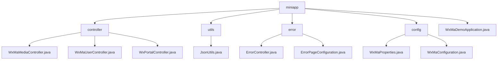

# Basic Information

|      |      |
|------|------|
| Name | miniapp |
| Language | .java |
| Code Path | weixin-java-miniapp-demo/src/main/java/com/github/binarywang/demo/wx/miniapp |
| Package Name | docs.src.main.java.com.github.binarywang.demo.wx.miniapp |
| Brief Description | This module provides backend core functionality for WeChat Mini Programs, including media upload/download, user authentication, and message routing. Developed based on Spring Boot, it supports multi-tenant configuration switching, with interfaces following RESTful style and using JSON communication. Key components include WxMaConfig, WxMaMessage, etc., and it depends on the weixin-java-miniapp SDK. The module covers error handling, configuration management, and application startup bootstrap, featuring high cohesion and low coupling characteristics, making it suitable for independent deployment within microservice architectures.``` |

# Description

## Overview

This module provides comprehensive backend service capabilities for WeChat Mini Programs, covering user authentication, message processing, media resource management, and multi-account configuration support. The interfaces follow RESTful specifications, communicate in JSON format, and ensure thread safety. All controller operations clean up ThreadLocal resources upon completion, similar to ServletContext lifecycle management mechanisms. Key data structures include WxMaConfig, WxMaJscode2SessionResult, and WxMaMessage. External dependencies mainly consist of the weixin-java-miniapp SDK, Spring Boot, and its Web module, without introducing other third-party libraries. For example: upload images via /media/upload to obtain media_id; decrypt phone numbers using /wxa/business/getuserphonenumber; configure multiple mini-program instances through wx.miniapp.configs.

## Main Business Scenarios

The module supports four core processes of WeChat Mini Programs: access verification, identity management, message routing, and multimedia interaction. It supports GET signature verification and POST reception of plaintext/AES encrypted messages, and distributes processing through routers to form an interaction architecture similar to an event bus pattern. User-related interfaces implement login state maintenance and sensitive information decryption, such as exchanging code for openid. Media controllers are suitable for typical scenarios like avatar upload and voice download. It also supports unified error page redirection to enhance user experience consistency under exceptional circumstances. API types cover HTTP GET/POST requests, with integration cases including closed-loop processing from WeChat callbacks to business responses. For example: accessing undefined interfaces returns a "page not found" prompt; adding text processors through WxMaMessageRouter implements automatic response functionality.


### Package Internal Structure View



This flowchart shows the module structure of the WeChat Mini Program Demo project, including the main components such as controllers, utility classes, error handling, and configuration, along with their hierarchical relationships.

# File List

| Name   | Type  | Description |
|-------|------|-------------|
| [WxMaDemoApplication.java](WxMaDemoApplication.md) | file | This is the startup class of a Spring Boot application, marked with the @SpringBootApplication annotation, and starts the Spring application context through the main method. |
| [config](config/_module.md) | package | This class is the configuration class for WeChat Mini Programs. It reads configuration information prefixed with `wx.miniapp` through the `@ConfigurationProperties` annotation, supporting management of multiple sets of Mini Program configurations. It contains a static inner class `Config` that defines core configuration items such as appid, secret, token, aesKey, and msgDataFormat. A List collection is used to manage multiple sets of configuration information, which is utilized to initialize the WeChat Mini Program service and message routing processing mechanism, thereby implementing registration management for multiple Mini Program accounts and automated message interaction functionalities. |
| [error](error/_module.md) | package | This is a Spring Boot error handling system that includes an error controller and configuration class. The controller handles 404 and 500 error requests, returning a unified error view. The configuration class implements the ErrorPageRegistrar interface, mapping HTTP 404 and 500 status codes to corresponding error paths, achieving unified error page management. |
| [utils](utils/_module.md) | package | The JsonUtils utility class provides JSON serialization functionality, using ObjectMapper to implement the conversion from objects to JSON strings. It is configured with non-null field serialization and formatted output, returning null in case of exceptions. |
| [controller](controller/_module.md) | package | This controller implements the media file upload and download functionality for WeChat Mini Programs, supporting configuration switching via appid. It uploads temporary image materials and returns a unique media_id, retrieves files based on media_id during download, and automatically cleans up thread-local variables after interface processing is complete. |


