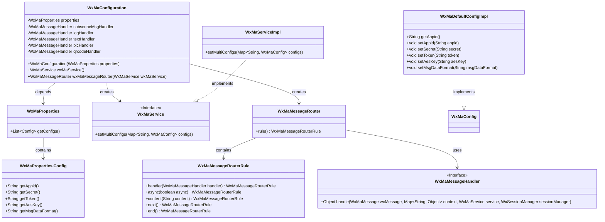
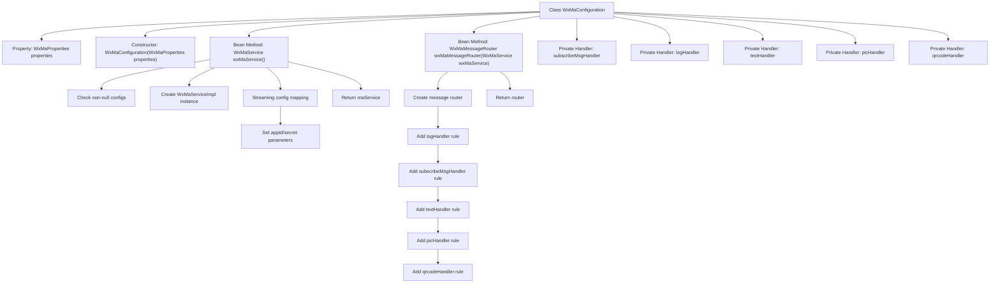

# Basic Information

|      |      |
|------|------|
| Name | WxMaConfiguration |
| Language | .java |
| Code Path | weixin-java-miniapp-demo/src/main/java/com/github/binarywang/demo/wx/miniapp/config/WxMaConfiguration.java |
| Package Name | com.github.binarywang.demo.wx.miniapp.config |
| Dependencies | ['cn.binarywang.wx.miniapp.api.WxMaService', 'cn.binarywang.wx.miniapp.api.impl.WxMaServiceImpl', 'cn.binarywang.wx.miniapp.bean.WxMaKefuMessage', 'cn.binarywang.wx.miniapp.bean.WxMaSubscribeMessage', 'cn.binarywang.wx.miniapp.config.impl.WxMaDefaultConfigImpl', 'cn.binarywang.wx.miniapp.config.impl.WxMaRedisConfigImpl', 'cn.binarywang.wx.miniapp.message.WxMaMessageHandler', 'cn.binarywang.wx.miniapp.message.WxMaMessageRouter', 'com.google.common.collect.Lists', 'lombok.extern.slf4j.Slf4j', 'me.chanjar.weixin.common.bean.result.WxMediaUploadResult', 'me.chanjar.weixin.common.error.WxErrorException', 'me.chanjar.weixin.common.error.WxRuntimeException', 'org.springframework.beans.factory.annotation.Autowired', 'org.springframework.boot.context.properties.EnableConfigurationProperties', 'org.springframework.context.annotation.Bean', 'org.springframework.context.annotation.Configuration', 'redis.clients.jedis.JedisPool', 'java.io.File', 'java.util.List', 'java.util.stream.Collectors'] |
| Brief Description | WeChat Mini Program configuration class, initializes services and message routing, handles subscription, text, image, and QR code messages. |

# Description

This is a configuration class for a WeChat Mini Program backend service, with main functionalities including initializing the WeChat Mini Program service and configuring message routing. The class injects configuration properties through its constructor and validates the configuration information when creating a WeChat Mini Program service instance, throwing an exception if any information is missing. The service supports multi-account configuration, with each account requiring parameters such as appid and secret key. The message routing section defines various message processing rules, including logic for handling logs, subscription messages, text, images, and QR code messages. Each processor responds to specific message types, such as sending customer service messages, uploading media files, or generating QR codes. Exception handling is implemented by printing stack traces.

# Class Summary

| Name   | Type  | Description |
|-------|------|-------------|
| WxMaConfiguration | class | This is a WeChat Mini Program configuration class that includes Bean definitions for WxMaService and WxMaMessageRouter, handling message types such as subscription messages, text, images, and QR codes. |

## Class WxMaConfiguration

|      |      |
|------|------|
| Access Modifier | @Slf4j;@Configuration;@EnableConfigurationProperties(WxMaProperties.class);public |
| Type | class |
| Name | WxMaConfiguration |
| Description | This is a WeChat Mini Program configuration class that includes Bean definitions for WxMaService and WxMaMessageRouter, handling message types such as subscription messages, text, images, and QR codes. |

### UML Class Diagram

This code represents a configuration class for a WeChat Mini Program backend service, whose main functions include initializing the WeChat Mini Program service (WxMaService) and message router (WxMaMessageRouter). WxMaConfiguration reads configuration information from WxMaProperties to create and configure WxMaService instances; it also constructs message routing rules to register corresponding handlers for different types of messages (subscription, text, image, QR code, etc.). The class diagram illustrates the dependency relationships between the configuration class and various components, including core modules such as property configuration, service implementation, message processing, and routing rules.

### Internal Method Call Graph

This flowchart illustrates the core structure of the WeChat Mini Program configuration class WxMaConfiguration. The class injects configuration properties through its constructor and provides two key Beans: wxMaService initializes multi-account configuration services, including parameter validation and streaming configuration mapping; wxMaMessageRouter constructs a message routing rule chain with five message handlers. Each handler implements specific business logic such as logging, subscription message replies, and media file uploads. Arrows clearly indicate the hierarchical call relationships from the class to methods and then to internal processing steps.

### Field List

| Name  | Type  | Description |
|-------|-------|------|
| properties | WxMaProperties | Private immutable WeChat Mini Program configuration property object. |
| picHandler = (wxMessage, context, service, sessionManager) -> {        try {            WxMediaUploadResult uploadResult = service.getMediaService()                .uploadMedia("image", "png",                    ClassLoader.getSystemResourceAsStream("tmp.png"));            service.getMsgService().sendKefuMsg(                WxMaKefuMessage                    .newImageBuilder()                    .mediaId(uploadResult.getMediaId())                    .toUser(wxMessage.getFromUser())                    .build());        } catch (WxErrorException e) {            e.printStackTrace();        }        return null;    } | WxMaMessageHandler | Define a WeChat Mini Program image message handler to upload temporary images and send customer service messages, printing errors when exceptions occur. |
| logHandler = (wxMessage, context, service, sessionManager) -> {        log.info("收到消息：" + wxMessage.toString());        service.getMsgService().sendKefuMsg(WxMaKefuMessage.newTextBuilder().content("收到信息为：" + wxMessage.toJson())            .toUser(wxMessage.getFromUser()).build());        return null;    } | WxMaMessageHandler | Define the WeChat Mini Program message handling logic: Record received messages and automatically reply with the user's message content. |
| subscribeMsgHandler = (wxMessage, context, service, sessionManager) -> {        service.getMsgService().sendSubscribeMsg(WxMaSubscribeMessage.builder()            .templateId("此处更换为自己的模板id")            .data(Lists.newArrayList(                new WxMaSubscribeMessage.MsgData("keyword1", "339208499")))            .toUser(wxMessage.getFromUser())            .build());        return null;    } | WxMaMessageHandler | Define a WeChat Mini Program subscription message handler, which sends subscription messages using specified template IDs and user data, with the recipient being the message sender. |
| textHandler = (wxMessage, context, service, sessionManager) -> {        service.getMsgService().sendKefuMsg(WxMaKefuMessage.newTextBuilder().content("回复文本消息")            .toUser(wxMessage.getFromUser()).build());        return null;    } | WxMaMessageHandler | WeChat Mini Program text message handling: Automatically replies with "Reply to text message" upon receiving a user message. |
| qrcodeHandler = (wxMessage, context, service, sessionManager) -> {        try {            final File file = service.getQrcodeService().createQrcode("123", 430);            WxMediaUploadResult uploadResult = service.getMediaService().uploadMedia("image", file);            service.getMsgService().sendKefuMsg(                WxMaKefuMessage                    .newImageBuilder()                    .mediaId(uploadResult.getMediaId())                    .toUser(wxMessage.getFromUser())                    .build());        } catch (WxErrorException e) {            e.printStackTrace();        }        return null;    } | WxMaMessageHandler | Processing WeChat Mini Program messages, generating QR codes and uploading them as images, then sending them to users via customer service messages. Print errors when exceptions occur. |

### Method List

| Name  | Type  | Description |
|-------|-------|------|
| wxMaService | WxMaService | Create a WeChat Mini Program service instance, initialize multi-account configuration after checking the settings, and return the service object. |
| wxMaMessageRouter | WxMaMessageRouter | Define the message routing rules for WeChat Mini Programs, including logic for handling logs, subscription messages, text, images, and QR codes. |

