# Basic Information

|      |      |
|------|------|
| Name | WxMaConfiguration |
| Language | .java |
| Code Path | weixin-java-miniapp-demo/src/main/java/com/github/binarywang/demo/wx/miniapp/config/WxMaConfiguration.java |
| Package Name | com.github.binarywang.demo.wx.miniapp.config |
| Dependencies | ['cn.binarywang.wx.miniapp.api.WxMaService', 'cn.binarywang.wx.miniapp.api.impl.WxMaServiceImpl', 'cn.binarywang.wx.miniapp.bean.WxMaKefuMessage', 'cn.binarywang.wx.miniapp.bean.WxMaSubscribeMessage', 'cn.binarywang.wx.miniapp.config.impl.WxMaDefaultConfigImpl', 'cn.binarywang.wx.miniapp.config.impl.WxMaRedisConfigImpl', 'cn.binarywang.wx.miniapp.message.WxMaMessageHandler', 'cn.binarywang.wx.miniapp.message.WxMaMessageRouter', 'com.google.common.collect.Lists', 'lombok.extern.slf4j.Slf4j', 'me.chanjar.weixin.common.bean.result.WxMediaUploadResult', 'me.chanjar.weixin.common.error.WxErrorException', 'me.chanjar.weixin.common.error.WxRuntimeException', 'org.springframework.beans.factory.annotation.Autowired', 'org.springframework.boot.context.properties.EnableConfigurationProperties', 'org.springframework.context.annotation.Bean', 'org.springframework.context.annotation.Configuration', 'redis.clients.jedis.JedisPool', 'java.io.File', 'java.util.List', 'java.util.stream.Collectors'] |
| Brief Description | This configuration class is used to initialize WeChat Mini Program services and message routers, supporting multi-mini-program configurations, and defines various message processing logic, including logging, text replies, image sending, and QR code generation functions. |

# Description

This configuration class is used to initialize the WeChat Mini Program service. It creates multiple mini program instances by reading configuration properties and registers message routers. The router distributes messages to different handlers based on message content, handling scenarios such as log recording, subscription message sending, text replies, image and QR code message responses, while also supporting multimedia resource upload and customer service message delivery functions.

# Class Summary

| Name   | Type  | Description |
|-------|------|-------------|
| WxMaConfiguration | class | This configuration class is used to initialize WeChat Mini Program services and message routers, supporting multi-mini-program configurations, and defines various message processing logic, including logging, text replies, image sending, and QR code generation functions. |


## Class WxMaConfiguration

|      |      |
|------|------|
| Access Modifier | @Slf4j;@Configuration;@EnableConfigurationProperties(WxMaProperties.class);public |
| Type | class |
| Name | WxMaConfiguration |
| Description | This configuration class is used to initialize WeChat Mini Program services and message routers, supporting multi-mini-program configurations, and defines various message processing logic, including logging, text replies, image sending, and QR code generation functions. |


### UML Class Diagram

```mermaid
classDiagram
    class WxMaConfiguration {
        -WxMaProperties properties
        -WxMaMessageHandler subscribeMsgHandler
        -WxMaMessageHandler logHandler
        -WxMaMessageHandler textHandler
        -WxMaMessageHandler picHandler
        -WxMaMessageHandler qrcodeHandler
        +WxMaConfiguration(WxMaProperties properties)
        +WxMaService wxMaService()
        +WxMaMessageRouter wxMaMessageRouter(WxMaService wxMaService)
    }

    class WxMaProperties {
        <<Interface>>
        +List~Config~ getConfigs()
    }

    class WxMaService {
        <<Interface>>
        +void setMultiConfigs(Map~String, WxMaDefaultConfigImpl~ configs)
        +WxMaMsgService getMsgService()
        +WxMaMediaService getMediaService()
        +WxMaQrcodeService getQrcodeService()
    }

    class WxMaServiceImpl {
        +void setMultiConfigs(Map~String, WxMaDefaultConfigImpl~ configs)
        +WxMaMsgService getMsgService()
        +WxMaMediaService getMediaService()
        +WxMaQrcodeService getQrcodeService()
    }

    class WxMaDefaultConfigImpl {
        +void setAppid(String appid)
        +void setSecret(String secret)
        +void setToken(String token)
        +void setAesKey(String aesKey)
        +void setMsgDataFormat(String msgDataFormat)
        +String getAppid()
    }

    class WxMaMessageRouter {
        +WxMaMessageRouter(WxMaService wxMaService)
        +WxMaMessageRouter rule()
        +WxMaMessageRouter handler(WxMaMessageHandler handler)
        +WxMaMessageRouter next()
        +WxMaMessageRouter async(boolean async)
        +WxMaMessageRouter content(String content)
        +WxMaMessageRouter end()
    }

    class WxMaMessageHandler {
        <<Interface>>
        +Object handle(WxMaMessage wxMessage, Map~String, Object~ context, WxMaService service, WxSessionManager sessionManager)
    }

    class WxMaMessage {
        +String getFromUser()
        +String toJson()
        +String toString()
    }

    class WxSessionManager {
    }

    class WxMaSubscribeMessage {
        -String templateId
        -List~MsgData~ data
        -String toUser
        +WxMaSubscribeMessage builder()
        +WxMaSubscribeMessage templateId(String templateId)
        +WxMaSubscribeMessage data(List~MsgData~ data)
        +WxMaSubscribeMessage toUser(String toUser)
        +WxMaSubscribeMessage build()
    }

    class WxMaKefuMessage {
        +WxMaKefuMessage newTextBuilder()
        +WxMaKefuMessage newImageBuilder()
        +WxMaKefuMessage content(String content)
        +WxMaKefuMessage mediaId(String mediaId)
        +WxMaKefuMessage toUser(String toUser)
        +WxMaKefuMessage build()
    }

    class WxMediaUploadResult {
        +String getMediaId()
    }

    class WxMaMsgService {
        +void sendSubscribeMsg(WxMaSubscribeMessage message)
        +void sendKefuMsg(WxMaKefuMessage message)
    }

    class WxMaMediaService {
        +WxMediaUploadResult uploadMedia(String mediaType, String fileType, InputStream inputStream)
        +WxMediaUploadResult uploadMedia(String mediaType, File file)
    }

    class WxMaQrcodeService {
        +File createQrcode(String sceneStr, int width)
    }

    class WxErrorException {
        +printStackTrace()
    }


    WxMaConfiguration --> WxMaProperties : depends on
    WxMaConfiguration --> WxMaService : creates and configures
    WxMaConfiguration --> WxMaMessageRouter : creates and configures routing rules
    WxMaConfiguration --> WxMaMessageHandler : holds multiple handler instances
    WxMaServiceImpl ..|> WxMaService : implements
    WxMaDefaultConfigImpl --> WxMaProperties.Config : configuration mapping
    WxMaMessageRouter --> WxMaService : routing requires service support
    WxMaMessageRouter --> WxMaMessageHandler : registers handling logic
    WxMaMessageHandler --> WxMaMessage : processes WeChat message objects
    WxMaMessageHandler --> WxSessionManager : manages session state
    WxMaMessageHandler --> WxMaSubscribeMessage : builds subscription messages
    WxMaMessageHandler --> WxMaKefuMessage : builds customer service messages
    WxMaMessageHandler --> WxMediaUploadResult : gets media upload results
    WxMaMessageHandler --> WxErrorException : catches exceptions
    WxMaService --> WxMaMsgService : provides messaging service interface
    WxMaService --> WxMaMediaService : provides media service interface
    WxMaService --> WxMaQrcodeService : provides QR code service interface
```



This class diagram illustrates how the WeChat Mini Program configuration class `WxMaConfiguration` constructs core service components through property binding and bean injection, including multi-configuration management, message routing, and various message handlers. Each component has clear responsibilities and a complete structure, reflecting the integration design approach of Spring Boot auto-configuration with the WeChat SDK.


### Internal Method Call Graph

```mermaid
graph TD
    A["Class WxMaConfiguration"]
    B["Property: WxMaProperties properties"]
    C["Constructor: WxMaConfiguration(WxMaProperties properties)"]
    D["Bean method: wxMaService()"]
    E["Bean method: wxMaMessageRouter(WxMaService wxMaService)"]
    F["Message handler: subscribeMsgHandler"]
    G["Message handler: logHandler"]
    H["Message handler: textHandler"]
    I["Message handler: picHandler"]
    J["Message handler: qrcodeHandler"]

    A --> B
    A --> C
    A --> D
    A --> E
    D --> "Create WxMaServiceImpl instance"
    D --> "Read configs and validate non-null"
    D --> "Build config map and set to maService"
    E --> "Create WxMaMessageRouter instance"
    E --> "Register logHandler rule"
    E --> "Register subscribeMsgHandler rule"
    E --> "Register textHandler rule"
    E --> "Register picHandler rule"
    E --> "Register qrcodeHandler rule"
    F --> "Send subscription message"
    G --> "Log and reply customer service message"
    H --> "Reply text message"
    I --> "Upload image and send"
    J --> "Generate QR code and send"
```

This flowchart illustrates the structure and core logic of the WeChat Mini Program configuration class `WxMaConfiguration`. It mainly includes the initialization of service Beans, loading of multiple configuration items, and binding of message routing rules, covering the complete chain from configuration injection to various types of message handling.

### Field List

| Name  | Type  | Description |
|-------|-------|------|
| properties | WxMaProperties | This is a private constant instance of the WeChat Mini Program configuration property class, used to store and manage relevant configuration information for WeChat Mini Programs. |
| textHandler = (wxMessage, context, service, sessionManager) -> {        service.getMsgService().sendKefuMsg(WxMaKefuMessage.newTextBuilder().content("回复文本消息")            .toUser(wxMessage.getFromUser()).build());        return null;    } | WxMaMessageHandler | This is a WeChat Mini Program message processor, used to handle text messages and automatically reply to users. |
| logHandler = (wxMessage, context, service, sessionManager) -> {        log.info("收到消息：" + wxMessage.toString());        service.getMsgService().sendKefuMsg(WxMaKefuMessage.newTextBuilder().content("收到信息为：" + wxMessage.toJson())            .toUser(wxMessage.getFromUser()).build());        return null;    } | WxMaMessageHandler | This is a WeChat Mini Program message processor, used to record received messages and automatically reply to users. |
| picHandler = (wxMessage, context, service, sessionManager) -> {        try {            WxMediaUploadResult uploadResult = service.getMediaService()                .uploadMedia("image", "png",                    ClassLoader.getSystemResourceAsStream("tmp.png"));            service.getMsgService().sendKefuMsg(                WxMaKefuMessage                    .newImageBuilder()                    .mediaId(uploadResult.getMediaId())                    .toUser(wxMessage.getFromUser())                    .build());        } catch (WxErrorException e) {            e.printStackTrace();        }        return null;    } | WxMaMessageHandler | This is a WeChat Mini Program image message processor, used to upload local image resources and send them to users. The processor uploads temporary image files in PNG format through a service, then constructs customer service messages to send the uploaded media ID to the source user, achieving the image reply function. Exception situations will print error stack information. |
| subscribeMsgHandler = (wxMessage, context, service, sessionManager) -> {        service.getMsgService().sendSubscribeMsg(WxMaSubscribeMessage.builder()            .templateId("此处更换为自己的模板id")            .data(Lists.newArrayList(                new WxMaSubscribeMessage.MsgData("keyword1", "339208499")))            .toUser(wxMessage.getFromUser())            .build());        return null;    } | WxMaMessageHandler | This is a WeChat Mini Program message processor used to handle user subscription messages. When a user triggers a subscription event, the system automatically sends a subscription message containing the specified template ID and keyword data to the user. |
| qrcodeHandler = (wxMessage, context, service, sessionManager) -> {        try {            final File file = service.getQrcodeService().createQrcode("123", 430);            WxMediaUploadResult uploadResult = service.getMediaService().uploadMedia("image", file);            service.getMsgService().sendKefuMsg(                WxMaKefuMessage                    .newImageBuilder()                    .mediaId(uploadResult.getMediaId())                    .toUser(wxMessage.getFromUser())                    .build());        } catch (WxErrorException e) {            e.printStackTrace();        }        return null;    } | WxMaMessageHandler | This code defines a WeChat Mini Program message handler used to generate parameterized QR codes and send them to users. Upon receiving a message, the handler first creates a QR code image file with the parameter "123" and size 430, then uploads the image to the WeChat server to obtain a media ID, and finally sends the QR code image to the message sender user through the customer service message interface. The entire process includes exception handling mechanisms. |

### Method List

| Name  | Type  | Description |
|-------|-------|------|
| wxMaService | WxMaService | This code configures the WeChat Mini Program service, reads the configuration list, and initializes multiple mini program configurations, including parameters such as appid, secret, and token, supporting multi-mini program management. |
| wxMaMessageRouter | WxMaMessageRouter | This code configures a WeChat Mini Program message router, defining processing rules for various message types including subscription messages, text, images, and QR codes, while supporting asynchronous processing and logging functionality. |


