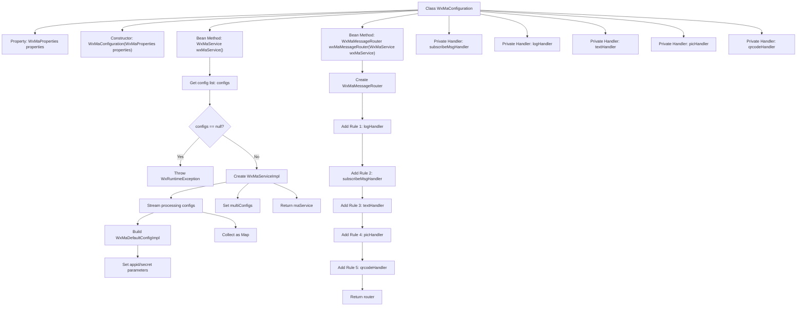

# Basic Information

|      |      |
|------|------|
| Name | WxMaConfiguration |
| Language | .java |
| Code Path | weixin-java-miniapp-demo\src\main\java\com\github\binarywang\demo\wx\miniapp\config\WxMaConfiguration.java |
| Package Name | com.github.binarywang.demo.wx.miniapp.config |
| Dependencies | ['cn.binarywang.wx.miniapp.api.WxMaService', 'cn.binarywang.wx.miniapp.api.impl.WxMaServiceImpl', 'cn.binarywang.wx.miniapp.bean.WxMaKefuMessage', 'cn.binarywang.wx.miniapp.bean.WxMaSubscribeMessage', 'cn.binarywang.wx.miniapp.config.impl.WxMaDefaultConfigImpl', 'cn.binarywang.wx.miniapp.config.impl.WxMaRedisConfigImpl', 'cn.binarywang.wx.miniapp.message.WxMaMessageHandler', 'cn.binarywang.wx.miniapp.message.WxMaMessageRouter', 'com.google.common.collect.Lists', 'lombok.extern.slf4j.Slf4j', 'me.chanjar.weixin.common.bean.result.WxMediaUploadResult', 'me.chanjar.weixin.common.error.WxErrorException', 'me.chanjar.weixin.common.error.WxRuntimeException', 'org.springframework.beans.factory.annotation.Autowired', 'org.springframework.boot.context.properties.EnableConfigurationProperties', 'org.springframework.context.annotation.Bean', 'org.springframework.context.annotation.Configuration', 'redis.clients.jedis.JedisPool', 'java.io.File', 'java.util.List', 'java.util.stream.Collectors'] |
| Brief Description | This is a WeChat Mini Program configuration class that includes service initialization and message routing setup. It creates a WxMaService to handle multiple configurations and checks their validity. It defines message routing rules to process subscription, text, image, and QR code messages, providing logging and customer service message reply functionality. |

# Description

This is a WeChat Mini Program backend configuration class, whose main functions include initializing WeChat Mini Program services and configuring message routing. The class injects configuration properties through its constructor, and checks whether the configuration exists when creating a WxMaService instance—throwing an exception if not. The service configuration supports multiple accounts, mapping the configuration information into a Map with Appid as the key. It also configures a message router, defining five message processing rules: log recording, subscription messages, text messages, image messages, and QR code messages, each with its corresponding handler. The handler functions include sending customer service messages, uploading media files, generating QR codes, etc., with some operations involving exception handling.

# Class Summary

| Name   | Type  | Description |
|-------|------|-------------|
| WxMaConfiguration | class | The WxMaConfiguration configuration class initializes the WeChat Mini Program service WxMaService and the message router WxMaMessageRouter, handling message types such as subscriptions, text, images, and QR codes. |


## Class WxMaConfiguration

|      |      |
|------|------|
| Access Modifier | @Slf4j;@Configuration;@EnableConfigurationProperties(WxMaProperties.class);public |
| Type | class |
| Name | WxMaConfiguration |
| Description | The WxMaConfiguration configuration class initializes the WeChat Mini Program service WxMaService and the message router WxMaMessageRouter, handling message types such as subscriptions, text, images, and QR codes. |


### UML Class Diagram

```mermaid
classDiagram
    class WxMaConfiguration {
        -WxMaProperties properties
        -WxMaMessageHandler subscribeMsgHandler
        -WxMaMessageHandler logHandler
        -WxMaMessageHandler textHandler
        -WxMaMessageHandler picHandler
        -WxMaMessageHandler qrcodeHandler
        +WxMaConfiguration(WxMaProperties properties)
        +WxMaService wxMaService()
        +WxMaMessageRouter wxMaMessageRouter(WxMaService wxMaService)
    }

    class WxMaProperties {
        +List~Config~ getConfigs()
    }

    class WxMaProperties.Config {
        +String getAppid()
        +String getSecret()
        +String getToken()
        +String getAesKey()
        +String getMsgDataFormat()
    }

    class WxMaService {
        <<Interface>>
        +void setMultiConfigs(Map~String, WxMaConfig~ configs)
        +MsgService getMsgService()
        +MediaService getMediaService()
        +QrcodeService getQrcodeService()
    }

    class WxMaServiceImpl {
        +void setMultiConfigs(Map~String, WxMaConfig~ configs)
        +MsgService getMsgService()
        +MediaService getMediaService()
        +QrcodeService getQrcodeService()
    }

    class WxMaDefaultConfigImpl {
        +String getAppid()
        +void setAppid(String appid)
        +void setSecret(String secret)
        +void setToken(String token)
        +void setAesKey(String aesKey)
        +void setMsgDataFormat(String msgDataFormat)
    }

    class WxMaMessageRouter {
        +WxMaMessageRouter(WxMaService wxMaService)
        +rule() RuleBuilder
    }

    interface WxMaMessageHandler {
        <<Interface>>
        +Object handle(WxMaMessage wxMessage, Map~String, Object~ context, WxMaService service, WxSessionManager sessionManager)
    }

    WxMaConfiguration --> WxMaProperties : Dependency
    WxMaConfiguration --> WxMaService : Create
    WxMaConfiguration --> WxMaMessageRouter : Create
    WxMaConfiguration ..|> WxMaMessageHandler : Implement
    WxMaServiceImpl ..|> WxMaService : Implement
    WxMaDefaultConfigImpl ..|> WxMaConfig : Implement
    WxMaProperties *-- WxMaProperties.Config : Contain
```

This code represents a configuration class for a WeChat Mini Program backend service, primarily responsible for initializing the WeChat Mini Program service (WxMaService) and message router (WxMaMessageRouter). The WxMaConfiguration class, annotated with @Configuration, indicates it is a Spring configuration class. It relies on WxMaProperties to obtain configuration details, creates and configures WxMaService instances, and constructs message routing rules. The class diagram illustrates core classes and their relationships, including configuration classes, service interfaces and implementations, configuration items, and message handlers, demonstrating the integration of Spring dependency injection with the WeChat Mini Program SDK.


### Internal Method Call Graph



This code represents a Spring Boot configuration class for WeChat Mini Program server-side, primarily accomplishing two core functions: 1) Initializing multi-account Mini Program service instances (WxMaService) by reading configuration files to build multiple Mini Program configurations; 2) Creating a message router (WxMaMessageRouter) to define processing rule chains for different message types (subscription/text/image/QR code). The flowchart clearly illustrates the validation process during configuration initialization, the streaming processing of multi-account configurations, and the chained construction logic of message routing rules.

### Field List

| Name  | Type  | Description |
|-------|-------|------|
| properties | WxMaProperties | A private immutable WeChat Mini Program configuration property object. |
| logHandler = (wxMessage, context, service, sessionManager) -> {        log.info("收到消息：" + wxMessage.toString());        service.getMsgService().sendKefuMsg(WxMaKefuMessage.newTextBuilder().content("收到信息为：" + wxMessage.toJson())            .toUser(wxMessage.getFromUser()).build());        return null;    } | WxMaMessageHandler | Define WeChat Mini Program message handling logic: Record received message content and automatically reply to users, including the original message JSON. |
| subscribeMsgHandler = (wxMessage, context, service, sessionManager) -> {        service.getMsgService().sendSubscribeMsg(WxMaSubscribeMessage.builder()            .templateId("此处更换为自己的模板id")            .data(Lists.newArrayList(                new WxMaSubscribeMessage.MsgData("keyword1", "339208499")))            .toUser(wxMessage.getFromUser())            .build());        return null;    } | WxMaMessageHandler | Define a WeChat Mini Program subscription message handler to send subscription messages to users using the specified template ID and keyword data. |
| textHandler = (wxMessage, context, service, sessionManager) -> {        service.getMsgService().sendKefuMsg(WxMaKefuMessage.newTextBuilder().content("回复文本消息")            .toUser(wxMessage.getFromUser()).build());        return null;    } | WxMaMessageHandler | WeChat Mini Program Message Handling: Automatically reply with a fixed text content upon receiving a user's text message. |
| picHandler = (wxMessage, context, service, sessionManager) -> {        try {            WxMediaUploadResult uploadResult = service.getMediaService()                .uploadMedia("image", "png",                    ClassLoader.getSystemResourceAsStream("tmp.png"));            service.getMsgService().sendKefuMsg(                WxMaKefuMessage                    .newImageBuilder()                    .mediaId(uploadResult.getMediaId())                    .toUser(wxMessage.getFromUser())                    .build());        } catch (WxErrorException e) {            e.printStackTrace();        }        return null;    } | WxMaMessageHandler | Defined a WeChat Mini Program message handler `picHandler` for uploading temporary images and returning customer service messages upon receiving image messages. Prints error information when handling exceptions. |
| qrcodeHandler = (wxMessage, context, service, sessionManager) -> {        try {            final File file = service.getQrcodeService().createQrcode("123", 430);            WxMediaUploadResult uploadResult = service.getMediaService().uploadMedia("image", file);            service.getMsgService().sendKefuMsg(                WxMaKefuMessage                    .newImageBuilder()                    .mediaId(uploadResult.getMediaId())                    .toUser(wxMessage.getFromUser())                    .build());        } catch (WxErrorException e) {            e.printStackTrace();        }        return null;    } | WxMaMessageHandler | Processing WeChat messages, generating QR codes, uploading and sending them to users, and printing errors when exceptions occur. |

### Method List

| Name  | Type  | Description |
|-------|-------|------|
| wxMaService | WxMaService | Create a WeChat Mini Program service instance, check the configuration, and initialize multi-account settings, including parameters such as appid and secret key. If not configured, throw an exception prompt. |
| wxMaMessageRouter | WxMaMessageRouter | Create a WeChat Mini Program message routing, configure synchronous handlers for subscription, text, image, and QR code messages. |


