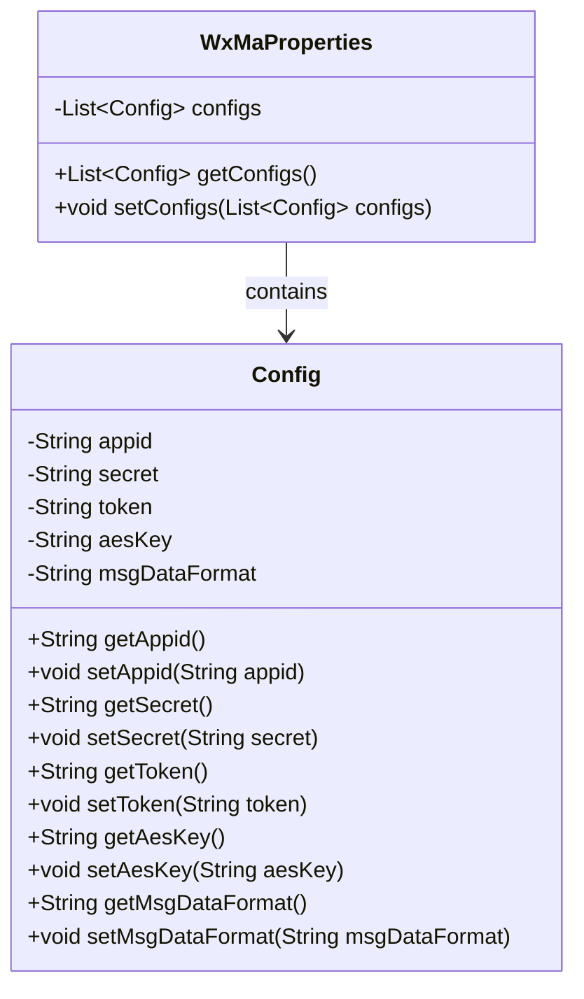
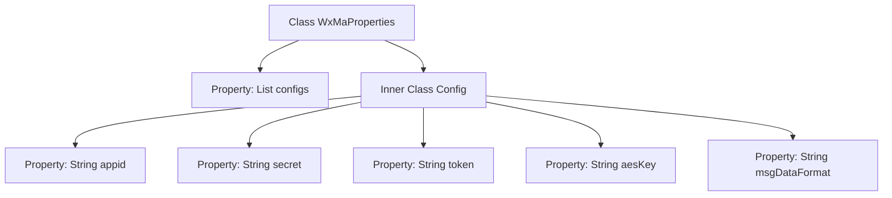

# Basic Information

|      |      |
|------|------|
| Name | WxMaProperties |
| Language | .java |
| Code Path | weixin-java-miniapp-demo\src\main\java\com\github\binarywang\demo\wx\miniapp\config\WxMaProperties.java |
| Package Name | com.github.binarywang.demo.wx.miniapp.config |
| Dependencies | ['java.util.List', 'org.springframework.boot.context.properties.ConfigurationProperties', 'lombok.Data'] |
| Brief Description | The WxMaProperties class is used to configure WeChat Mini Program properties, containing multiple Config items. Each Config item includes fields such as appid, secret, token, aesKey, and msgDataFormat. |

# Description

This is a Java class definition for configuring properties of a WeChat Mini Program. The main class `WxMaProperties` uses the `@ConfigurationProperties` annotation to bind configuration items prefixed with "wx.miniapp" and contains a list of `Config` type named `configs`. The static inner class `Config` defines Mini Program-related configuration fields: `appid` (Mini Program ID), `secret` (Mini Program secret key), `token` (message server token), `aesKey` (message encryption key), and `msgDataFormat` (message format XML/JSON). All fields automatically generate getter/setter methods via Lombok's `@Data` annotation.

# Class Summary

| Name   | Type  | Description |
|-------|------|-------------|
| WxMaProperties | class | The WxMaProperties class is used to configure WeChat Mini Program properties, containing multiple Config items, each with fields such as appid, secret, token, aesKey, and msgDataFormat. |

## Class WxMaProperties

|      |      |
|------|------|
| Access Modifier | @Data;@ConfigurationProperties(prefix = "wx.miniapp");public |
| Type | class |
| Name | WxMaProperties |
| Description | The WxMaProperties class is used to configure WeChat Mini Program properties, containing multiple Config items, each with fields such as appid, secret, token, aesKey, and msgDataFormat. |

### UML Class Diagram

This code defines a WeChat Mini Program configuration class WxMaProperties, which uses the @ConfigurationProperties annotation to bind configurations with the "wx.miniapp" prefix. The inner static class Config encapsulates core Mini Program configuration items: appid, secret, token, aesKey, and msgDataFormat. The @Data annotation automatically generates getter/setter methods. WxMaProperties contains a list of multiple Config items, making it suitable for multi-Mini Program configuration scenarios. The class diagram clearly illustrates the containment relationship between the main configuration class and the nested configuration class, as well as all accessible property interfaces.

### Internal Method Call Graph

This code defines a Spring Boot configuration class WxMaProperties for managing multi-account configurations of WeChat Mini Programs. The main class contains a list of inner Config classes, where each Config instance stores the Mini Program's appid, secret, token, aesKey, and message format configurations. The @ConfigurationProperties annotation binds to the "wx.miniapp" prefix configuration, while the @Data annotation automatically generates getter/setter methods. This design enables centralized management of multiple Mini Program accounts and facilitates dynamic parameter loading through configuration files.

### Field List

| Name  | Type  | Description |
|-------|-------|------|
| configs | List<Config> | Private configuration list variable configs. |

### Method List

| Name  | Type  | Description |
|-------|-------|------|

