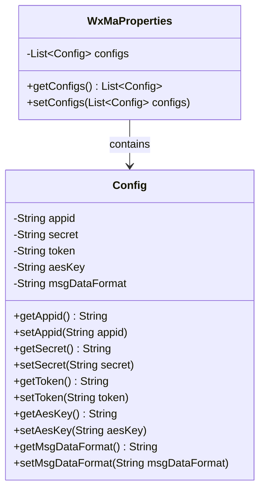
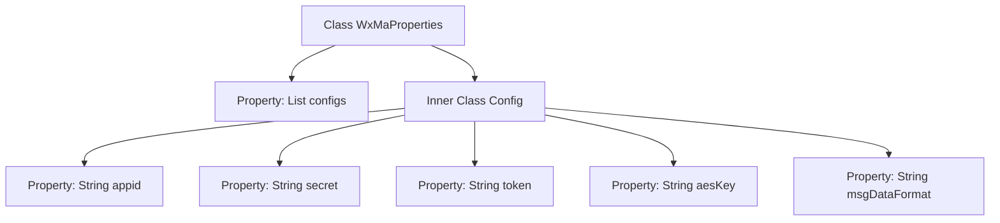

# Basic Information

|      |      |
|------|------|
| Name | WxMaProperties |
| Language | .java |
| Code Path | weixin-java-miniapp-demo/src/main/java/com/github/binarywang/demo/wx/miniapp/config/WxMaProperties.java |
| Package Name | com.github.binarywang.demo.wx.miniapp.config |
| Dependencies | ['java.util.List', 'org.springframework.boot.context.properties.ConfigurationProperties', 'lombok.Data'] |
| Brief Description | The WxMaProperties class is used to configure WeChat Mini Program properties, containing multiple Config items, each with fields such as appid, secret, token, aesKey, and msgDataFormat. |

# Description

The content defines a Java configuration class named `WxMaProperties`, which is used to manage configuration parameters related to WeChat Mini Programs. The class uses the `@ConfigurationProperties` annotation with the prefix `wx.miniapp`. It includes a list of inner `Config` classes, where each `Config` object stores the configuration information for a single Mini Program. The `Config` class contains five fields: `appid` (Mini Program ID), `secret` (Mini Program secret key), `token` (message server token), `aesKey` (message encryption key), and `msgDataFormat` (message format, supporting XML or JSON). All fields automatically generate getter/setter methods via Lombok's `@Data` annotation. This structure supports multi-Mini Program configurations and is suitable for Spring Boot applications that need to manage multiple WeChat Mini Programs.

# Class Summary

| Name   | Type  | Description |
|-------|------|-------------|
| WxMaProperties | class | The WxMaProperties class is used to configure WeChat Mini Program properties, containing multiple Config items, each with fields such as appid, secret, token, aesKey, and msgDataFormat. |

## Class WxMaProperties

|      |      |
|------|------|
| Access Modifier | @Data;@ConfigurationProperties(prefix = "wx.miniapp");public |
| Type | class |
| Name | WxMaProperties |
| Description | The WxMaProperties class is used to configure WeChat Mini Program properties, containing multiple Config items, each with fields such as appid, secret, token, aesKey, and msgDataFormat. |

### UML Class Diagram

This class diagram illustrates the structural relationship of WeChat Mini Program configuration properties. WxMaProperties serves as the main configuration class, binding configuration items with the "wx.miniapp" prefix through the @ConfigurationProperties annotation, and internally aggregates a list composed of multiple Config objects. Each Config object stores core parameters of a mini program: appid for identity identification, secret for security authentication, token and aesKey for message encryption, and msgDataFormat defining message format. The @Data annotation automatically generates getter/setter methods for all fields, forming a standard JavaBean structure. This design supports multi-mini-program configuration management, clearly separating overall configurations from individual mini-program configurations through a hierarchical structure.

### Internal Method Call Graph

This code defines a Spring Boot configuration class WxMaProperties for managing multi-account configurations of WeChat Mini Programs. The core component is the inner Config class that stores sensitive information like appid and secret for individual mini programs. It uses @ConfigurationProperties annotation to bind configurations with the "wx.miniapp" prefix, and @Data annotation to auto-generate getters/setters. The flowchart illustrates the hierarchical relationship between the main class and nested configuration class, along with the composition structure of 5 key fields within the Config class.

### Field List

| Name  | Type  | Description |
|-------|-------|------|
| configs | List<Config> | Private configuration list variable `configs`. |

### Method List

| Name  | Type  | Description |
|-------|-------|------|

