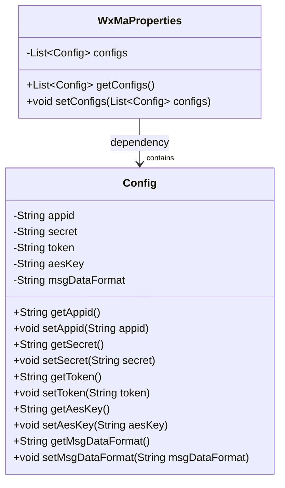
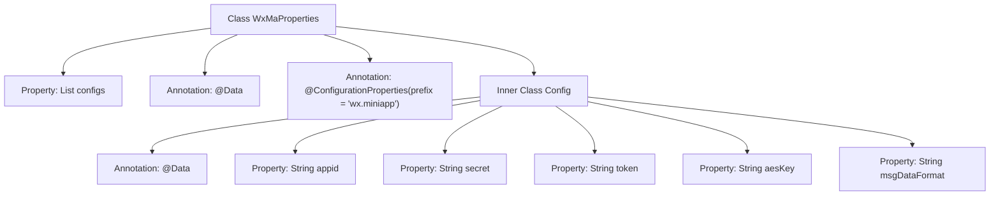

# Basic Information

|      |      |
|------|------|
| Name | WxMaProperties |
| Language | .java |
| Code Path | weixin-java-miniapp-demo/src/main/java/com/github/binarywang/demo/wx/miniapp/config/WxMaProperties.java |
| Package Name | com.github.binarywang.demo.wx.miniapp.config |
| Dependencies | ['java.util.List', 'org.springframework.boot.context.properties.ConfigurationProperties', 'lombok.Data'] |
| Brief Description | This class is used to configure WeChat Mini Program related parameters, including core configuration items such as app ID, secret key, token, encryption key, and message format. |

# Description

This class is a property configuration class used to configure WeChat Mini Program related parameters. Through the @ConfigurationProperties annotation, it specifies the configuration prefix as "wx.miniapp" and supports multiple sets of configurations. It defines an embedded static inner class Config, which contains the core configuration items for WeChat Mini Programs: appid (application identifier), secret (application key), token (message server token), aesKey (message encryption key), and msgDataFormat (message data format type). The entire configuration structure manages multiple sets of mini program configuration information using a List collection approach.

# Class Summary

| Name   | Type  | Description |
|-------|------|-------------|
| WxMaProperties | class | This class is used to configure WeChat Mini Program related parameters, including core configuration items such as app ID, secret key, token, and message format. |

## Class WxMaProperties

|      |      |
|------|------|
| Access Modifier | @Data;@ConfigurationProperties(prefix = "wx.miniapp");public |
| Type | class |
| Name | WxMaProperties |
| Description | This class is used to configure WeChat Mini Program related parameters, including core configuration items such as app ID, secret key, token, and message format. |

### UML Class Diagram

This class diagram describes the structure of WeChat Mini Program configuration properties. The `WxMaProperties` class is used to encapsulate configuration information for multiple WeChat Mini Programs, each configuration item is represented by the inner static class `Config`, which includes key parameters such as appid and secret, and supports automatic binding through `@ConfigurationProperties`.

### Internal Method Call Graph

This flowchart illustrates the structure of the `WxMaProperties` configuration class, including its inner static class `Config` and its various property fields. The outer class is used to bind WeChat Mini Program related configurations, specifying the prefix as `wx.miniapp` through `@ConfigurationProperties`. The inner class encapsulates specific parameters for each Mini Program instance such as `appid`, `secret`, etc. The overall structure clearly reflects the configuration hierarchy and data mapping relationships.

### Field List

| Name  | Type  | Description |
|-------|-------|------|
| configs | List<Config> | This is a private configuration list variable used to store a collection of configuration objects of type Config. |

### Method List

| Name  | Type  | Description |
|-------|-------|------|

