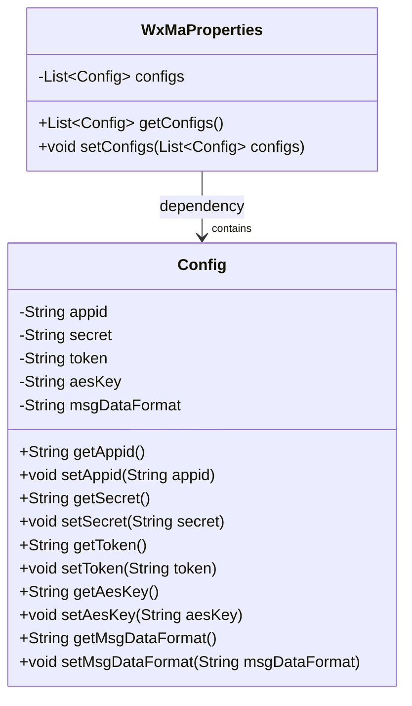
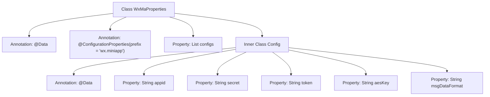

# Basic Information

|      |      |
|------|------|
| Name | WxMaProperties |
| Language | .java |
| Code Path | weixin-java-miniapp-demo/src/main/java/com/github/binarywang/demo/wx/miniapp/config/WxMaProperties.java |
| Package Name | com.github.binarywang.demo.wx.miniapp.config |
| Dependencies | ['java.util.List', 'org.springframework.boot.context.properties.ConfigurationProperties', 'lombok.Data'] |
| Brief Description | This class is used to configure WeChat Mini Program related parameters, including application ID, secret key, message server token, and encryption key information. |

# Description

This class is a WeChat Mini Program configuration property class, used to store and manage the relevant configuration information of WeChat Mini Programs. The class contains a configuration list, each configuration item includes core parameters such as the mini program's appid, secret key, message server token, encryption key aesKey, and message data format, supporting multi-mini program configuration management.

# Class Summary

| Name   | Type  | Description |
|-------|------|-------------|
| WxMaProperties | class | This class is used to configure WeChat Mini Program related parameters, including application ID, secret key, message server token, and encryption key information. |

## Class WxMaProperties

|      |      |
|------|------|
| Access Modifier | @Data;@ConfigurationProperties(prefix = "wx.miniapp");public |
| Type | class |
| Name | WxMaProperties |
| Description | This class is used to configure WeChat Mini Program related parameters, including application ID, secret key, message server token, and encryption key information. |

### UML Class Diagram

This class diagram describes the structure of WeChat Mini Program configuration properties. The `WxMaProperties` class is used to encapsulate multiple `Config` configuration items, each `Config` corresponding to an authentication and message configuration information of a mini program, supporting batch injection via `@ConfigurationProperties`. The relationship between them is aggregation, indicating that `WxMaProperties` contains multiple `Config` instances.

### Internal Method Call Graph

This flowchart illustrates the structure of the `WxMaProperties` configuration class, including its annotation configuration with binding prefix "wx.miniapp", the contained `List<Config>` property, and the various field definitions of the inner static class `Config`. The overall structure reflects the organizational approach for multiple configuration items in WeChat Mini Programs.

### Field List

| Name  | Type  | Description |
|-------|-------|------|
| configs | List<Config> | This is a private configuration list field used to store a collection of configuration objects of type Config. |

### Method List

| Name  | Type  | Description |
|-------|-------|------|

