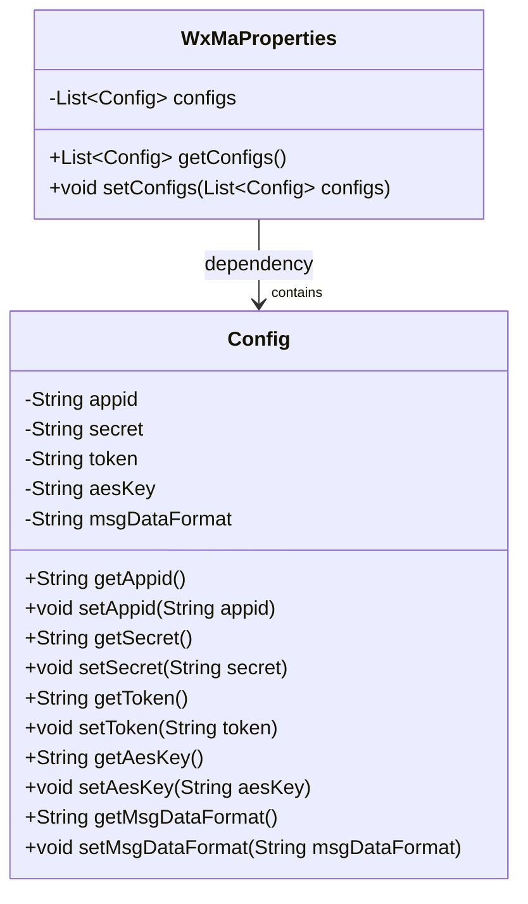
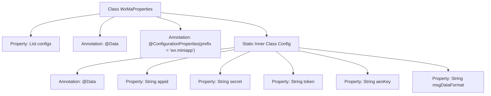

# Basic Information

|      |      |
|------|------|
| Name | WxMaProperties |
| Language | .java |
| Code Path | weixin-java-miniapp-demo/src/main/java/com/github/binarywang/demo/wx/miniapp/config/WxMaProperties.java |
| Package Name | com.github.binarywang.demo.wx.miniapp.config |
| Dependencies | ['java.util.List', 'org.springframework.boot.context.properties.ConfigurationProperties', 'lombok.Data'] |
| Brief Description | This class is used to configure WeChat Mini Program related parameters, including application ID, secret key, message server token, and encryption key information. |

# Description

This class is a property configuration class used to configure WeChat Mini Program related parameters. Through the @ConfigurationProperties annotation, it specifies the configuration prefix as "wx.miniapp" and supports multiple sets of configurations. It defines a Config static inner class internally, containing the core configuration items for WeChat Mini Program: appid (application identifier), secret (application key), token (message server token), aesKey (message encryption key), and msgDataFormat (message data format type). The entire configuration structure adopts a List collection approach to manage multiple sets of configuration information, facilitating unified configuration management for multiple Mini Program applications.

# Class Summary

| Name   | Type  | Description |
|-------|------|-------------|
| WxMaProperties | class | This class is used to configure WeChat Mini Program related parameters, including application ID, secret key, message server token, and encryption key information. |

## Class WxMaProperties

|      |      |
|------|------|
| Access Modifier | @Data;@ConfigurationProperties(prefix = "wx.miniapp");public |
| Type | class |
| Name | WxMaProperties |
| Description | This class is used to configure WeChat Mini Program related parameters, including application ID, secret key, message server token, and encryption key information. |

### UML Class Diagram

This class diagram describes the structure of WeChat Mini Program configuration properties. The `WxMaProperties` class is used to encapsulate multiple `Config` configuration items, each `Config` corresponding to the basic information of a mini program (such as appid, secret, etc.). Through the `@ConfigurationProperties` annotation, Spring Boot can automatically bind properties prefixed with `wx.miniapp` in the configuration file to this class, achieving centralized management and reading of configurations.

### Internal Method Call Graph

This flowchart illustrates the structure and relationships of the `WxMaProperties` configuration class and its static inner class `Config`. `WxMaProperties` binds configuration properties with the prefix `wx.miniapp` via the `@ConfigurationProperties` annotation, and contains a list of `Config` objects. Each `Config` object uses the `@Data` annotation to automatically generate Getter/Setter methods, which are used to store relevant configuration information for WeChat Mini Programs.

### Field List

| Name  | Type  | Description |
|-------|-------|------|
| configs | List<Config> | This is a private configuration list variable used to store a collection of configuration objects of type Config. |

### Method List

| Name  | Type  | Description |
|-------|-------|------|

