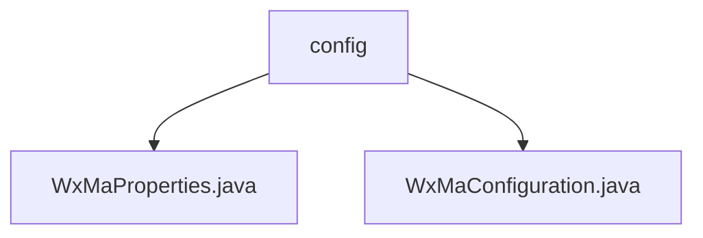

# Basic Information

|      |      |
|------|------|
| Name | config |
| Language | .java |
| Code Path | weixin-java-miniapp-demo/src/main/java/com/github/binarywang/demo/wx/miniapp/config |
| Package Name | docs.src.main.java.com.github.binarywang.demo.wx.miniapp.config |
| Brief Description | This class is a configuration management class for WeChat Mini Programs, storing core parameters such as appid, secret, and token, and supporting multi-mini-program configurations. It is used to initialize mini-program services and message routing processing mechanisms, defines handlers for logging, text replies, and image responses, and supports sending customer service messages and subscription notifications. |

# Description

## Overview

This module is responsible for configuration management and service initialization of WeChat Mini Programs, supporting multi-account access and message routing processing. Similar to the Spring Boot configuration loading mechanism, it stores core parameters such as AppId, Secret, and Token through the WxMaProperties class, while the WxMaConfiguration class completes service instantiation and message processor registration.

The interface specifications include configuration property injection, message type routing binding, customer service message sending, and subscription notification push. Key data structures consist of mini-program configuration lists, message processor mapping tables, and message data format definitions. External dependencies mainly include the Weixin Java SDK and related logging frameworks.

For example: WxMaProperties maintains multiple combinations of appid and secret for different mini-programs; WxMaConfiguration registers text message callback processing logic.

## Main Business Scenarios

The module supports unified access management for multiple mini-programs, achieving end-to-end processing of message reception, parsing, and response. It adopts an event-driven model to distribute different types of messages to corresponding processors. For instance, when a user sends text, it triggers an automatic reply, and scan events trigger QR code processing logic.

Integration scenarios cover customer service message delivery, template message notifications, and user behavior log collection. API types encompass three major categories: configuration reading, service acquisition, and message routing. The overall functionality features high extensibility, facilitating integration with enterprise-level WeChat ecosystem application platforms.

### Package Internal Structure View

This flowchart shows the structure of the WeChat Mini Program configuration module. The `config` package contains two configuration class files: `WxMaProperties.java` for property configuration, and `WxMaConfiguration.java` for configuration initialization. Both belong to the `config` configuration package as child nodes, reflecting a typical Java project configuration separation design.

# File List

| Name   | Type  | Description |
|-------|------|-------------|
| [WxMaProperties.java](WxMaProperties.md) | file | This class is used to configure WeChat Mini Program related parameters, including application ID, secret key, message server token, and encryption key information. |
| [WxMaConfiguration.java](WxMaConfiguration.md) | file | This class is a configuration class for WeChat Mini Programs, initializing services and message routers, handling messages of types such as subscription messages, text, images, and QR codes, and supporting the sending of customer service messages and uploading media files. |

