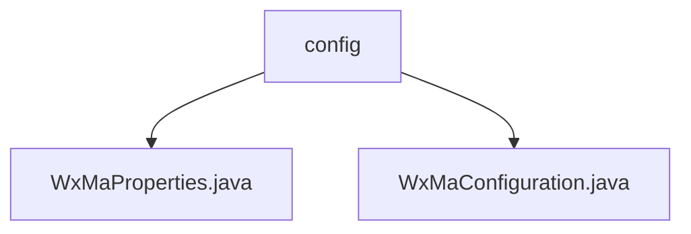

# Basic Information

|      |      |
|------|------|
| Name | config |
| Language | .java |
| Code Path | weixin-java-miniapp-demo/src/main/java/com/github/binarywang/demo/wx/miniapp/config |
| Package Name | docs.src.main.java.com.github.binarywang.demo.wx.miniapp.config |
| Brief Description | WxMaProperties is a configuration class for WeChat Mini Programs, supporting multi-account management and containing fields such as appid and secret keys. WxMaConfiguration initializes services and handles message routing, incorporating various message handlers and exception handling. |

# Description

## Overview  
The core responsibility of this module is to manage the backend service configuration and message routing for WeChat Mini Programs, supporting parallel processing of multiple accounts. It adopts the Spring Boot configuration specification, defining parameter structures such as Mini Program ID and secret keys through `@ConfigurationProperties`, and supports XML/JSON message formats. Key data structures include the `WxMaProperties.Config` inner class, which stores authentication and encryption parameters for a single Mini Program. The only external dependency is the WeChat Mini Program SDK. Implementation examples include configuration validation exception throwing and multi-account initialization.  

## Key Business Scenarios  
This module is suitable for Spring Boot applications that need to operate multiple WeChat Mini Programs simultaneously, similar to multi-tenant configuration management. Business processes include: 1) Loading and validating configurations for each Mini Program during startup; 2) Routing messages to corresponding handlers based on message types (e.g., text/image); 3) Executing specific operations, such as generating QR codes or uploading media files. The interaction mode is event-driven, resembling a message bus mechanism. A typical scenario is user subscription message processing, where automated responses are achieved through predefined handler chains.

### Package Internal Structure View

This flowchart illustrates the hierarchical structure of the configuration module in the WeChat Mini Program demo project. The root node is the config folder, which contains two Java configuration files: WxMaProperties.java stores the mini program's property configurations, while WxMaConfiguration.java handles the initialization configurations for the mini program services. This structure clearly separates configuration-related code, adhering to the typical configuration management approach of Spring Boot applications.

# File List

| Name   | Type  | Description |
|-------|------|-------------|
| [WxMaProperties.java](WxMaProperties.md) | file | The WxMaProperties class is used to configure WeChat Mini Program properties, containing multiple Config items, each with fields including appid, secret, token, aesKey, and msgDataFormat. |
| [WxMaConfiguration.java](WxMaConfiguration.md) | file | WeChat Mini Program configuration class, initializes services and message routing, handles subscription, text, image, and QR code messages. |

