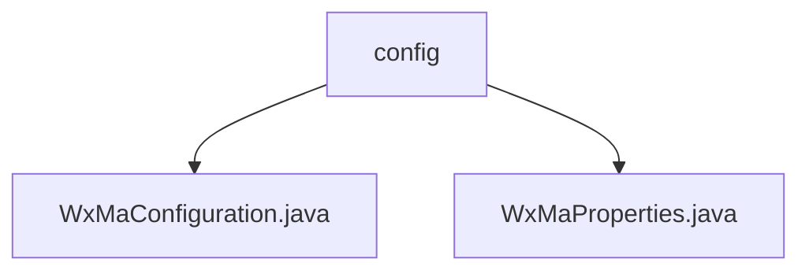

# Basic Information

|      |      |
|------|------|
| Name | config |
| Language | .java |
| Code Path | weixin-java-miniapp-demo/src/main/java/com/github/binarywang/demo/wx/miniapp/config |
| Package Name | docs.src.main.java.com.github.binarywang.demo.wx.miniapp.config |
| Brief Description | This configuration class is used to initialize the WeChat Mini Program service. It completes the registration and management of multiple mini program accounts by reading configuration properties, builds a message router, and defines message processing logic for text, images, QR codes, and other message types. It supports sending customer service messages and subscription message notifications. |

# Description

## Overview

This module is responsible for the initialization of WeChat Mini Program services and message routing processing, supporting multi-account configuration management and handling logic for various message types. Core parameters such as AppID and Secret are loaded through property configuration classes, and message distribution and processing for text, image, QR code, and other message types are implemented by combining with a message router.

The interface specification includes configuration reading, message processor registration, and routing forwarding mechanisms, adopting streaming configuration and component injection to enhance extensibility. Key data structures include Config configuration items, WxMaProperties attribute mapping class, and message router instances. External dependencies mainly consist of the WeChat Mini Program Java SDK and related Spring Boot annotation support.

For example, the system can log user-sent text messages or generate parameterized QR codes to return to the client when a scan event is triggered.

## Main Business Scenarios

The module integrates the complete chain from Mini Program access configuration to message processing, suitable for scenarios requiring integration with multiple WeChat Mini Programs and unified management of message responses. Its interaction pattern resembles an event bus, dispatching different types of messages to corresponding processors to execute specific business actions.

Functionality covers basic configuration loading, message listening, customer service message pushing, and subscription notification delivery, with good integration capabilities. Typical applications such as enterprise-level multi-tenant Mini Program platforms can quickly build standard communication entry points through this module.

API types encompass configuration injection interfaces and message routing callback interfaces, supporting flexible extension of new message types and business processors. For example, when receiving an image message, automatically upload the material to cloud storage and return a processing result notification.

### Package Internal Structure View

This flowchart shows the structure of the configuration module in the WeChat Mini Program Demo project, where the `config` package contains two configuration class files used to implement parameter settings and initialization configurations for WeChat Mini Program related functions.

# File List

| Name   | Type  | Description |
|-------|------|-------------|
| [WxMaConfiguration.java](WxMaConfiguration.md) | file | This configuration class is used to initialize WeChat Mini Program services and message routers, supporting multi-mini-program configurations, and defines various message processing logic, including logging, text replies, image sending, and QR code generation functions. |
| [WxMaProperties.java](WxMaProperties.md) | file | This is a WeChat Mini Program configuration property class that contains configuration information for multiple mini programs. Each configuration item has parameters such as appid, secret, token, aesKey, and message format. |

