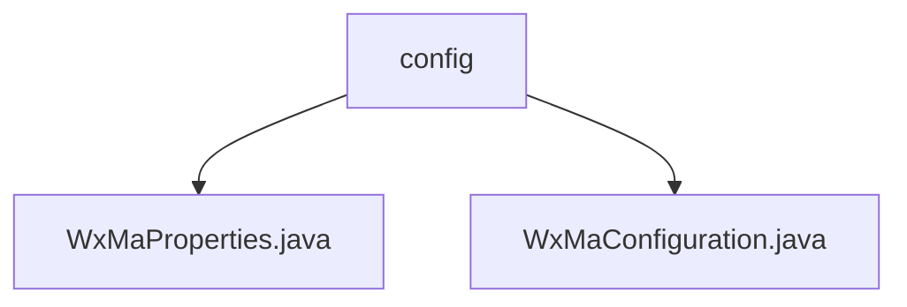

# Basic Information

|      |      |
|------|------|
| Name | config |
| Language | .java |
| Code Path | weixin-java-miniapp-demo/src/main/java/com/github/binarywang/demo/wx/miniapp/config |
| Package Name | docs.src.main.java.com.github.binarywang.demo.wx.miniapp.config |
| Brief Description | This class is the configuration class for WeChat Mini Programs. It reads configuration properties with the prefix `wx.miniapp` through the `@ConfigurationProperties` annotation, supporting multiple sets of Mini Program configurations. It contains a static inner class `Config` that defines core parameters such as appid, secret, token, aesKey, and msgDataFormat. A List collection is used to manage multiple sets of configuration information, which is utilized to initialize the Mini Program service and register message routers to handle various messaging scenarios. |

# Description

## Overview

This module is used to configure and initialize WeChat Mini Program services, supporting multi-configuration management. Through property binding and message routing mechanisms, it implements distribution processing for different message types.

The interface specification requires providing configuration items prefixed with "wx.miniapp" and supports multiple mini program instances through a List structure. Each instance must include core fields such as AppId and Secret.

Key data structures include WxMaProperties and its nested Config class, which encapsulates parameters such as appid, secret, token, aesKey, and msgDataFormat.

External dependencies mainly come from the weixin-java-miniapp library and related Spring Boot annotation components.

For example: WxMaProperties uses @ConfigurationProperties to bind configurations; WxMaConfiguration utilizes WxMaService to build message routers.

## Main Business Scenarios

The module supports the complete process from configuration loading to service startup, similar to factory pattern creating multiple mini program instances.

The interaction mode implements event distribution based on message routers, connecting to functional modules such as logging, text replies, and image responses respectively.

Functionality covers typical application scenarios including message receiving and replying, material uploading, and customer service message pushing.

Typical application modes include: user subscription notifications triggering message sending, scan code events returning QR code images, etc.

API types cover configuration reading interfaces and message processing interfaces during service runtime, with integration cases including custom message handler registration and multimedia resource operations.

### Package Internal Structure View

This flowchart shows the structure of the WeChat Mini Program configuration module. The `config` package contains two configuration class files: `WxMaProperties.java` for property configuration, and `WxMaConfiguration.java` for configuration initialization. Both belong to the configuration layer of the WeChat Mini Program Demo project.

# File List

| Name   | Type  | Description |
|-------|------|-------------|
| [WxMaProperties.java](WxMaProperties.md) | file | This class is used to configure WeChat Mini Program related parameters, including core configuration items such as app ID, secret key, token, encryption key, and message format. |
| [WxMaConfiguration.java](WxMaConfiguration.md) | file | This configuration class is used to initialize WeChat Mini Program services and message routers, supporting multi-mini-program configurations, and defines various message processing logic, including logging, text replies, image sending, and QR code generation functions. |

