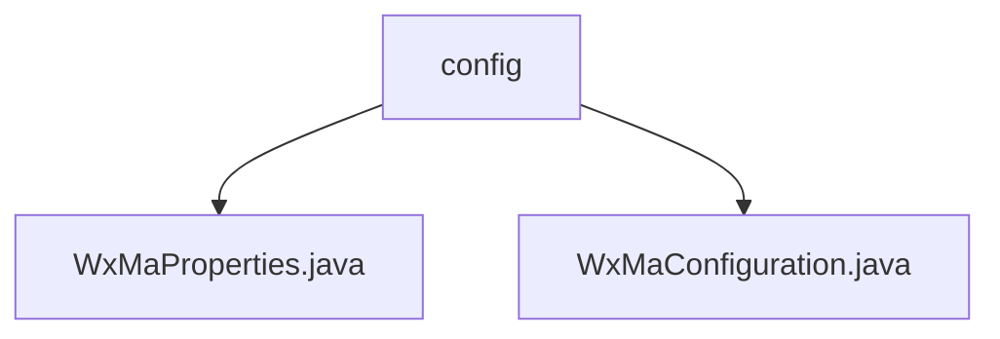

# Basic Information

|      |      |
|------|------|
| Name | config |
| Language | .java |
| Code Path | weixin-java-miniapp-demo/src/main/java/com/github/binarywang/demo/wx/miniapp/config |
| Package Name | docs.src.main.java.com.github.binarywang.demo.wx.miniapp.config |
| Brief Description | This class is the configuration class for WeChat Mini Programs. It reads configuration information prefixed with `wx.miniapp` through the `@ConfigurationProperties` annotation, supporting management of multiple sets of Mini Program configurations. It contains a static inner class `Config` that defines core configuration items such as appid, secret, token, aesKey, and msgDataFormat. A List collection is used to manage multiple sets of configuration information, which is utilized to initialize the WeChat Mini Program service and message routing processing mechanism, thereby implementing registration management for multiple Mini Program accounts and automated message interaction functionalities. |

# Description

## Overview

This module is used to manage multi-account configuration and service initialization for WeChat Mini Programs, supporting the loading of multiple sets of mini program parameters through property configuration classes, and registering corresponding message handling routes.  
The interface specification includes the property binding prefix `wx.miniapp`, as well as configuration items based on the Config class such as Appid, Secret, Token, etc., combined with a List structure to support multi-instance management.

The core data structure is the static inner class Config in WxMaProperties, which encapsulates the basic fields required for mini program authentication and communication; WxMaConfiguration is responsible for mapping configurations into operable service objects.

External dependencies mainly include Spring Boot's @ConfigurationProperties and the WeChat Java SDK (such as WxMaService, WxMaMessageRouter), without introducing other third-party libraries.

For example, the first mini program's application ID can be configured via `wx.miniapp.configs[0].appid`, and the system will accordingly create the corresponding message router and service instance.

## Main Business Scenarios

The module is primarily applied in backend services that need to connect to multiple WeChat Mini Programs simultaneously, completing account loading and service registration through a unified configuration center, implementing message distribution similar to an event bus pattern.

Interaction patterns cover automatic response processes from users sending text, images to the mini program backend, supporting various processing logics such as logging, keyword replies, and QR code distribution.

Function completeness is reflected in the ability to dynamically load multiple sets of mini program configurations and separately build independent message processing chains, ensuring no interference between different accounts.

Typical application scenarios include enterprise-level WeChat customer service systems or platform-type mini program management backends, supporting rapid expansion of new mini program access without modifying the code structure.

API types cover three major categories: configuration reading, service injection, and message routing. Integration examples include adding a text message processor through WxMaMessageRouter to implement auto-reply functionality.

### Package Internal Structure View

This flowchart shows the structure of the WeChat Mini Program configuration module. The `config` package contains two configuration class files: `WxMaProperties.java` and `WxMaConfiguration.java`, which are used to manage the relevant configuration properties and initialization settings for the WeChat Mini Program.

# File List

| Name   | Type  | Description |
|-------|------|-------------|
| [WxMaProperties.java](WxMaProperties.md) | file | This class is used to configure WeChat Mini Program related parameters, including application ID, secret key, message server token, and encryption key information. |
| [WxMaConfiguration.java](WxMaConfiguration.md) | file | This configuration class is used to initialize WeChat Mini Program services and message routers, supporting multi-application configuration and various message processing logic. |

