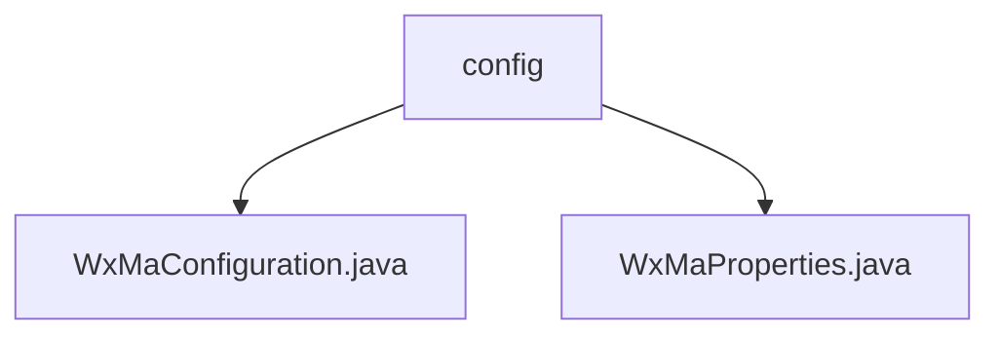

# Basic Information

|      |      |
|------|------|
| Name | config |
| Language | .java |
| Code Path | weixin-java-miniapp-demo\src\main\java\com\github\binarywang\demo\wx\miniapp\config |
| Package Name | docs.src.main.java.com.github.binarywang.demo.wx.miniapp.config |
| Brief Description | WeChat Mini Program backend configuration class, initializes services and message routing, supports multiple accounts, and defines five message processing rules. The configuration property class binds Mini Program configuration items, including fields such as ID and secret key. |

# Description

## Overview  
This module serves as the backend configuration system for WeChat Mini Programs, with its core responsibility being to initialize multi-account Mini Program services and configure message routing, functioning similarly to a gateway router dispatcher. It binds configuration properties via the WxMaProperties class and supports multi-account management using Appid as the key. Key data structures include the Config inner class (containing fields such as Appid/Secret) and a message routing rule Map. Dependencies include the WeChat SDK (WxMaService) and Lombok. For example, configuration injection is achieved through @ConfigurationProperties, and the message router predefines five processor rules.

## Primary Business Scenarios  
The module handles the entire lifecycle of Mini Program messages, with a typical workflow as follows: validate configurations during initialization → build multi-account service instances → configure message routing rules. The interaction model is event-driven, such as text messages triggering customer service replies or QR code messages invoking generation interfaces. It fully supports the five message types required by the WeChat protocol, such as subscription messages being distributed to corresponding handlers via MsgRouter. API integration examples include media file uploads and QR code generation, both encapsulated as standardized processing chains.

### Package Internal Structure View

This flowchart illustrates the hierarchical structure of the configuration module in the WeChat Mini Program Demo project. The root node is the config folder, which contains two Java configuration files: WxMaConfiguration and WxMaProperties. These two files are directly subordinate to the config directory without any deeper subdirectory structure, forming a simple two-level tree relationship.

# File List

| Name   | Type  | Description |
|-------|------|-------------|
| [WxMaConfiguration.java](WxMaConfiguration.md) | file | This is a WeChat Mini Program configuration class that includes service initialization and message routing setup. It creates a WxMaService to handle multiple configurations and checks their validity. It defines message routing rules to process subscription, text, image, and QR code messages, providing logging and customer service message reply functionality. |
| [WxMaProperties.java](WxMaProperties.md) | file | The WxMaProperties class is used to configure WeChat Mini Program properties, containing multiple Config items, each of which includes the appid, secret, token, aesKey, and msgDataFormat fields. |

