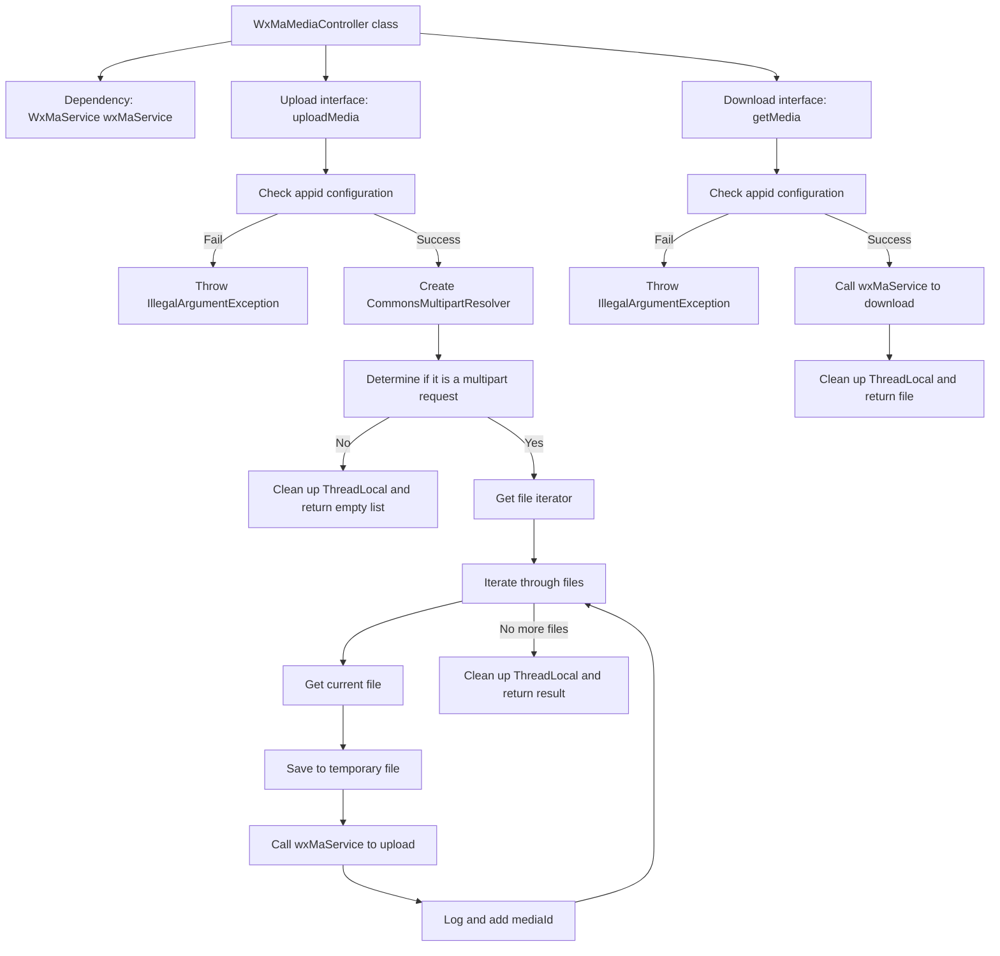

# Basic Information

|      |      |
|------|------|
| Name | WxMaMediaController |
| Language | .java |
| Code Path | weixin-java-miniapp-demo/src/main/java/com/github/binarywang/demo/wx/miniapp/controller/WxMaMediaController.java |
| Package Name | com.github.binarywang.demo.wx.miniapp.controller |
| Dependencies | ['cn.binarywang.wx.miniapp.api.WxMaService', 'cn.binarywang.wx.miniapp.constant.WxMaConstants', 'cn.binarywang.wx.miniapp.util.WxMaConfigHolder', 'com.google.common.collect.Lists', 'com.google.common.io.Files', 'lombok.AllArgsConstructor', 'lombok.extern.slf4j.Slf4j', 'me.chanjar.weixin.common.bean.result.WxMediaUploadResult', 'me.chanjar.weixin.common.error.WxErrorException', 'org.springframework.web.bind.annotation', 'org.springframework.web.multipart.MultipartFile', 'org.springframework.web.multipart.MultipartHttpServletRequest', 'org.springframework.web.multipart.commons.CommonsMultipartResolver', 'javax.servlet.http.HttpServletRequest', 'java.io.File', 'java.io.IOException', 'java.util.Iterator', 'java.util.List'] |
| Brief Description | This controller provides upload and download functions for WeChat Mini Program temporary media files, supports configuration switching via appid, the upload interface returns a list of media_ids, and the download interface retrieves files based on media_id. |

# Description

This controller provides upload and download functionality for WeChat Mini Program media files. By routing requests through the specified appid, it supports uploading temporary image materials and returning a list of media_ids, while also providing the functionality to download corresponding temporary materials based on mediaId. The interface implementation includes multi-file processing, exception capturing, and thread-local variable cleanup mechanisms to ensure stable service operation.

# Class Summary

| Name   | Type  | Description |
|-------|------|-------------|
| WxMaMediaController | class | This controller provides upload and download functionality for WeChat Mini Program media files, supports configuration switching via appid, the upload interface returns a list of media_id, and the download interface retrieves files based on media_id. |

## Class WxMaMediaController

|      |      |
|------|------|
| Access Modifier | @RestController;@AllArgsConstructor;@Slf4j;@RequestMapping("/wx/media/{appid}");public |
| Type | class |
| Name | WxMaMediaController |
| Description | This controller provides upload and download functionality for WeChat Mini Program media files, supports configuration switching via appid, the upload interface returns a list of media_id, and the download interface retrieves files based on media_id. |

### UML Class Diagram

```mermaid
classDiagram
    class WxMaMediaController {
        -WxMaService wxMaService
        +List~String~ uploadMedia(String appid, HttpServletRequest request) throws WxErrorException
        +File getMedia(String appid, String mediaId) throws WxErrorException
    }

    class WxMaService {
        <<Interface>>
        +boolean switchover(String appid)
        +WxMaConfigHolder getConfigHolder()
        +WxMaMediaService getMediaService()
    }

    class WxMaMediaService {
        <<Interface>>
        +WxMediaUploadResult uploadMedia(String mediaType, File file) throws WxErrorException
        +File getMedia(String mediaId) throws WxErrorException
    }

    class WxMediaUploadResult {
        +String getMediaId()
    }

    class WxMaConstants {
        <<Interface>>
    }

    class WxMaConfigHolder {
        +void remove()
    }

    class CommonsMultipartResolver {
        +boolean isMultipart(HttpServletRequest request)
    }

    class MultipartHttpServletRequest {
        +Iterator~String~ getFileNames()
        +MultipartFile getFile(String name)
    }

    class MultipartFile {
        +String getOriginalFilename()
        +void transferTo(File dest) throws IOException, IllegalStateException
    }

    class File {
        +String toString()
    }

    class HttpServletRequest {
    }

    class Lists {
        <<Utility>>
        +ArrayList~T~ newArrayList()
    }

    class Files {
        <<Utility>>
        +File createTempDir()
    }

    class Logger {
        <<Interface>>
        +void info(String msg)
        +void error(String msg, Throwable t)
    }

    WxMaMediaController --> WxMaService : Dependency
    WxMaMediaController --> CommonsMultipartResolver : Creates and uses
    WxMaMediaController --> MultipartHttpServletRequest : Converts to use
    WxMaMediaController --> MultipartFile : Retrieves file
    WxMaMediaController --> File : File operations
    WxMaMediaController --> WxMediaUploadResult : Receives result
    WxMaMediaController --> WxMaConfigHolder : Clears config
    WxMaMediaController --> Lists : Utility class invocation
    WxMaMediaController --> Files : Creates temporary directory
    WxMaMediaController --> Logger : Logs records
    WxMaService --> WxMaMediaService : Provides media service
```

This class diagram shows the structure of the WeChat Mini Program media controller `WxMaMediaController` and its relationships with other key components. It uses dependency injection to utilize `WxMaService` for handling configuration switching and media upload/download functionalities across different appids. Meanwhile, it implements file uploading logic by integrating with Spring MVC's multipart request resolution mechanism, and leverages utility classes for auxiliary operations such as logging and temporary file creation.

### Internal Method Call Graph

This flowchart illustrates the processing logic of two core interfaces in the WeChat Mini Program media controller: `uploadMedia` is used to upload temporary media by validating the appid, parsing multipart requests, and saving and uploading files one by one; `getMedia` downloads uploaded media based on mediaId. The entire process includes exception handling and resource cleanup operations, with a clear structure and well-defined responsibilities.

### Field List

| Name  | Type  | Description |
|-------|-------|------|
| wxMaService | WxMaService | This is a private immutable instance variable declaration for a WeChat Mini Program service interface. |

### Method List

| Name  | Type  | Description |
|-------|-------|------|
| uploadMedia | List<String> | This interface handles media file uploads for WeChat Mini Programs, supports simultaneous upload of multiple files, and returns a list of media IDs. |
| getMedia | File | This interface is used to download WeChat media files. It retrieves the corresponding media file through appid and mediaId. If the appid configuration does not exist, an exception is thrown. After successful retrieval, it cleans up thread-local variables and returns the file. |

