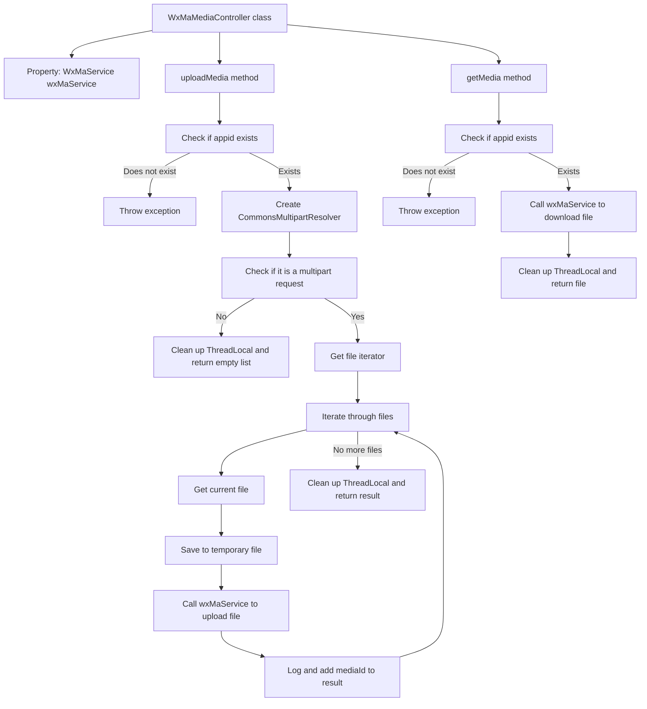

# Basic Information

|      |      |
|------|------|
| Name | WxMaMediaController |
| Language | .java |
| Code Path | weixin-java-miniapp-demo/src/main/java/com/github/binarywang/demo/wx/miniapp/controller/WxMaMediaController.java |
| Package Name | com.github.binarywang.demo.wx.miniapp.controller |
| Dependencies | ['cn.binarywang.wx.miniapp.api.WxMaService', 'cn.binarywang.wx.miniapp.constant.WxMaConstants', 'cn.binarywang.wx.miniapp.util.WxMaConfigHolder', 'com.google.common.collect.Lists', 'com.google.common.io.Files', 'lombok.AllArgsConstructor', 'lombok.extern.slf4j.Slf4j', 'me.chanjar.weixin.common.bean.result.WxMediaUploadResult', 'me.chanjar.weixin.common.error.WxErrorException', 'org.springframework.web.bind.annotation', 'org.springframework.web.multipart.MultipartFile', 'org.springframework.web.multipart.MultipartHttpServletRequest', 'org.springframework.web.multipart.commons.CommonsMultipartResolver', 'javax.servlet.http.HttpServletRequest', 'java.io.File', 'java.io.IOException', 'java.util.Iterator', 'java.util.List'] |
| Brief Description | This controller provides upload and download functions for WeChat Mini Program temporary media files, supports configuration switching via appid, the upload interface returns a list of media_ids, and the download interface retrieves files based on media_id. |

# Description

This controller provides upload and download functionality for WeChat Mini Program media files. By specifying the appid, it can switch to the corresponding configuration, supporting the upload of temporary image materials and returning a media_id, with only one media_id generated per upload. The multipart/form-data format must be used for uploading. It also supports downloading the corresponding temporary material files based on the media_id. After processing, the interface will automatically clean up thread-local variables to ensure a clean environment.

# Class Summary

| Name   | Type  | Description |
|-------|------|-------------|
| WxMaMediaController | class | This controller provides upload and download functions for WeChat Mini Program temporary media files, supports configuration switching via appid, the upload interface returns a list of media_ids, and the download interface retrieves files based on media_id. |


## Class WxMaMediaController

|      |      |
|------|------|
| Access Modifier | @RestController;@AllArgsConstructor;@Slf4j;@RequestMapping("/wx/media/{appid}");public |
| Type | class |
| Name | WxMaMediaController |
| Description | This controller provides upload and download functions for WeChat Mini Program temporary media files, supports configuration switching via appid, the upload interface returns a list of media_ids, and the download interface retrieves files based on media_id. |


### UML Class Diagram

```mermaid
classDiagram
    class WxMaMediaController {
        -WxMaService wxMaService
        +List~String~ uploadMedia(String appid, HttpServletRequest request) throws WxErrorException
        +File getMedia(String appid, String mediaId) throws WxErrorException
    }

    class WxMaService {
        <<Interface>>
        +boolean switchover(String appid)
        +WxMaConfigHolder getConfigHolder()
        +WxMaMediaService getMediaService()
    }

    class WxMaMediaService {
        <<Interface>>
        +WxMediaUploadResult uploadMedia(String mediaType, File file) throws WxErrorException
        +File getMedia(String mediaId) throws WxErrorException
    }

    class WxMediaUploadResult {
        +String getMediaId()
    }

    class WxMaConstants {
        <<Interface>>
    }

    class WxMaConfigHolder {
        <<Interface>>
        +void remove()
    }

    class CommonsMultipartResolver {
        +boolean isMultipart(HttpServletRequest request)
    }

    class MultipartHttpServletRequest {
        +Iterator~String~ getFileNames()
        +MultipartFile getFile(String name)
    }

    class MultipartFile {
        +String getOriginalFilename()
        +void transferTo(File dest) throws IOException
    }

    class File {
        +File(File parent, String child)
    }

    class Lists {
        <<Interface>>
        +ArrayList~E~ newArrayList()
    }

    class HttpServletRequest {
    }

    class IOException {
    }

    class WxErrorException {
    }

    // Dependencies
    WxMaMediaController --> WxMaService : depends on
    WxMaMediaController --> CommonsMultipartResolver : creates and uses
    WxMaMediaController --> MultipartHttpServletRequest : casts to and uses
    WxMaMediaController --> MultipartFile : retrieves file content
    WxMaMediaController --> File : creates temporary files
    WxMaMediaController --> Lists : uses newArrayList()
    WxMaMediaController --> WxMaConfigHolder : calls remove()
    WxMaMediaController --> WxMaConstants : uses constants
    WxMaMediaController --> WxMediaUploadResult : receives upload result
    WxMaMediaController --> HttpServletRequest : processes requests
    WxMaMediaController --> IOException : catches exceptions
    WxMaMediaController --> WxErrorException : throws exceptions

    WxMaService --> WxMaMediaService : provides media service interface
    WxMaService --> WxMaConfigHolder : configuration management

    WxMaMediaService --> WxMediaUploadResult : returns upload result
    WxMaMediaService --> File : file operations
    WxMaMediaService --> WxErrorException : throws exceptions
```

This class diagram illustrates the structure and dependencies of the WeChat Mini Program media controller `WxMaMediaController`. It invokes WeChat services via the `WxMaService` interface to implement functionalities for uploading and downloading temporary media files. The controller relies on Spring Web classes to handle multipart requests and utilizes multiple utility classes to perform file operations and logging. An exception handling mechanism ensures program robustness, while a ThreadLocal cleanup mechanism guarantees context safety.


### Internal Method Call Graph



This flowchart illustrates the processing logic of two main interfaces in the WeChat Mini Program media controller: uploading temporary media and downloading temporary media. The process includes key steps such as parameter validation, multipart request parsing, file operations, and service invocation, while also demonstrating exception handling and resource cleanup mechanisms.

### Field List

| Name  | Type  | Description |
|-------|-------|------|
| wxMaService | WxMaService | This is a private constant field declaration for a WeChat Mini Program service interface, used to provide WeChat Mini Program related functionality invocation capabilities within the class. |

### Method List

| Name  | Type  | Description |
|-------|-------|------|
| uploadMedia | List<String> | This interface handles media file uploads for WeChat Mini Programs, supports simultaneous upload of multiple files, and returns a list of media_ids. |
| getMedia | File | This interface is used to download WeChat media files. It retrieves the corresponding media resources through appid and mediaId, and supports multi-application configuration switching. After successfully obtaining the file, it automatically cleans up thread-local variables to ensure data isolation. If the appid configuration does not exist, an exception prompt is thrown. |


