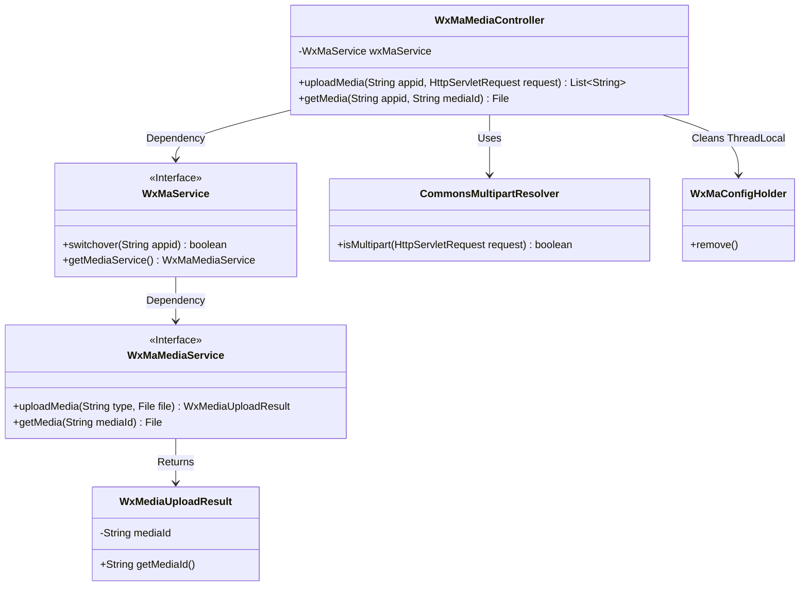
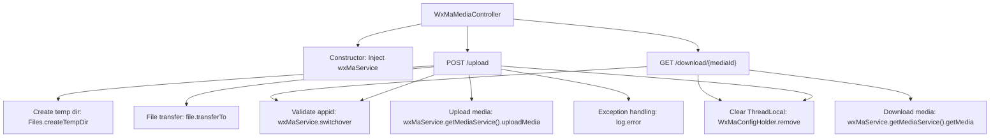
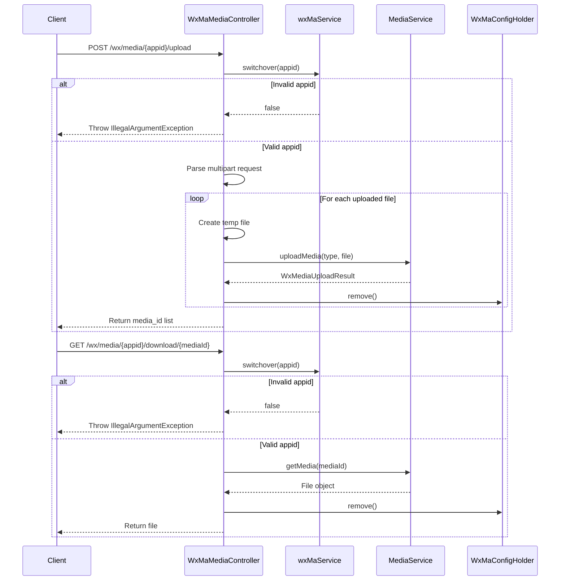

# Basic Information

|      |      |
|------|------|
| Name | WxMaMediaController |
| Language | .java |
| Code Path | weixin-java-miniapp-demo\src\main\java\com\github\binarywang\demo\wx\miniapp\controller\WxMaMediaController.java |
| Package Name | com.github.binarywang.demo.wx.miniapp.controller |
| Dependencies | ['cn.binarywang.wx.miniapp.api.WxMaService', 'cn.binarywang.wx.miniapp.constant.WxMaConstants', 'cn.binarywang.wx.miniapp.util.WxMaConfigHolder', 'com.google.common.collect.Lists', 'com.google.common.io.Files', 'lombok.AllArgsConstructor', 'lombok.extern.slf4j.Slf4j', 'me.chanjar.weixin.common.bean.result.WxMediaUploadResult', 'me.chanjar.weixin.common.error.WxErrorException', 'org.springframework.web.bind.annotation', 'org.springframework.web.multipart.MultipartFile', 'org.springframework.web.multipart.MultipartHttpServletRequest', 'org.springframework.web.multipart.commons.CommonsMultipartResolver', 'javax.servlet.http.HttpServletRequest', 'java.io.File', 'java.io.IOException', 'java.util.Iterator', 'java.util.List'] |
| Brief Description | WeChat Mini Program Media Controller, providing functionality for uploading and downloading temporary materials. Uploading returns a list of media_ids, while downloading returns files. It checks the validity of the appid and cleans up ThreadLocal. |

# Description

This is a WeChat Mini Program media file management controller class, which includes functionalities for uploading and downloading temporary materials. The upload interface accepts multiple file uploads, verifies the validity of the appid, saves the temporary files, and returns a list of media_ids. The download interface retrieves media files based on the mediaId. Both operations include ThreadLocal cleanup logic to ensure thread safety. The upload process records file paths and media_ids, and logs error messages in case of exceptions.

# Class Summary

| Name   | Type  | Description |
|-------|------|-------------|
| WxMaMediaController | class | WeChat Mini Program Media Controller, providing functionality for uploading and downloading temporary materials. Upload requires appid verification, supports multi-file processing, and returns media_id. Download requires verification of both appid and media_id, returning the media file. Clears ThreadLocal after operations. |

## Class WxMaMediaController

|      |      |
|------|------|
| Access Modifier | @RestController;@AllArgsConstructor;@Slf4j;@RequestMapping("/wx/media/{appid}");public |
| Type | class |
| Name | WxMaMediaController |
| Description | WeChat Mini Program Media Controller, providing functionality for uploading and downloading temporary materials. Upload requires appid verification, supports multi-file processing, and returns media_id. Download requires verification of both appid and media_id, returning the media file. Clears ThreadLocal after operations. |

### UML Class Diagram

This code describes a WeChat Mini Program media file controller, primarily providing functionality for uploading and downloading temporary materials. The class diagram illustrates the interaction between the controller WxMaMediaController and the WeChat service interface WxMaService, which further relies on the media service interface WxMaMediaService to handle specific operations. The controller also utilizes CommonsMultipartResolver to parse multipart requests and manages thread-local variables via WxMaConfigHolder. The upload function returns a result object containing a mediaId, with the overall design adhering to a layered architecture and the dependency inversion principle.

### Internal Method Call Graph

This flowchart illustrates the core logic of the WeChat media management controller, including two main endpoints for file upload and download. The upload process involves temporary file creation, multipart request handling, and media service invocation, while the download process retrieves files via media ID. Both operations include appid validation and ThreadLocal cleanup mechanisms, with exception handling implemented through logging. The sequence diagram details the interaction process between the client, controller, and service layers, particularly emphasizing branch handling logic under different conditions.

### Field List

| Name  | Type  | Description |
|-------|-------|------|
| wxMaService | WxMaService | Private constant variables of WeChat Mini Program service instances. |

### Method List

| Name  | Type  | Description |
|-------|-------|------|
| uploadMedia | List<String> | Java method for handling WeChat Mini Program file uploads, verifying the appid before parsing multi-file requests, uploading each file individually and returning a list of media_ids, and finally cleaning up ThreadLocal. |
| getMedia | File | Java Method: Download media file via appid and mediaId, return the file after checking appid configuration, and finally clean up ThreadLocal. Prompt "Configuration not found" in case of exceptions. |

