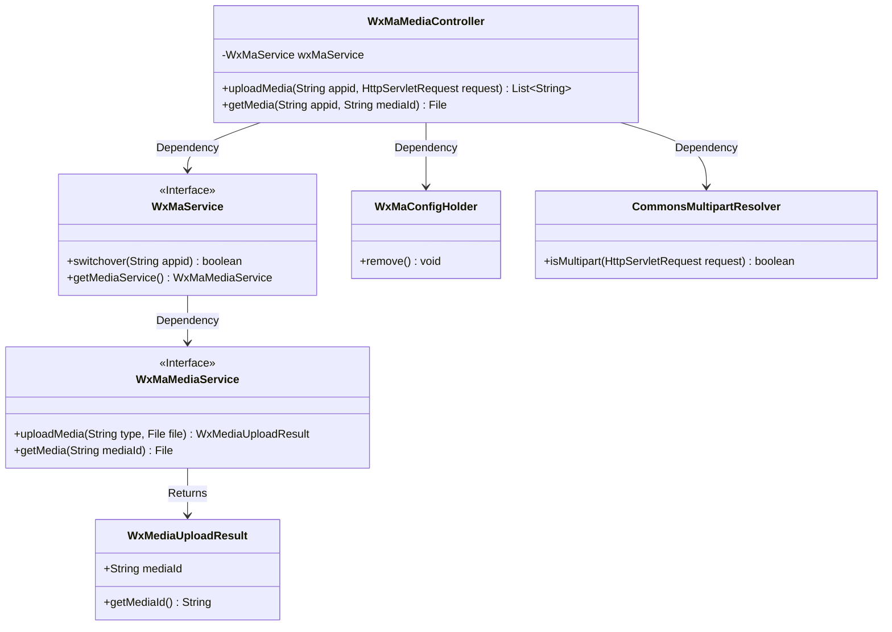
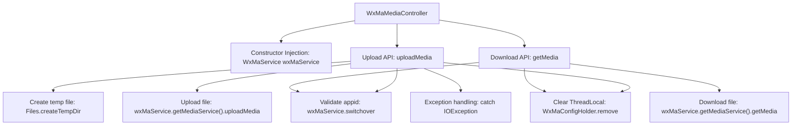

# Basic Information

|      |      |
|------|------|
| Name | WxMaMediaController |
| Language | .java |
| Code Path | weixin-java-miniapp-demo/src/main/java/com/github/binarywang/demo/wx/miniapp/controller/WxMaMediaController.java |
| Package Name | com.github.binarywang.demo.wx.miniapp.controller |
| Dependencies | ['cn.binarywang.wx.miniapp.api.WxMaService', 'cn.binarywang.wx.miniapp.constant.WxMaConstants', 'cn.binarywang.wx.miniapp.util.WxMaConfigHolder', 'com.google.common.collect.Lists', 'com.google.common.io.Files', 'lombok.AllArgsConstructor', 'lombok.extern.slf4j.Slf4j', 'me.chanjar.weixin.common.bean.result.WxMediaUploadResult', 'me.chanjar.weixin.common.error.WxErrorException', 'org.springframework.web.bind.annotation', 'org.springframework.web.multipart.MultipartFile', 'org.springframework.web.multipart.MultipartHttpServletRequest', 'org.springframework.web.multipart.commons.CommonsMultipartResolver', 'javax.servlet.http.HttpServletRequest', 'java.io.File', 'java.io.IOException', 'java.util.Iterator', 'java.util.List'] |
| Brief Description | WeChat Mini Program Media Controller, providing functions for uploading and downloading temporary materials. Uploading returns a list of media_ids, while downloading returns media files. Requires validation of appid effectiveness and cleanup of ThreadLocal after operations. |

# Description

This is a controller class for media file management in a WeChat Mini Program, which includes functionalities for uploading and downloading temporary materials. The upload interface receives an appid and HTTP request, processes multi-file uploads after validating configurations, and returns a list of media_ids. The download interface retrieves media files based on the appid and mediaId. Both operations include ThreadLocal cleanup logic. The upload process records file paths and media_ids, and logs error messages in case of exceptions.

# Class Summary

| Name   | Type  | Description |
|-------|------|-------------|
| WxMaMediaController | class | WeChat Mini Program Material Controller, providing upload and download functions for temporary materials, including verifying appid, handling file uploads, and returning media_id or files. |

## Class WxMaMediaController

|      |      |
|------|------|
| Access Modifier | @RestController;@AllArgsConstructor;@Slf4j;@RequestMapping("/wx/media/{appid}");public |
| Type | class |
| Name | WxMaMediaController |
| Description | WeChat Mini Program Material Controller, providing upload and download functions for temporary materials, including verifying appid, handling file uploads, and returning media_id or files. |

### UML Class Diagram

This code implements a REST controller for WeChat Mini Program media file upload and download. The core class WxMaMediaController operates media services through the WxMaService interface, relies on CommonsMultipartResolver for file upload processing, and uses WxMaConfigHolder to manage thread-local variables. The upload method converts temporary files into WeChat media IDs, while the download method retrieves files based on media IDs. The class diagram illustrates the invocation relationships between the controller and service layers, as well as the key data transfer object WxMediaUploadResult.

### Internal Method Call Graph

This flowchart illustrates the core logic of the WeChat Material Management Controller, including two main interfaces for upload and download. The upload process involves appid validation, multi-file processing, temporary file creation, and media service invocation; the download process includes permission verification and media file retrieval. Both processes conclude by clearing ThreadLocal-stored configuration to ensure thread safety. The sequence diagram details the interaction sequence between the client and components, along with exception handling paths.

### Field List

| Name  | Type  | Description |
|-------|-------|------|
| wxMaService | WxMaService | Private immutable member variables of WeChat Mini Program service instances. |

### Method List

| Name  | Type  | Description |
|-------|-------|------|
| uploadMedia | List<String> | Upload media file interface: After verifying the appid, process multi-file uploads and return a list of media IDs. Clean up configurations and log errors in case of exceptions. |
| getMedia | File | Java Method: Download WeChat Mini Program media files via appid and mediaId, verify the configuration, return the file, and finally clean up the ThreadLocal. |

