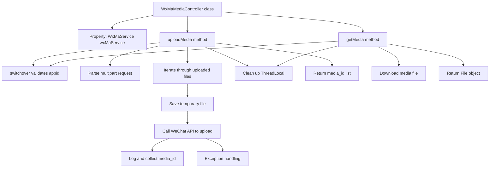

# Basic Information

|      |      |
|------|------|
| Name | WxMaMediaController |
| Language | .java |
| Code Path | weixin-java-miniapp-demo/src/main/java/com/github/binarywang/demo/wx/miniapp/controller/WxMaMediaController.java |
| Package Name | com.github.binarywang.demo.wx.miniapp.controller |
| Dependencies | ['cn.binarywang.wx.miniapp.api.WxMaService', 'cn.binarywang.wx.miniapp.constant.WxMaConstants', 'cn.binarywang.wx.miniapp.util.WxMaConfigHolder', 'com.google.common.collect.Lists', 'com.google.common.io.Files', 'lombok.AllArgsConstructor', 'lombok.extern.slf4j.Slf4j', 'me.chanjar.weixin.common.bean.result.WxMediaUploadResult', 'me.chanjar.weixin.common.error.WxErrorException', 'org.springframework.web.bind.annotation', 'org.springframework.web.multipart.MultipartFile', 'org.springframework.web.multipart.MultipartHttpServletRequest', 'org.springframework.web.multipart.commons.CommonsMultipartResolver', 'javax.servlet.http.HttpServletRequest', 'java.io.File', 'java.io.IOException', 'java.util.Iterator', 'java.util.List'] |
| Brief Description | This controller provides upload and download functions for WeChat Mini Program temporary media files, supports configuration switching via appid, the upload interface returns a list of media_ids, and the download interface retrieves files based on media_id. |

# Description

This controller provides upload and download functionality for WeChat Mini Program media files. By specifying the appid, it can switch to the corresponding configuration, supporting the upload of temporary image materials and returning a list of media_ids, while also providing the function to download temporary materials based on media_id. The interface implementation includes multi-file processing, exception capture, and thread-local variable cleanup operations to ensure stable service operation.

# Class Summary

| Name   | Type  | Description |
|-------|------|-------------|
| WxMaMediaController | class | This controller provides upload and download functions for WeChat Mini Program temporary media files, supports configuration switching via appid, the upload interface returns a list of media_ids, and the download interface retrieves files based on media_id. |


## Class WxMaMediaController

|      |      |
|------|------|
| Access Modifier | @RestController;@AllArgsConstructor;@Slf4j;@RequestMapping("/wx/media/{appid}");public |
| Type | class |
| Name | WxMaMediaController |
| Description | This controller provides upload and download functions for WeChat Mini Program temporary media files, supports configuration switching via appid, the upload interface returns a list of media_ids, and the download interface retrieves files based on media_id. |


### UML Class Diagram

```mermaid
classDiagram
    class WxMaMediaController {
        -WxMaService wxMaService
        +List~String~ uploadMedia(String appid, HttpServletRequest request) throws WxErrorException
        +File getMedia(String appid, String mediaId) throws WxErrorException
    }

    class WxMaService {
        <<Interface>>
        +boolean switchover(String appid)
        +WxMaConfigHolder getConfigHolder()
        +WxMaMediaService getMediaService()
    }

    class WxMaMediaService {
        <<Interface>>
        +WxMediaUploadResult uploadMedia(String mediaType, File file) throws WxErrorException
        +File getMedia(String mediaId) throws WxErrorException
    }

    class WxMaConstants {
        <<Interface>>
        +String KefuMsgType.IMAGE
    }

    class WxMediaUploadResult {
        +String getMediaId()
    }

    class WxMaConfigHolder {
        +void remove()
    }

    class CommonsMultipartResolver {
        +boolean isMultipart(HttpServletRequest request)
    }

    class MultipartHttpServletRequest {
        +Iterator~String~ getFileNames()
        +MultipartFile getFile(String name)
    }

    class MultipartFile {
        +String getOriginalFilename()
        +void transferTo(File dest) throws IOException, IllegalStateException
    }

    class Files {
        +File createTempDir()
    }

    class HttpServletRequest {
    }

    class File {
    }

    class IOException {
    }

    class WxErrorException {
    }

    class List {
    }

    class Iterator {
    }

    class String {
    }

    // Dependencies
    WxMaMediaController --> WxMaService : depends on
    WxMaMediaController --> CommonsMultipartResolver : creates and uses
    WxMaMediaController --> MultipartHttpServletRequest : casts to and uses
    WxMaMediaController --> MultipartFile : retrieves file content
    WxMaMediaController --> File : operates local files
    WxMaMediaController --> WxMediaUploadResult : receives upload result
    WxMaMediaController --> WxMaConfigHolder : clears configuration
    WxMaMediaController --> WxMaConstants : uses constants
    WxMaMediaController --> Files : creates temporary directory
    WxMaMediaController --> HttpServletRequest : handles requests
    WxMaMediaController --> IOException : catches exceptions
    WxMaMediaController --> WxErrorException : throws exceptions
    WxMaMediaController --> List : returns list
    WxMaMediaController --> Iterator : iterates filenames
    WxMaMediaController --> String : passes parameters

    WxMaService --> WxMaMediaService : provides media service
    WxMaService --> WxMaConfigHolder : switches configurations

    WxMaMediaService --> WxMediaUploadResult : returns upload result
    WxMaMediaService --> File : saves downloaded file
    WxMaMediaService --> WxErrorException : may throw exception
```

This class diagram illustrates the structure of the WeChat Mini Program media controller `WxMaMediaController` and its relationships with other key components. It implements material upload and download functionalities through dependency injection using WeChat service interfaces, involving core logic modules such as multipart request parsing, file operations, and exception handling.


### Internal Method Call Graph



This flowchart illustrates the execution logic of two core interfaces in the WeChat Mini Program media controller: uploading and downloading temporary media materials. The process includes key steps such as parameter validation, file processing, calling WeChat services, and resource cleanup, clearly reflecting the complete request processing chain and exception handling mechanism.

### Field List

| Name  | Type  | Description |
|-------|-------|------|
| wxMaService | WxMaService | This is a private constant field declaration for a WeChat Mini Program service interface, used to provide WeChat Mini Program related function calls within the class. |

### Method List

| Name  | Type  | Description |
|-------|-------|------|
| getMedia | File | This interface is used to download WeChat media files. It switches configurations via appid, retrieves the media file with the specified mediaId, and cleans up thread-local variables upon completion. If the appid configuration does not exist, an exception is thrown. |
| uploadMedia | List<String> | This interface handles media file uploads for WeChat Mini Programs, supports simultaneous upload of multiple files, and returns a list of media_ids. |


