# Basic Information

|      |      |
|------|------|
| Name | WxMaMediaController |
| Language | .java |
| Code Path | weixin-java-miniapp-demo/src/main/java/com/github/binarywang/demo/wx/miniapp/controller/WxMaMediaController.java |
| Package Name | com.github.binarywang.demo.wx.miniapp.controller |
| Dependencies | ['cn.binarywang.wx.miniapp.api.WxMaService', 'cn.binarywang.wx.miniapp.constant.WxMaConstants', 'cn.binarywang.wx.miniapp.util.WxMaConfigHolder', 'com.google.common.collect.Lists', 'com.google.common.io.Files', 'lombok.AllArgsConstructor', 'lombok.extern.slf4j.Slf4j', 'me.chanjar.weixin.common.bean.result.WxMediaUploadResult', 'me.chanjar.weixin.common.error.WxErrorException', 'org.springframework.web.bind.annotation', 'org.springframework.web.multipart.MultipartFile', 'org.springframework.web.multipart.MultipartHttpServletRequest', 'org.springframework.web.multipart.commons.CommonsMultipartResolver', 'javax.servlet.http.HttpServletRequest', 'java.io.File', 'java.io.IOException', 'java.util.Iterator', 'java.util.List'] |
| Brief Description | This controller provides upload and download functions for WeChat Mini Program temporary media files, supports configuration switching via appid, the upload interface returns a list of media_ids, and the download interface retrieves files based on media_id. |

# Description

This controller provides upload and download functionality for WeChat Mini Program media files. By specifying the appid to route requests, it supports uploading temporary image materials and returns the corresponding media_id list, while also providing the functionality to download temporary materials based on mediaId. Files are received in multipart format during upload, with CommonsMultipartResolver handling the requests. Thread local variables are cleaned up after each operation to ensure a clean environment. An exception is thrown if the corresponding appid configuration is not found.

# Class Summary

| Name   | Type  | Description |
|-------|------|-------------|
| WxMaMediaController | class | This controller provides upload and download functions for WeChat Mini Program temporary media files, supports configuration switching via appid, the upload interface returns a list of media_ids, and the download interface retrieves files based on media_id. |

## Class WxMaMediaController

|      |      |
|------|------|
| Access Modifier | @RestController;@AllArgsConstructor;@Slf4j;@RequestMapping("/wx/media/{appid}");public |
| Type | class |
| Name | WxMaMediaController |
| Description | This controller provides upload and download functions for WeChat Mini Program temporary media files, supports configuration switching via appid, the upload interface returns a list of media_ids, and the download interface retrieves files based on media_id. |

### UML Class Diagram

```mermaid
classDiagram
    class WxMaMediaController {
        -WxMaService wxMaService
        +List~String~ uploadMedia(String appid, HttpServletRequest request) throws WxErrorException
        +File getMedia(String appid, String mediaId) throws WxErrorException
    }

    class WxMaService {
        <<Interface>>
        +boolean switchover(String appid)
        +WxMediaService getMediaService()
    }

    class WxMediaService {
        <<Interface>>
        +WxMediaUploadResult uploadMedia(String type, File file) throws WxErrorException
        +File getMedia(String mediaId) throws WxErrorException
    }

    class WxMaConstants {
        <<Interface>>
        +String KefuMsgType.IMAGE
    }

    class WxMaConfigHolder {
        <<Interface>>
        +void remove()
    }

    class CommonsMultipartResolver {
        +boolean isMultipart(HttpServletRequest request)
    }

    class MultipartHttpServletRequest {
        +Iterator~String~ getFileNames()
        +MultipartFile getFile(String name)
    }

    class MultipartFile {
        +String getOriginalFilename()
        +void transferTo(File dest) throws IOException, IllegalStateException
    }

    class File {
        +File(File parent, String child)
    }

    class Lists {
        <<Interface>>
        +ArrayList~E~ newArrayList()
    }

    class HttpServletRequest {
    }

    class WxErrorException {
    }

    class IOException {
    }

    class Logger {
        +void info(String msg)
        +void error(String msg, Throwable t)
    }

    WxMaMediaController --> WxMaService : Dependency
    WxMaMediaController --> CommonsMultipartResolver : Usage
    WxMaMediaController --> MultipartHttpServletRequest : Cast and Use
    WxMaMediaController --> MultipartFile : Get File
    WxMaMediaController --> File : Create Temporary File
    WxMaMediaController --> Lists : Create List
    WxMaMediaController --> WxMaConstants : Use Constants
    WxMaMediaController --> WxMaConfigHolder : Clean Configuration
    WxMaMediaController --> Logger : Log Records
    WxMaService --> WxMediaService : Get Service
```

This class diagram shows the structure of the WeChat Mini Program media controller `WxMaMediaController` and its related dependencies. It implements REST interfaces via Spring annotations, responsible for handling logic of temporary media upload and download, relying on WeChat service interfaces to perform core operations. It also involves auxiliary functional modules such as multipart request parsing, file operations, and exception handling.

### Internal Method Call Graph

This flowchart illustrates the execution logic of two main interfaces in the WeChat Mini Program media controller: one is the `uploadMedia` method for handling temporary media uploads, and the other is the `getMedia` method used for downloading temporary media. The entire process includes key steps such as request pre-validation, file processing, calling WeChat services, and resource cleanup.

### Field List

| Name  | Type  | Description |
|-------|-------|------|
| wxMaService | WxMaService | This is a private constant field declaration for a WeChat Mini Program service interface, used to provide WeChat Mini Program related function calls within the class. |

### Method List

| Name  | Type  | Description |
|-------|-------|------|
| uploadMedia | List<String> | This interface handles media file uploads for WeChat Mini Programs, supporting simultaneous upload of multiple files, and returns a list of media IDs. First, it validates the appid configuration and checks whether the request contains files. It then iterates through and saves each file to a temporary directory, calls the WeChat API to upload images and obtain media_id, and finally cleans up thread-local variables. If no files are present, it returns an empty list. |
| getMedia | File | This interface is used to download WeChat media files. It retrieves the corresponding media file through appid and mediaId. If the appid configuration does not exist, an exception is thrown. After successful retrieval, it cleans up thread-local variables and returns the file. |

