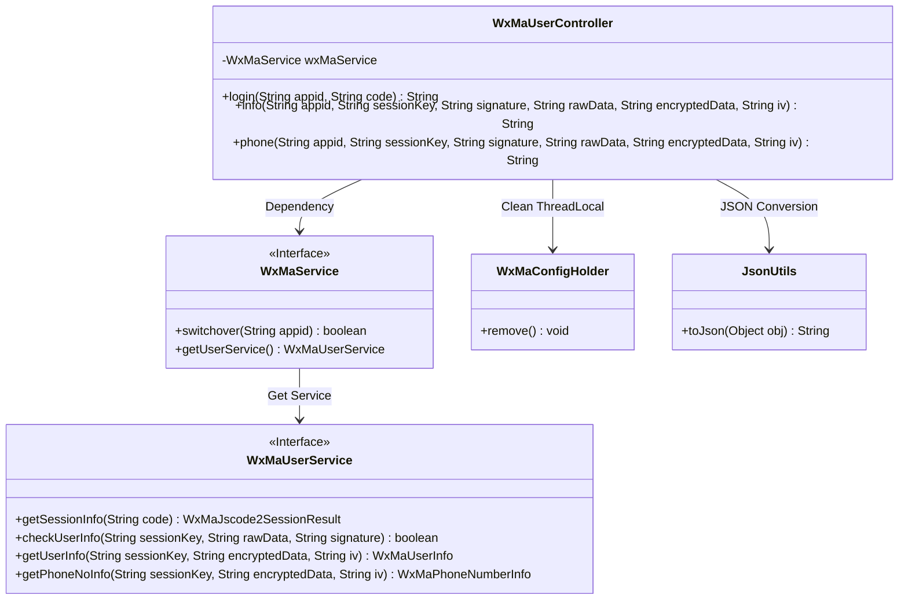

# Basic Information

|      |      |
|------|------|
| Name | WxMaUserController |
| Language | .java |
| Code Path | weixin-java-miniapp-demo/src/main/java/com/github/binarywang/demo/wx/miniapp/controller/WxMaUserController.java |
| Package Name | com.github.binarywang.demo.wx.miniapp.controller |
| Dependencies | ['cn.binarywang.wx.miniapp.api.WxMaService', 'cn.binarywang.wx.miniapp.bean.WxMaJscode2SessionResult', 'cn.binarywang.wx.miniapp.bean.WxMaPhoneNumberInfo', 'cn.binarywang.wx.miniapp.bean.WxMaUserInfo', 'cn.binarywang.wx.miniapp.util.WxMaConfigHolder', 'com.github.binarywang.demo.wx.miniapp.utils.JsonUtils', 'lombok.AllArgsConstructor', 'lombok.extern.slf4j.Slf4j', 'me.chanjar.weixin.common.error.WxErrorException', 'org.apache.commons.lang3.StringUtils', 'org.springframework.web.bind.annotation.GetMapping', 'org.springframework.web.bind.annotation.PathVariable', 'org.springframework.web.bind.annotation.RequestMapping', 'org.springframework.web.bind.annotation.RestController'] |
| Brief Description | WeChat Mini Program User Controller, providing interfaces for login, retrieving user information, and phone number. It requires validation of appid and user data, returns results in JSON format, handles exceptions, and cleans up ThreadLocal. |

# Description

This is a WeChat Mini Program user-related controller class containing three interfaces. The login interface retrieves user session information via a code, verifies the validity of the appid, and returns JSON data including sessionKey and openid. The user info retrieval interface requires validation of the user data signature, decrypts the data upon successful verification, and returns the user info JSON. The phone number retrieval interface also requires signature validation, decrypts the data upon successful verification, and returns the phone number info JSON. Each interface clears the configuration information in ThreadLocal at the end. All interfaces switch WeChat service configurations based on the appid parameter in the path.

# Class Summary

| Name   | Type  | Description |
|-------|------|-------------|
| WxMaUserController | class | WeChat Mini Program User Controller, providing interfaces for login, user information, and mobile number retrieval. It requires validation of appid and user data, returns results in JSON format, and clears ThreadLocal after use. |

## Class WxMaUserController

|      |      |
|------|------|
| Access Modifier | @RestController;@AllArgsConstructor;@Slf4j;@RequestMapping("/wx/user/{appid}");public |
| Type | class |
| Name | WxMaUserController |
| Description | WeChat Mini Program User Controller, providing interfaces for login, user information, and mobile number retrieval. It requires validation of appid and user data, returns results in JSON format, and clears ThreadLocal after use. |

### UML Class Diagram

This code implements a WeChat Mini Program user management controller, providing three core functionalities: login, retrieving user information, and obtaining phone numbers. The class diagram illustrates the controller's dependencies on WeChat service interfaces. It invokes underlying user services through WxMaService, manages thread-local variables using WxMaConfigHolder, and leverages JsonUtils for data serialization. All operations include appid verification and ThreadLocal cleanup mechanisms to ensure thread safety and configuration isolation.

### Internal Method Call Graph

```mermaid
graph TD
    A["Class WxMaUserController"]
    B["Property: WxMaService wxMaService"]
    C["Method: login(String appid, String code)"]
    D["Method: info(String appid, String sessionKey, String signature, String rawData, String encryptedData, String iv)"]
    E["Method: phone(String appid, String sessionKey, String signature, String rawData, String encryptedData, String iv)"]
    F["Check: StringUtils.isBlank(code)"]
    G["Call: wxMaService.switchover(appid)"]
    H["Call: wxMaService.getUserService().getSessionInfo(code)"]
    I["Logging: session.getSessionKey() and session.getOpenid()"]
    J["Return: JsonUtils.toJson(session)"]
    K["Exception Handling: WxErrorException"]
    L["Cleanup: WxMaConfigHolder.remove()"]
    M["Check: wxMaService.getUserService().checkUserInfo(...)"]
    N["Decrypt: wxMaService.getUserService().getUserInfo(...)"]
    O["Decrypt: wxMaService.getUserService().getPhoneNoInfo(...)"]

    A --> B
    A --> C
    A --> D
    A --> E
    C --> F
    C --> G
    C --> H
    C --> I
    C --> J
    C --> K
    C --> L
    D --> G
    D --> M
    D --> N
    D --> L
    E --> G
    E --> M
    E --> O
    E --> L
```

This flowchart illustrates the structure of the WxMaUserController class and its primary method invocation relationships. The class contains three core methods: login, info, and phone, all taking appid as a path parameter. The login method handles WeChat Mini Program login by validating the code and retrieving session information; the info method verifies user information and returns decrypted data; the phone method validates and decrypts user phone number information. All methods check appid validity and perform ThreadLocal cleanup. Exception handling and logging are implemented throughout the process to ensure data security and traceability.

### Field List

| Name  | Type  | Description |
|-------|-------|------|
| wxMaService | WxMaService | Private immutable member variables of WeChat Mini Program service instances. |

### Method List

| Name  | Type  | Description |
|-------|-------|------|
| login | String | This is a WeChat Mini Program login interface that retrieves user session information using a code. After verifying the code is not empty, it checks the appid configuration. If successful, it returns session data (including sessionKey and openid); otherwise, it returns an error. Finally, it cleans up the ThreadLocal. |
| info | String | WeChat Mini Program User Information Verification Interface: Check appid configuration, verify user data signature, and decrypt to return user information. Returns error prompts on failure. |
| phone | String | This is an interface for a WeChat Mini Program to obtain a user's phone number. It first verifies the appid and user information, then decrypts and retrieves the phone number data before returning it. If verification fails, an error message is returned. |

