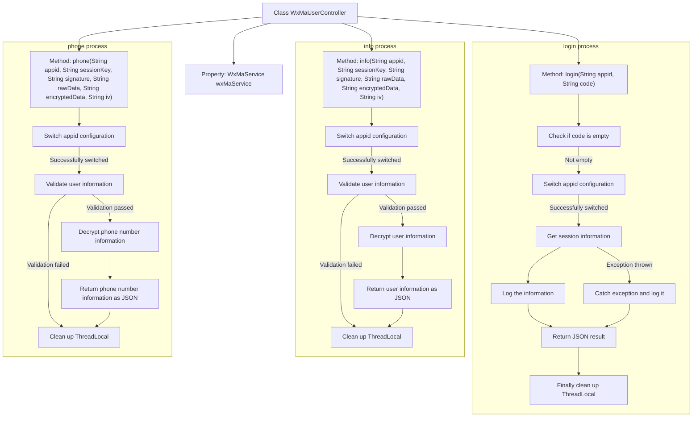

# Basic Information

|      |      |
|------|------|
| Name | WxMaUserController |
| Language | .java |
| Code Path | weixin-java-miniapp-demo/src/main/java/com/github/binarywang/demo/wx/miniapp/controller/WxMaUserController.java |
| Package Name | com.github.binarywang.demo.wx.miniapp.controller |
| Dependencies | ['cn.binarywang.wx.miniapp.api.WxMaService', 'cn.binarywang.wx.miniapp.bean.WxMaJscode2SessionResult', 'cn.binarywang.wx.miniapp.bean.WxMaPhoneNumberInfo', 'cn.binarywang.wx.miniapp.bean.WxMaUserInfo', 'cn.binarywang.wx.miniapp.util.WxMaConfigHolder', 'com.github.binarywang.demo.wx.miniapp.utils.JsonUtils', 'lombok.AllArgsConstructor', 'lombok.extern.slf4j.Slf4j', 'me.chanjar.weixin.common.error.WxErrorException', 'org.apache.commons.lang3.StringUtils', 'org.springframework.web.bind.annotation.GetMapping', 'org.springframework.web.bind.annotation.PathVariable', 'org.springframework.web.bind.annotation.RequestMapping', 'org.springframework.web.bind.annotation.RestController'] |
| Brief Description | This controller provides WeChat Mini Program user login, information retrieval, and phone number decryption functions. It switches configurations through appid and handles session validation and data decryption. |

# Description

This controller provides WeChat Mini Program user-related interfaces, including login, obtaining user information, and binding mobile phone numbers. It switches configurations through appid, processes JSCode login credential verification, decrypts user sensitive information and returns results, while also including thread local variable cleanup and exception log recording.

# Class Summary

| Name   | Type  | Description |
|-------|------|-------------|
| WxMaUserController | class | This controller provides WeChat Mini Program user login, information retrieval, and phone number decryption functions. It switches configurations through appid and handles session validation and data decryption. |


## Class WxMaUserController

|      |      |
|------|------|
| Access Modifier | @RestController;@AllArgsConstructor;@Slf4j;@RequestMapping("/wx/user/{appid}");public |
| Type | class |
| Name | WxMaUserController |
| Description | This controller provides WeChat Mini Program user login, information retrieval, and phone number decryption functions. It switches configurations through appid and handles session validation and data decryption. |


### UML Class Diagram

```mermaid
classDiagram

    class WxMaUserController {
        -WxMaService wxMaService
        +String login(String appid, String code)
        +String info(String appid, String sessionKey, String signature, String rawData, String encryptedData, String iv)
        +String phone(String appid, String sessionKey, String signature, String rawData, String encryptedData, String iv)
    }

    class <<Interface>> WxMaService {
        +boolean switchover(String appid)
        +WxMaUserService getUserService()
    }

    class WxMaUserService {
        +WxMaJscode2SessionResult getSessionInfo(String jsCode) throws WxErrorException
        +boolean checkUserInfo(String sessionKey, String rawData, String signature)
        +WxMaUserInfo getUserInfo(String sessionKey, String encryptedData, String iv)
        +WxMaPhoneNumberInfo getPhoneNoInfo(String sessionKey, String encryptedData, String iv)
    }

    class WxMaConfigHolder {
        +static void remove()
    }

    class JsonUtils {
        +static String toJson(Object object)
    }

    class WxMaJscode2SessionResult {
        +String getSessionKey()
        +String getOpenid()
    }

    class WxMaUserInfo {
    }

    class WxMaPhoneNumberInfo {
    }

    class WxErrorException {
    }

    // Relationships between classes
    WxMaUserController --> WxMaService : Dependency
    WxMaUserController --> WxMaConfigHolder : Clear context
    WxMaUserController --> JsonUtils : Serialize return value
    WxMaUserController --> WxErrorException : Exception handling
    WxMaUserController --> WxMaJscode2SessionResult : Get session info
    WxMaUserController --> WxMaUserInfo : Get user info
    WxMaUserController --> WxMaPhoneNumberInfo : Get phone number info

    WxMaService --> WxMaUserService : Get service instance

```

This class diagram shows the structure of the WeChat Mini Program user controller `WxMaUserController` and its relationships with other key classes and interfaces. The controller invokes WeChat services through the `WxMaService` interface to perform operations such as login, obtaining user information, and retrieving phone numbers. It also depends on utility classes for serialization and context management. Exception handling and logging are included in the control logic.


### Internal Method Call Graph



This flowchart illustrates the execution processes of three core interfaces in the WeChat Mini Program User Controller (WxMaUserController): login, get user information, and get phone number. Each interface includes key steps such as parameter validation, configuration switching, information processing, and response returning, with a unified cleanup of thread-local variables at the end to ensure request context isolation.

### Field List

| Name  | Type  | Description |
|-------|-------|------|
| wxMaService | WxMaService | This is a private constant field declaration for a WeChat Mini Program service interface, used to provide WeChat Mini Program related function calls within the class. |

### Method List

| Name  | Type  | Description |
|-------|-------|------|
| info | String | This interface is used to obtain WeChat Mini Program user information, switch configurations through appid, verify user signatures, and decrypt and return user data. |
| login | String | This interface handles WeChat Mini Program login requests, obtaining user session information through appid and code. First, it validates whether the code is empty, then switches to the corresponding WeChat configuration, calls the service to obtain sessionKey and openid, logs the information, and returns the session information in JSON format. If an exception occurs, it logs the error and returns the exception information, finally cleaning up thread-local variables. |
| phone | String | This interface is used to obtain the user's phone number by verifying user information and decrypting encrypted data. First, switch to the specified appid configuration, verify the legitimacy of user information, then decrypt the phone number related information and return the result. The process will clean up thread local variables. |


