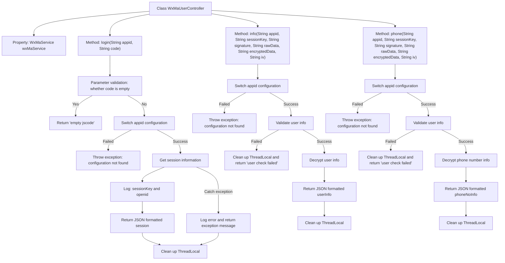

# Basic Information

|      |      |
|------|------|
| Name | WxMaUserController |
| Language | .java |
| Code Path | weixin-java-miniapp-demo/src/main/java/com/github/binarywang/demo/wx/miniapp/controller/WxMaUserController.java |
| Package Name | com.github.binarywang.demo.wx.miniapp.controller |
| Dependencies | ['cn.binarywang.wx.miniapp.api.WxMaService', 'cn.binarywang.wx.miniapp.bean.WxMaJscode2SessionResult', 'cn.binarywang.wx.miniapp.bean.WxMaPhoneNumberInfo', 'cn.binarywang.wx.miniapp.bean.WxMaUserInfo', 'cn.binarywang.wx.miniapp.util.WxMaConfigHolder', 'com.github.binarywang.demo.wx.miniapp.utils.JsonUtils', 'lombok.AllArgsConstructor', 'lombok.extern.slf4j.Slf4j', 'me.chanjar.weixin.common.error.WxErrorException', 'org.apache.commons.lang3.StringUtils', 'org.springframework.web.bind.annotation.GetMapping', 'org.springframework.web.bind.annotation.PathVariable', 'org.springframework.web.bind.annotation.RequestMapping', 'org.springframework.web.bind.annotation.RestController'] |
| Brief Description | This class is a controller for WeChat Mini Program user-related interfaces, providing login, user information retrieval, and mobile number binding functions. It switches configurations through appid and processes data returned by WeChat. |

# Description

This controller provides WeChat Mini Program user-related interfaces, including login, obtaining user information, and binding mobile phone numbers. It switches configurations through appID, calls WeChat services to complete session acquisition and data decryption, and records logs. All operations clean up ThreadLocal resources in the finally block to ensure thread safety. The interface returns JSON formatted data or error information.

# Class Summary

| Name   | Type  | Description |
|-------|------|-------------|
| WxMaUserController | class | This class is a controller for WeChat Mini Program user-related interfaces, providing login, user information retrieval, and phone number binding functions. It switches configurations through appid and processes data returned by WeChat. |


## Class WxMaUserController

|      |      |
|------|------|
| Access Modifier | @RestController;@AllArgsConstructor;@Slf4j;@RequestMapping("/wx/user/{appid}");public |
| Type | class |
| Name | WxMaUserController |
| Description | This class is a controller for WeChat Mini Program user-related interfaces, providing login, user information retrieval, and phone number binding functions. It switches configurations through appid and processes data returned by WeChat. |


### UML Class Diagram

```mermaid
classDiagram
    class WxMaUserController {
        -WxMaService wxMaService
        +String login(String appid, String code)
        +String info(String appid, String sessionKey, String signature, String rawData, String encryptedData, String iv)
        +String phone(String appid, String sessionKey, String signature, String rawData, String encryptedData, String iv)
    }

    class WxMaService {
        <<Interface>>
        +boolean switchover(String appid)
        +WxMaUserService getUserService()
    }

    class WxMaUserService {
        <<Interface>>
        +WxMaJscode2SessionResult getSessionInfo(String jsCode) throws WxErrorException
        +boolean checkUserInfo(String sessionKey, String rawData, String signature)
        +WxMaUserInfo getUserInfo(String sessionKey, String encryptedData, String iv)
        +WxMaPhoneNumberInfo getPhoneNoInfo(String sessionKey, String encryptedData, String iv)
    }

    class WxMaJscode2SessionResult {
        +String getSessionKey()
        +String getOpenid()
    }

    class WxMaUserInfo {
    }

    class WxMaPhoneNumberInfo {
    }

    class WxMaConfigHolder {
        +static void remove()
    }

    class JsonUtils {
        +static String toJson(Object object)
    }

    class StringUtils {
        +static boolean isBlank(String str)
    }

    class WxErrorException {
    }

    class log {
        +static void info(String msg)
        +static void error(String msg, Throwable t)
    }

    // Dependencies
    WxMaUserController --> WxMaService : depends on
    WxMaUserController --> WxMaConfigHolder : clean up ThreadLocal
    WxMaUserController --> JsonUtils : serialize response result
    WxMaUserController --> StringUtils : parameter validation
    WxMaUserController --> WxErrorException : exception handling
    WxMaUserController --> log : logging
    WxMaService --> WxMaUserService : get user service
    WxMaUserService --> WxMaJscode2SessionResult : parse login credentials
    WxMaUserService --> WxMaUserInfo : decrypt user info
    WxMaUserService --> WxMaPhoneNumberInfo : decrypt phone number info
```

This class diagram shows the controller `WxMaUserController` for WeChat Mini Program user-related interfaces and its dependent services and utility classes. The controller switches configurations via `WxMaService` and obtains user services to implement functions such as login, retrieving user information, and phone numbers. Each method involves parameter validation, security checks, exception handling, and logging, with results ultimately serialized and returned.


### Internal Method Call Graph



This flowchart illustrates the processing logic of three core interfaces in the WeChat Mini Program User Controller (`WxMaUserController`): login, get user information, and get phone number. Each interface first validates parameters and configurations, then performs specific business operations, and finally cleans up thread variables. The structure is clear and well-organized.

### Field List

| Name  | Type  | Description |
|-------|-------|------|
| wxMaService | WxMaService | This is a private constant field declaration for a WeChat Mini Program service interface, used to provide WeChat Mini Program related function calls within the class. |

### Method List

| Name  | Type  | Description |
|-------|-------|------|
| info | String | This interface is used to obtain WeChat Mini Program user information. It first validates the appid configuration, then verifies the user session validity, and finally decrypts and returns the user information. The process includes error handling and resource cleanup. |
| login | String | This interface handles WeChat Mini Program login requests, obtaining user session information through appid and code. First, it validates whether the code is empty, then switches to the corresponding WeChat configuration, calls the service to obtain session_key and openid, and finally returns the session information or error information in JSON format. |
| phone | String | This interface is used to obtain the user's phone number by verifying user information and decrypting encrypted data. First, switch to the specified appid configuration, verify the legality of user information, then decrypt the phone number information and return the result in JSON format. The process will clean up thread-local variables. |


