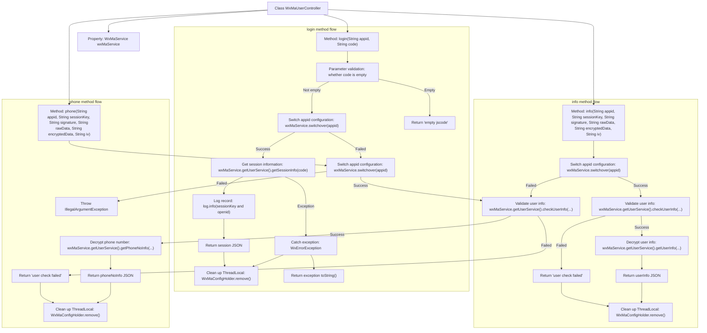

# Basic Information

|      |      |
|------|------|
| Name | WxMaUserController |
| Language | .java |
| Code Path | weixin-java-miniapp-demo/src/main/java/com/github/binarywang/demo/wx/miniapp/controller/WxMaUserController.java |
| Package Name | com.github.binarywang.demo.wx.miniapp.controller |
| Dependencies | ['cn.binarywang.wx.miniapp.api.WxMaService', 'cn.binarywang.wx.miniapp.bean.WxMaJscode2SessionResult', 'cn.binarywang.wx.miniapp.bean.WxMaPhoneNumberInfo', 'cn.binarywang.wx.miniapp.bean.WxMaUserInfo', 'cn.binarywang.wx.miniapp.util.WxMaConfigHolder', 'com.github.binarywang.demo.wx.miniapp.utils.JsonUtils', 'lombok.AllArgsConstructor', 'lombok.extern.slf4j.Slf4j', 'me.chanjar.weixin.common.error.WxErrorException', 'org.apache.commons.lang3.StringUtils', 'org.springframework.web.bind.annotation.GetMapping', 'org.springframework.web.bind.annotation.PathVariable', 'org.springframework.web.bind.annotation.RequestMapping', 'org.springframework.web.bind.annotation.RestController'] |
| Brief Description | This class is a controller for WeChat Mini Program user-related interfaces, providing login, user information retrieval, and phone number binding functions. It switches configurations through appid and processes data returned by WeChat. |

# Description

This controller provides WeChat Mini Program user-related interfaces, including login, obtaining user information, and binding mobile phone numbers. It switches configurations through appid, processes JSCode login and returns session information, supports user data decryption and verification. All operations are logged and thread local variables are cleaned up upon completion.

# Class Summary

| Name   | Type  | Description |
|-------|------|-------------|
| WxMaUserController | class | This controller provides WeChat Mini Program user login, information retrieval, and phone number decryption functions. It switches configurations through appid and handles session validation and data decryption. |


## Class WxMaUserController

|      |      |
|------|------|
| Access Modifier | @RestController;@AllArgsConstructor;@Slf4j;@RequestMapping("/wx/user/{appid}");public |
| Type | class |
| Name | WxMaUserController |
| Description | This controller provides WeChat Mini Program user login, information retrieval, and phone number decryption functions. It switches configurations through appid and handles session validation and data decryption. |


### UML Class Diagram

```mermaid
classDiagram
    class WxMaUserController {
        -WxMaService wxMaService
        +String login(String appid, String code)
        +String info(String appid, String sessionKey, String signature, String rawData, String encryptedData, String iv)
        +String phone(String appid, String sessionKey, String signature, String rawData, String encryptedData, String iv)
    }

    class WxMaService {
        <<Interface>>
        +boolean switchover(String appid)
        +WxMaUserService getUserService()
    }

    class WxMaUserService {
        <<Interface>>
        +WxMaJscode2SessionResult getSessionInfo(String jsCode)
        +boolean checkUserInfo(String sessionKey, String rawData, String signature)
        +WxMaUserInfo getUserInfo(String sessionKey, String encryptedData, String iv)
        +WxMaPhoneNumberInfo getPhoneNoInfo(String sessionKey, String encryptedData, String iv)
    }

    class WxMaJscode2SessionResult {
        +String getSessionKey()
        +String getOpenid()
    }

    class WxMaUserInfo {
    }

    class WxMaPhoneNumberInfo {
    }

    class WxMaConfigHolder {
        +void remove()
    }

    class JsonUtils {
        +String toJson(Object object)
    }

    class StringUtils {
        +boolean isBlank(String str)
    }

    class WxErrorException {
    }

    class log {
        +void info(String msg)
        +void error(String msg, Throwable t)
    }

    // Dependencies
    WxMaUserController --> WxMaService : depends on
    WxMaUserController --> WxMaConfigHolder : clean ThreadLocal
    WxMaUserController --> JsonUtils : serialize response
    WxMaUserController --> StringUtils : parameter validation
    WxMaUserController --> WxErrorException : exception handling
    WxMaUserController --> log : logging
    WxMaService --> WxMaUserService : get user service
    WxMaUserService --> WxMaJscode2SessionResult : login session info
    WxMaUserService --> WxMaUserInfo : decrypt user info
    WxMaUserService --> WxMaPhoneNumberInfo : decrypt phone number info
```

This class diagram shows the controller `WxMaUserController` for WeChat Mini Program user-related interfaces, along with its dependent service interfaces and utility classes. The controller switches configurations via `WxMaService` and obtains user services to implement functions such as login, retrieving user information, and phone number, while also involving auxiliary operations like parameter validation, logging, and exception handling. Each component has clearly defined responsibilities and explicit dependency relationships.


### Internal Method Call Graph



This flowchart illustrates the execution flows of three core interfaces in the WeChat Mini Program user controller (`WxMaUserController`): the login interface (`login`), the user information retrieval interface (`info`), and the phone number retrieval interface (`phone`). Each interface includes key steps such as parameter validation, configuration switching, service invocation, and result processing, followed by unified resource cleanup at the end.

### Field List

| Name  | Type  | Description |
|-------|-------|------|
| wxMaService | WxMaService | This is a private constant field declaration for a WeChat Mini Program service interface, used to provide function calls related to WeChat Mini Programs. |

### Method List

| Name  | Type  | Description |
|-------|-------|------|
| info | String | This interface is used to obtain WeChat Mini Program user information. It switches configurations through the appid and validates the user session. If validation fails, it returns error information; if successful, it decrypts and returns the user information. |
| login | String | This interface handles WeChat Mini Program login requests, obtaining user session information through appid and code. First, it validates whether the code is empty, then switches to the corresponding WeChat configuration, calls the service to obtain sessionKey and openid, and finally returns JSON formatted session information or error information. |
| phone | String | This interface is used to obtain the user's phone number by verifying user information and decrypting encrypted data. First, switch to the specified appid configuration and verify the legitimacy of the user information. If the verification fails, clear the ThreadLocal and return the error message; if the verification succeeds, decrypt the phone number information and return the result in JSON format, finally clearing the ThreadLocal. |


