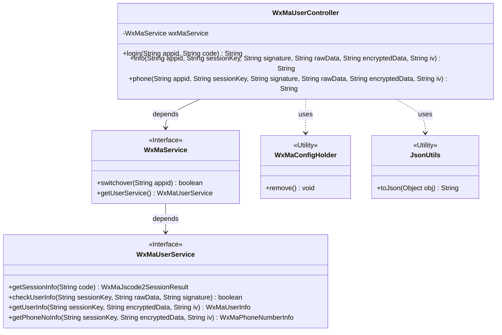
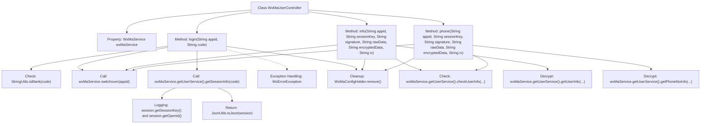

# Basic Information

|      |      |
|------|------|
| Name | WxMaUserController |
| Language | .java |
| Code Path | weixin-java-miniapp-demo\src\main\java\com\github\binarywang\demo\wx\miniapp\controller\WxMaUserController.java |
| Package Name | com.github.binarywang.demo.wx.miniapp.controller |
| Dependencies | ['cn.binarywang.wx.miniapp.api.WxMaService', 'cn.binarywang.wx.miniapp.bean.WxMaJscode2SessionResult', 'cn.binarywang.wx.miniapp.bean.WxMaPhoneNumberInfo', 'cn.binarywang.wx.miniapp.bean.WxMaUserInfo', 'cn.binarywang.wx.miniapp.util.WxMaConfigHolder', 'com.github.binarywang.demo.wx.miniapp.utils.JsonUtils', 'lombok.AllArgsConstructor', 'lombok.extern.slf4j.Slf4j', 'me.chanjar.weixin.common.error.WxErrorException', 'org.apache.commons.lang3.StringUtils', 'org.springframework.web.bind.annotation.GetMapping', 'org.springframework.web.bind.annotation.PathVariable', 'org.springframework.web.bind.annotation.RequestMapping', 'org.springframework.web.bind.annotation.RestController'] |
| Brief Description | WeChat Mini Program User Controller, providing interfaces for login, retrieving user information, and phone number. It requires validation of appid and user data, returns results in JSON format, and cleans up ThreadLocal after use. |

# Description

This is a WeChat Mini Program user management controller class containing three interfaces: the login interface verifies the user's code and returns session information; the user info interface validates and decrypts to return user data; the phone number interface validates and decrypts to return user phone number information. All interfaces require validation of the appid's validity and clean up the ThreadLocal-stored configuration information after processing.

# Class Summary

| Name   | Type  | Description |
|-------|------|-------------|
| WxMaUserController | class | WeChat Mini Program User Controller, providing interfaces for login, retrieving user information, and phone number. It requires validation of appid and sessionKey, returns JSON data, handles exceptions, and cleans up ThreadLocal. |

## Class WxMaUserController

|      |      |
|------|------|
| Access Modifier | @RestController;@AllArgsConstructor;@Slf4j;@RequestMapping("/wx/user/{appid}");public |
| Type | class |
| Name | WxMaUserController |
| Description | WeChat Mini Program User Controller, providing interfaces for login, retrieving user information, and phone number. It requires validation of appid and sessionKey, returns JSON data, handles exceptions, and cleans up ThreadLocal. |

### UML Class Diagram

Class Diagram Description: This diagram illustrates the structure of the WeChat Mini Program user controller WxMaUserController, which interacts with WeChat services through the WxMaService interface, containing three core methods: login, retrieve user information, and obtain phone number. The controller relies on the WxMaService interface to implement business logic, which further delegates specific user operations to WxMaUserService. Utility classes JsonUtils and WxMaConfigHolder are used for JSON serialization and thread-local variable cleanup respectively. The overall design follows a layered architecture, adhering to the Single Responsibility Principle.

### Internal Method Call Graph

This code represents a WeChat Mini Program user-related Spring Boot controller with three main interfaces: login for obtaining session information, info for retrieving basic user information, and phone for acquiring user phone number details. Each interface first verifies the appid configuration, performs necessary parameter validation and decryption operations, and finally returns data in JSON format. All operations conclude with cleanup of ThreadLocal-stored configuration. The flowchart clearly illustrates the class structure, method invocation relationships, and key processing steps, including both normal flows and exception handling paths.

### Field List

| Name  | Type  | Description |
|-------|-------|------|
| wxMaService | WxMaService | WeChat Mini Program Service Instance (Private Immutable) |

### Method List

| Name  | Type  | Description |
|-------|-------|------|
| login | String | The code is a WeChat Mini Program login interface that receives appid and code parameters, verifies the validity of the code, and checks the appid configuration. After obtaining the user session information, it returns JSON data. In case of exceptions, it logs the error and cleans up the ThreadLocal. |
| info | String | The code is a backend interface for a WeChat Mini Program, designed to verify user information and return decrypted user data. It first checks the appid configuration, then validates the user data signature, and finally decrypts the data to return the user information in JSON format. |
| phone | String | WeChat User Mobile Number API: Verifies the appid and user information, decrypts the mobile number data, and returns the result. Returns an error message if failed. |

