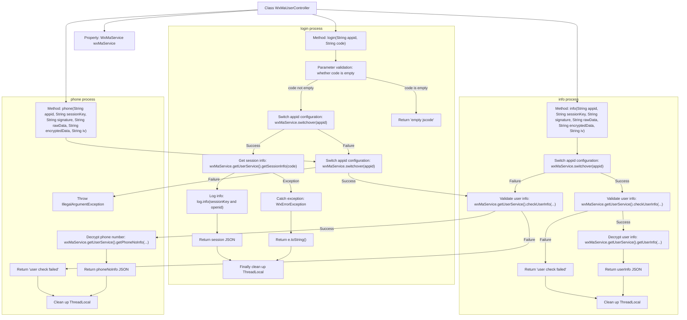

# Basic Information

|      |      |
|------|------|
| Name | WxMaUserController |
| Language | .java |
| Code Path | weixin-java-miniapp-demo/src/main/java/com/github/binarywang/demo/wx/miniapp/controller/WxMaUserController.java |
| Package Name | com.github.binarywang.demo.wx.miniapp.controller |
| Dependencies | ['cn.binarywang.wx.miniapp.api.WxMaService', 'cn.binarywang.wx.miniapp.bean.WxMaJscode2SessionResult', 'cn.binarywang.wx.miniapp.bean.WxMaPhoneNumberInfo', 'cn.binarywang.wx.miniapp.bean.WxMaUserInfo', 'cn.binarywang.wx.miniapp.util.WxMaConfigHolder', 'com.github.binarywang.demo.wx.miniapp.utils.JsonUtils', 'lombok.AllArgsConstructor', 'lombok.extern.slf4j.Slf4j', 'me.chanjar.weixin.common.error.WxErrorException', 'org.apache.commons.lang3.StringUtils', 'org.springframework.web.bind.annotation.GetMapping', 'org.springframework.web.bind.annotation.PathVariable', 'org.springframework.web.bind.annotation.RequestMapping', 'org.springframework.web.bind.annotation.RestController'] |
| Brief Description | This controller provides WeChat Mini Program user login, information retrieval, and phone number decryption functions. It switches configurations through appid and handles session verification and data decryption. |

# Description

This controller provides WeChat Mini Program user-related interfaces, including login, obtaining user information, and binding mobile phone numbers. It switches configurations through appID, handles JSCode login credential verification and session management, supports user data decryption and signature verification, ensures secure access, and returns results in JSON format. All operations clean up thread-local variables upon completion.

# Class Summary

| Name   | Type  | Description |
|-------|------|-------------|
| WxMaUserController | class | This controller provides WeChat Mini Program user login, user information retrieval, and mobile phone number binding functions. It switches configurations through appid and handles session validation and data decryption. |


## Class WxMaUserController

|      |      |
|------|------|
| Access Modifier | @RestController;@AllArgsConstructor;@Slf4j;@RequestMapping("/wx/user/{appid}");public |
| Type | class |
| Name | WxMaUserController |
| Description | This controller provides WeChat Mini Program user login, user information retrieval, and mobile phone number binding functions. It switches configurations through appid and handles session validation and data decryption. |


### UML Class Diagram

```mermaid
classDiagram

    class WxMaUserController {
        -WxMaService wxMaService
        +String login(String appid, String code)
        +String info(String appid, String sessionKey, String signature, String rawData, String encryptedData, String iv)
        +String phone(String appid, String sessionKey, String signature, String rawData, String encryptedData, String iv)
    }

    class WxMaService {
        <<Interface>>
        +boolean switchover(String appid)
        +WxMaUserService getUserService()
    }

    class WxMaUserService {
        <<Interface>>
        +WxMaJscode2SessionResult getSessionInfo(String jsCode) throws WxErrorException
        +boolean checkUserInfo(String sessionKey, String rawData, String signature)
        +WxMaUserInfo getUserInfo(String sessionKey, String encryptedData, String iv)
        +WxMaPhoneNumberInfo getPhoneNoInfo(String sessionKey, String encryptedData, String iv)
    }

    class WxMaConfigHolder {
        <<Utility Class>>
        +void remove()
    }

    class JsonUtils {
        <<Utility Class>>
        +String toJson(Object object)
    }

    class WxMaJscode2SessionResult {
        +String getSessionKey()
        +String getOpenid()
    }

    class WxMaUserInfo {
    }

    class WxMaPhoneNumberInfo {
    }

    class WxErrorException {
    }

    class StringUtils {
        <<Utility Class>>
        +boolean isBlank(CharSequence cs)
    }

    class RequestMapping {
    }

    class GetMapping {
    }

    class PathVariable {
    }

    class RestController {
    }

    class AllArgsConstructor {
    }

    class Slf4j {
    }


    // Dependencies
    WxMaUserController --> WxMaService : depends on
    WxMaUserController --> WxMaConfigHolder : calls remove()
    WxMaUserController --> JsonUtils : serializes result
    WxMaUserController --> StringUtils : validates parameters
    WxMaUserController --> WxMaJscode2SessionResult : uses return value
    WxMaUserController --> WxMaUserInfo : returns user info
    WxMaUserController --> WxMaPhoneNumberInfo : returns phone number info
    WxMaUserController --> WxErrorException : handles exceptions
    WxMaService --> WxMaUserService : gets service
```

This class diagram shows the controller class `WxMaUserController` for WeChat Mini Program user-related interfaces and its dependent service interfaces and utility classes. The controller switches configurations via `WxMaService` and invokes user services to perform operations such as login, retrieving user information, and phone numbers. It also integrates logging, parameter validation, and exception handling mechanisms to ensure stable operation of the interface.


### Internal Method Call Graph



This flowchart illustrates the processing flows of three core interfaces in the WeChat Mini Program user controller (`WxMaUserController`): login (`login`), get user information (`info`), and get phone number (`phone`). Each interface includes key steps such as parameter validation, configuration switching, service invocation, and exception handling, with unified cleanup of thread context at the end to ensure system stability and security.

### Field List

| Name  | Type  | Description |
|-------|-------|------|
| wxMaService | WxMaService | This is a private immutable instance variable of a WeChat Mini Program service interface, used to handle WeChat Mini Program related business logic. |

### Method List

| Name  | Type  | Description |
|-------|-------|------|
| login | String | This interface handles WeChat Mini Program login requests, obtaining user session information through appid and code. First, it validates whether the code is empty, then switches to the corresponding WeChat configuration, calls the service to obtain sessionKey and openid and logs the information, finally returns JSON formatted session information or error information, and cleans up thread local variables upon completion. |
| info | String | This interface is used to obtain WeChat Mini Program user information, switch configurations through appid and verify user signatures, and finally return the decrypted user data. |
| phone | String | This interface is used to obtain the user's phone number by verifying user information and decrypting encrypted data. First, switch to the specified appid configuration and verify the legitimacy of user information. If the verification fails, return an error message; if the verification succeeds, decrypt the phone number-related information and return the result in JSON format, finally clean up the thread local variables. |


